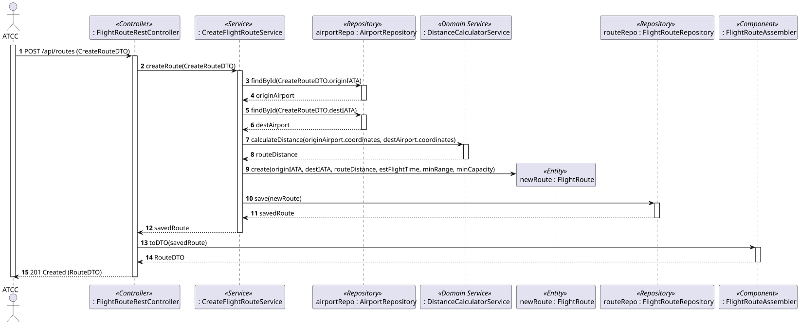

# US110 - Create a Flight Route

## 1. Requirements Engineering

### 1.1. User Story Description

As an ATCC (Air Transport Company Collaborator), I want to create a flight route by specifying origin airport, destination airport, estimated flight time, and minimum aircraft requirements (range, capacity). The system should verify both airports exist.

### 1.2. Customer Specifications and Clarifications 

- **Clarification from Forum:** Flight routes exist independently of the operational status of the airports. For example, a route LIS-OPO exists even if OPO is temporarily closed for maintenance.
- **Clarification from Forum:** The distance of a route is a fixed value calculated at the moment of the route's creation (assuming airports do not change locations).
- **Clarification from Forum:** The Route ID should be a system-generated identifier.

### 1.3. Acceptance Criteria

- **AC1:** Both the origin and destination airports must be verified to exist in the system.
- **AC2:** The route distance must be automatically calculated upon creation and stored as a fixed value.
- **AC3:** The system must generate a unique ID for the route.
- **AC4:** Input validation must be applied (e.g., IATA codes must be exactly 3 letters, range and capacity must be positive numbers).
- **AC5:** The API endpoint must follow RESTful principles, returning "201 Created" on success.
- **AC6:** The operation must be restricted to users with the 'ATCC' role (requires JWT authentication/authorization).

### 1.4. Found out Dependencies

* **Dependency to WP#2A (Airports):** This US heavily depends on the existence of Airports (US106). The system must be able to query existing airports by their IATA codes to validate the route creation and calculate the distance between their coordinates.

### 1.5 Input and Output Data

**Input Data:**
- Typed data (via JSON payload):
  - Origin Airport (IATA Code)
  - Destination Airport (IATA Code)
  - Estimated Flight Time (in minutes)
  - Minimum Range Requirement (in nautical miles or km)
  - Minimum Capacity Requirement (number of seats)

**Output Data:**
- Route ID (System generated)
- Calculated Route Distance
- Success message / "201 Created" HTTP Status
- JSON representation of the created Route (DTO).

### 1.6. System Sequence Diagram (SSD)

### 1.7 Other Relevant Remarks

- The calculation of the distance between two geographical coordinates might require a specific domain service or utility class (e.g., using the Haversine formula).

## 2. Analysis

### 2.1. Relevant Domain Model Excerpt 

### 2.2. Other Remarks

Following DDD principles, "FlightRoute" should preferably hold a reference to the Airport's identity (the IATA code) rather than the full "Airport" object, to keep aggregate boundaries clean.

## 3. Design - User Story Realization

### 3.1. Rationale

**The rationale grounds on the SSD interactions and the identified input/output data.**

| Interaction ID | Question: Which class is responsible for... | Answer  | Justification (with patterns)  |
|:-------------  |:--------------------- |:------------|:---------------------------- |
| Step 1         | ...receiving the HTTP POST request and JSON payload? | FlightRouteRestController | **Controller (REST):** Acts as the entry point for the API, separating presentation from business logic. |
| Step 2         | ...converting the JSON payload into a format the domain understands? | FlightRouteDTO / FlightRouteAssembler | **DTO (Data Transfer Object):** Carries data between processes to reduce coupling. |
| Step 3         | ...coordinating the route creation logic? | CreateFlightRouteService | **Application Service / Use Case Controller:** Orchestrates domain objects to fulfill the specific use case without containing business logic itself. |
| Step 4         | ...verifying if the origin and destination airports exist? | AirportRepository | **Repository:** Accesses the persistence layer to find aggregates by their ID (IATA Code). |
| Step 5         | ...calculating the distance between the two airports? | DistanceCalculatorService | **Domain Service:** Encapsulates business logic that involves multiple aggregates (two sets of coordinates). |
| Step 6         | ...instantiating the new Flight Route? | FlightRouteFactory or FlightRoute | **Creator:** Responsible for creating the complex entity and ensuring it starts in a valid state. |
| Step 7         | ...saving the new route to the database? | FlightRouteRepository | **Repository:** Persists the newly created aggregate root. |
| Step 8         | ...returning the response to the client? | FlightRouteRestController | **Controller:** Formats the DTO and sends the HTTP response (201 Created). |

### Systematization

According to the taken rationale, the conceptual classes promoted to software classes are:
- FlightRoute`
- RouteDistance`, `RouteRequirements`, `EstimatedFlightTime`, `RouteID` (Value Objects)

Other software classes (i.e. Pure Fabrication) identified:
- FlightRouteRestController`
- CreateFlightRouteService`
- FlightRouteRepository`
- AirportRepository`
- FlightRouteDTO`
- FlightRouteAssembler`
- DistanceCalculatorService`

### 3.2. Sequence Diagram (SD)

### 3.3. Class Diagram (CD)

## 4. Tests 

**Test 1:** Check that it is not possible to create a Route Requirement with a negative capacity. 

@Test
public void ensureMinCapacityCannotBeNegative() {
    assertThrows(IllegalArgumentException.class, () -> {
        new RouteRequirements(500.0, -10);
    });
}

## 5. Construction (Implementation)

_In this section, it is suggested to provide, if necessary, some evidence that the construction/implementation is in accordance with the previously carried out design. Furthermore, it is recommended to mention/describe the existence of other relevant files (e.g. configuration) and highlight relevant commits._

_It is also recommended to organize this content by subsections._

## 6. Integration and Demo 

_In this section, it is suggested to describe the efforts made to integrate this functionality with the other features of the system._

## 7. Observations

_In this section, it is suggested to present a critical perspective on the developed work, pointing, for example, to other alternatives and or future related work._