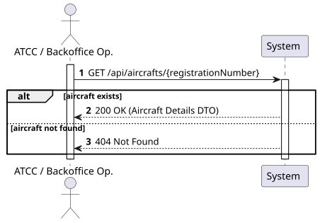
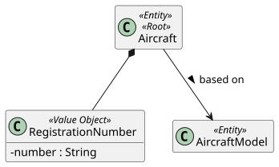
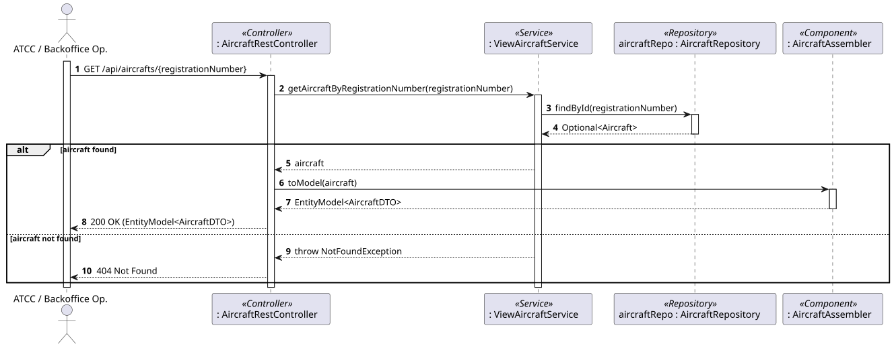
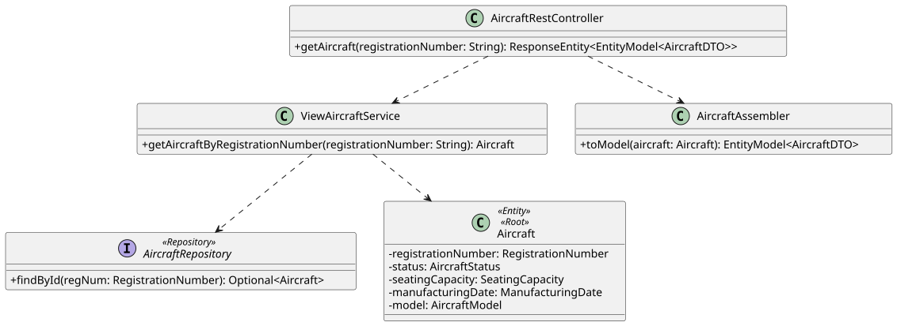

### 1. Requirements Engineering

#### 1.1. User Story Description

As a Backoffice Operator or ATCC, I want to view an aircraft's details given its registration number.

#### 1.2. Customer Specifications and Clarifications 

- **HATEOAS Compliance:** According to the general non-functional requirements (Section 3.6), the system must provide links in the resource representation. When returning the aircraft details, the system should include self-links and potentially links to the referenced aircraft model.

#### 1.3. Acceptance Criteria

- **AC1:** The system must validate if the provided registration number exists. If not, it must return an appropriate HTTP error code (e.g., `404 Not Found`).
- **AC2:** If the aircraft is found, the system must return a `200 OK` status with the complete aircraft details (Registration Number, Status, Specific Seating Capacity, Manufacturing Date, and its associated Aircraft Model specifications).
- **AC3:** The JSON response must include HATEOAS links.
- **AC4:** The endpoint must be protected by JWT. Both 'Backoffice Operator' and 'ATCC' roles must have authorization to access this resource.

#### 1.4. Found out Dependencies

- **Dependency to US102:** This User Story depends on the prior registration of aircraft instances. Without existing aircraft in the system, this query will always return a "Not Found" state.

#### 1.5 Input and Output Data

**Input Data:**
- Typed data: 
  - Registration Number.

**Output Data:**
- `200 OK` HTTP Status (if found)
- `404 Not Found` (if not found)
- JSON representation of the Aircraft (DTO) including HATEOAS links.

#### 1.6. System Sequence Diagram (SSD)

### 1.7 Other Relevant Remarks

Since this is a read-only operation, it does not mutate the state of the system and is strictly idempotent.

## 2. Analysis

### 2.1. Relevant Domain Model Excerpt 

This Use Case reads data from the Aircraft Aggregate and navigates its reference to the AircraftModel Aggregate to compose the full view for the user.

### 2.2. Other Remarks

The query will directly use the AircraftRepository to fetch the entity by its @EmbeddedId (RegistrationNumber).

## 3. Design - User Story Realization

### 3.1. Rationale

**The rationale grounds on the SSD interactions and the identified input/output data.**

| Interaction ID | Question: Which class is responsible for... | Answer | Justification (with patterns) |
|:---|:---|:---|:---|
| Step 1 | ...receiving the HTTP GET request? | `AircraftRestController` | **Controller (REST):** Acts as the API entry point, handling routing and HTTP protocol details. |
| Step 2 | ...coordinating the retrieval logic? | `ViewAircraftService` | **Application Service:** Interacts with the domain and repositories to fetch the requested data without exposing data access implementation to the controller. |
| Step 3 | ...finding the aircraft in the database? | `AircraftRepository` | **Repository:** Encapsulates the logic required to access the data source and rebuilds the aggregate from the database. |
| Step 4 | ...converting the domain object into a DTO with HATEOAS links? | `AircraftAssembler` | **Assembler:** Decouples the domain entity from the external representation and handles the logic of generating hypermedia links (HATEOAS). |
| Step 5 | ...returning the HTTP response to the client? | `AircraftRestController` | **Controller:** Formats the final DTO representation and sends a `200 OK` or `404 Not Found` status code. |

### Systematization

According to the taken rationale, the conceptual classes promoted to software classes are:
- `Aircraft` (Aggregate Root Entity)
- `RegistrationNumber` (Value Object)

Other software classes (i.e., Pure Fabrication) identified:
- `AircraftRestController`
- `ViewAircraftService`
- `AircraftRepository`
- `AircraftDTO`
- `AircraftAssembler`

### 3.2. Sequence Diagram (SD)

### 3.3. Class Diagram (CD)

## 4. Tests 

**Test 1:** Verify that requesting an existing aircraft returns the correct instance.

@Test
public void ensureGetExistingAircraftReturnsCorrectData() {
    RegistrationNumber regNum = new RegistrationNumber("CS-TKY");
    Aircraft expectedAircraft = new Aircraft(...); // Mocked data
    when(aircraftRepository.findById(regNum)).thenReturn(Optional.of(expectedAircraft));
    
    Aircraft result = viewAircraftService.getAircraftByRegistrationNumber("CS-TKY");
    
    assertEquals(expectedAircraft, result);
}

**Test 2:** Verify that requesting a non-existent aircraft throws the appropriate exception.

@Test
public void ensureGetNonExistentAircraftThrowsNotFoundException() {
    RegistrationNumber regNum = new RegistrationNumber("INVALID-REG");
    when(aircraftRepository.findById(regNum)).thenReturn(Optional.empty());
    
    assertThrows(NotFoundException.class, () -> {
        viewAircraftService.getAircraftByRegistrationNumber("INVALID-REG");
    });
}

## 5. Construction (Implementation)

### 5.1. Controller Excerpt (HATEOAS)

@GetMapping("/{registrationNumber}")
public ResponseEntity<EntityModel<AircraftDTO>> getAircraft(@PathVariable String registrationNumber) {
    Aircraft aircraft = viewAircraftService.getAircraftByRegistrationNumber(registrationNumber);
    return ResponseEntity.ok(aircraftAssembler.toModel(aircraft));
}

## 6. Integration and Demo 

- Implementation uses RepresentationModelAssembler for HATEOAS. Hypermedia links (_links) are generated for the self relation and the associated aircraft-model resource.

## 7. Observations

- Since this operation is read-only and strictly idempotent, it does not lock database rows or suffer from complex concurrency conditions.

- To improve performance in a real-world scenario with high traffic, a caching layer (like Redis or Spring Cache) could be evaluated to temporarily store DTO responses for frequently accessed aircraft instances.