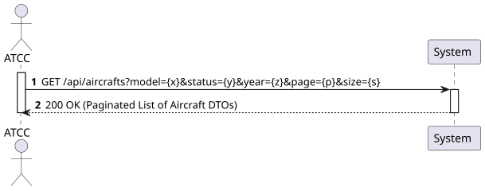
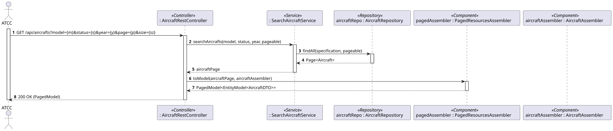
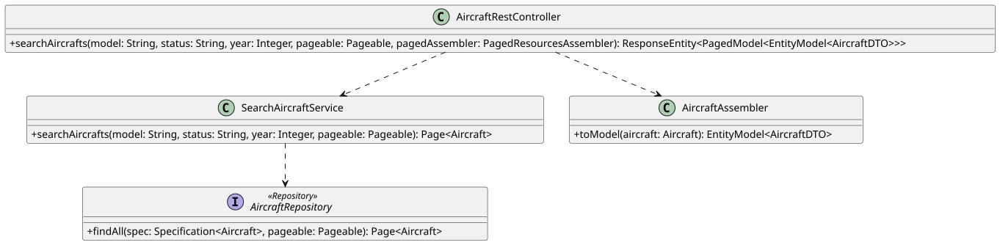

### 1. Requirements Engineering

#### 1.1. User Story Description

As an ATCC, I want to search for aircraft by model, status, or manufacturing year.

#### 1.2. Customer Specifications and Clarifications 

- **Search Criteria Combination:** The user can search by any individual parameter (model, status, or year) or a combination of them. If no parameters are provided, it is generally expected to return all aircraft, subject to pagination.
- **Pagination NFR:** According to the non-functional requirements (Section 4.6), "Long result lists must support pagination". This endpoint must inherently support `page` and `size` parameters.
- **HATEOAS NFR:** The resulting list of aircraft must include hypermedia links for both the collection itself and the individual aircraft items.

#### 1.3. Acceptance Criteria

- **AC1:** The system must allow searching aircraft by filtering exact matches on `model`, `status`, `manufacturing year`, or any combination of these three parameters.
- **AC2:** The system must return a paginated result to ensure performance and comply with NFRs.
- **AC3:** The response must return a `200 OK` HTTP status containing the filtered list of Aircraft DTOs. If no aircraft match the criteria, it should return an empty paginated list with a `200 OK` status.
- **AC4:** The JSON response must comply with HATEOAS principles.
- **AC5:** The operation must be restricted to users with the 'ATCC' role, requiring JWT token validation.

#### 1.4. Found out Dependencies

- **Dependency to US102:** This operation strictly depends on the registration of specific aircraft instances. Without existing aircraft, the search will continually yield empty results.

#### 1.5 Input and Output Data

**Input Data:**

- Typed data: 
  - `modelName` (String), 
  - `status` (String), 
  - `manufacturingYear` (Integer), 
  - `page` (Integer), 
  - `size` (Integer).

**Output Data:**

- `200 OK` HTTP Status.
- JSON representation of a Paginated Collection of Aircraft DTOs, including HATEOAS links.

#### 1.6. System Sequence Diagram (SSD)

### 1.7 Other Relevant Remarks

To accommodate flexible searching without writing overly complex nested logic, the backend should ideally leverage dynamic query mechanisms (e.g., JPA Specifications, QueryDSL, or Spring Data Example Matchers).

## 2. Analysis

### 2.1. Relevant Domain Model Excerpt 

This Use Case reads data from the Aircraft Aggregate. The search touches attributes directly within the Aircraft entity (Status, Manufacturing Date) and navigates its reference to the AircraftModel entity to match the model designation.

### 2.2. Other Remarks

Extracting the "year" from the ManufacturingDate (which is a LocalDate) requires specific handling at the database query level, or the service must construct dates for the start and end of the requested year to filter correctly.

## 3. Design - User Story Realization

### 3.1. Rationale

**The rationale grounds on the SSD interactions and the identified input/output data.**

| Interaction ID | Question: Which class is responsible for... | Answer | Justification (with patterns) |
|:---|:---|:---|:---|
| Step 1 | ...receiving the HTTP GET request with dynamic query parameters? | `AircraftRestController` | **Controller (REST):** Handles the HTTP request, extracting query parameters and pagination instructions. |
| Step 2 | ...coordinating the search execution? | `SearchAircraftService` | **Application Service:** Interacts with the repository layer to fetch filtered data. |
| Step 3 | ...building the dynamic query based on the provided filters? | `AircraftSpecification` | **Specification Pattern / Query Object:** Encapsulates the logic to dynamically build SQL/JPQL `WHERE` clauses based on optional parameters. |
| Step 4 | ...executing the paginated database query? | `AircraftRepository` | **Repository:** Interacts with the database, applying both the dynamic filters and the pagination limits (`LIMIT` / `OFFSET`). |
| Step 5 | ...converting the domain object page into a paginated DTO collection with links? | `PagedResourcesAssembler` & `AircraftAssembler` | **Assembler:** Decouples domain entities from external representation, automatically adding `next`, `prev`, `first`, and `last` HATEOAS pagination links. |
| Step 6 | ...returning the HTTP response to the client? | `AircraftRestController` | **Controller:** Formats the final `PagedModel` response and sends a `200 OK` status code. |

### Systematization

According to the taken rationale, the conceptual classes promoted to software classes are:
- `Aircraft` (Aggregate Root Entity)

Other software classes (i.e., Pure Fabrication) identified:
- `AircraftRestController`
- `SearchAircraftService`
- `AircraftRepository` (extending `JpaSpecificationExecutor`)
- `AircraftSpecification`
- `AircraftAssembler`

### 3.2. Sequence Diagram (SD)

### 3.3. Class Diagram (CD)

## 4. Tests 

**Test 1:** Verify that searching by an exact model name returns a correctly paginated list of matching aircraft.

@Test
public void ensureSearchByModelReturnsMatchingAircraft() {
    Pageable pageable = PageRequest.of(0, 10);
    // Mock the repository to return a page of A320s
    when(aircraftRepository.findAll(any(Specification.class), eq(pageable)))
        .thenReturn(new PageImpl<>(listOfA320s, pageable, 1));
        
    Page<Aircraft> result = searchAircraftService.searchAircrafts("A320", null, null, pageable);
    
    assertEquals(1, result.getTotalElements());
    assertEquals("A320", result.getContent().get(0).getModel().getDesignation().getModelName());
}

**Test 2:** Verify that searching with criteria that yield no results returns an empty page, not an error.

@Test
public void ensureSearchWithNoMatchesReturnsEmptyPage() {
    Pageable pageable = PageRequest.of(0, 10);
    when(aircraftRepository.findAll(any(Specification.class), eq(pageable)))
        .thenReturn(Page.empty());
        
    Page<Aircraft> result = searchAircraftService.searchAircrafts("NonExistent", null, null, pageable);
    
    assertTrue(result.isEmpty());
}

## 5. Construction (Implementation)

### 5.1. Repository & Specification

public interface AircraftRepository extends JpaRepository<Aircraft, RegistrationNumber>, JpaSpecificationExecutor<Aircraft> {}

## 6. Integration and Demo 

- Integrates with PagedResourcesAssembler to automatically handle pagination metadata (totalElements, totalPages) and navigation links (next, prev, first, last).

## 7. Observations

- The manufacturing year filter uses a date range query (January 1st to December 31st) to ensure compatibility with LocalDate fields and database indexing