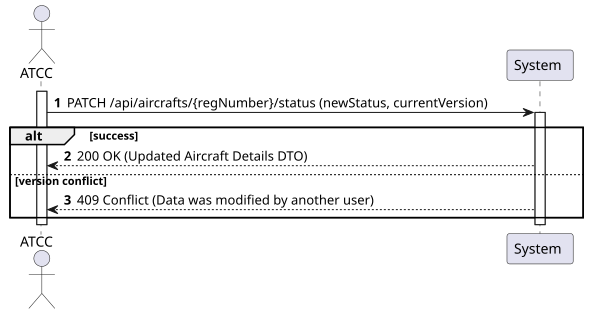
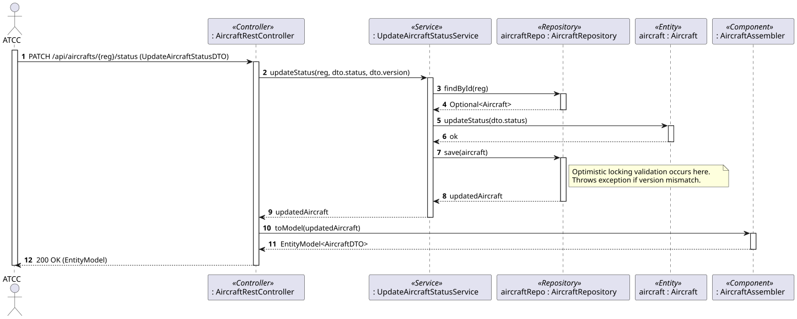
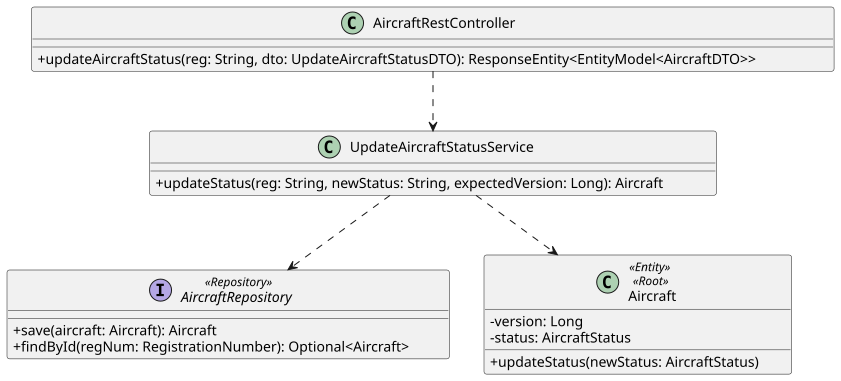

### 1. Requirements Engineering

#### 1.1. User Story Description

As an ATCC, I want to update an aircraft operational status.

#### 1.2. Customer Specifications and Clarifications 

- **Concurrency Management:** As explicitly mandated in the project specifications (Sections 5 and 9), the system must support concurrent access with proper handling of race conditions. Specifically for updating an aircraft's status, the system must implement **Optimistic Locking**. This ensures that if two operators try to update the same aircraft simultaneously, one will succeed and the other will be notified that the data has been modified in the meantime.
- **State Lifecycle:** The valid statuses are defined as Active, Inactive, and Under Maintenance (and eventually In-flight for future iterations).

#### 1.3. Acceptance Criteria

- **AC1:** The system must allow updating the operational status of an existing aircraft.
- **AC2:** The system must implement Optimistic Locking to prevent lost updates in concurrent scenarios. The client must provide the current `version` of the resource they are trying to update.
- **AC3:** The system must validate the requested state (e.g., cannot update to an unrecognized state).
- **AC4:** The endpoint must follow RESTful principles (e.g., `PATCH /api/aircrafts/{registrationNumber}/status`).
- **AC5:** If a concurrent update conflict occurs, the system must return a `409 Conflict` HTTP status code.
- **AC6:** The operation must be restricted to users with the 'ATCC' role (requires JWT authentication).

#### 1.4. Found out Dependencies

- **Dependency to US102:** The aircraft must exist in the system before its status can be updated.

#### 1.5 Input and Output Data

**Input Data:**
- Typed data: 
  - Registration Number.
  - New Status (String) 
  - Current Version (Integer/Long - for optimistic locking).

**Output Data:**
- `200 OK` HTTP Status with the updated Aircraft DTO.
- OR `409 Conflict` if the version provided does not match the database version.
- OR `400 Bad Request` / `404 Not Found` for invalid inputs or missing aircraft.

#### 1.6. System Sequence Diagram (SSD)

### 1.7 Other Relevant Remarks

Using a PATCH request is more semantically correct than PUT here, as we are applying a partial update (only the status) to the Aircraft resource, rather than replacing the entire aggregate.

## 2. Analysis

### 2.1. Relevant Domain Model Excerpt 

This Use Case involves modifying the AircraftStatus Value Object inside the Aircraft Aggregate Root. To support optimistic locking, a version attribute must be logically present in the Aggregate Root.

### 2.2. Other Remarks

The Aircraft entity must encapsulate the logic to change its state (e.g., a method updateStatus(newStatus)) rather than exposing setters, adhering to rich domain model principles.

## 3. Design - User Story Realization

### 3.1. Rationale

| Interaction ID | Question: Which class is responsible for... | Answer | Justification (with patterns) |
|:---|:---|:---|:---|
| Step 1 | ...receiving the HTTP PATCH request? | `AircraftRestController` | **Controller (REST):** Acts as the API entry point, translating the HTTP request to a service call. |
| Step 2 | ...carrying the partial update data? | `UpdateAircraftStatusDTO` | **DTO:** Carries the `newStatus` and the `version` required for locking validation. |
| Step 3 | ...coordinating the update logic? | `UpdateAircraftStatusService` | **Application Service:** Retrieves the domain object, asks it to update itself, and saves it. |
| Step 4 | ...verifying if the aircraft exists? | `AircraftRepository` | **Repository:** Accesses the database to find the aggregate by its registration number. |
| Step 5 | ...updating the state internally? | `Aircraft` | **Information Expert:** The aggregate root modifies its own internal state and ensures domain invariants hold. |
| Step 6 | ...saving the changes and validating the version? | `AircraftRepository` | **Repository:** Executes the update. The underlying ORM (Hibernate) automatically checks the `@Version` field to prevent concurrent modifications. |
| Step 7 | ...handling the potential concurrency exception? | `GlobalExceptionHandler` | **Pure Fabrication:** A global controller advice that catches `ObjectOptimisticLockingFailureException` and translates it to a `409 Conflict`. |
| Step 8 | ...returning the HTTP response? | `AircraftRestController` | **Controller:** Formats the DTO and sends the HTTP response. |

### Systematization

According to the taken rationale, the conceptual classes promoted to software classes are:
- `Aircraft` (Aggregate Root Entity)
- `AircraftStatus` (Value Object)

Other software classes (i.e., Pure Fabrication) identified:
- `AircraftRestController`
- `UpdateAircraftStatusService`
- `AircraftRepository`
- `UpdateAircraftStatusDTO`
- `AircraftAssembler`

### 3.2. Sequence Diagram (SD)

### 3.3. Class Diagram (CD)

## 4. Tests 

**Test 1:** Verify that updating an aircraft to a valid status succeeds.

@Test
public void ensureValidStatusUpdateSucceeds() {
    Aircraft aircraft = new Aircraft(...); // Assume initialized as ACTIVE
    aircraft.updateStatus(new AircraftStatus("UNDER_MAINTENANCE"));
    
    assertEquals("UNDER_MAINTENANCE", aircraft.getStatus().getState());
}

**Test 2:** Verify that concurrent updates trigger an optimistic locking exception.

@Test
public void ensureConcurrentUpdateThrowsOptimisticLockingException() {
    // 1. Fetch the same aircraft in two separate transactions/threads
    Aircraft a1 = aircraftRepository.findById(reg).get();
    Aircraft a2 = aircraftRepository.findById(reg).get();
    
    // 2. User 1 updates and saves successfully (Version increments)
    a1.updateStatus(new AircraftStatus("INACTIVE"));
    aircraftRepository.save(a1);
    
    // 3. User 2 tries to update with the old version
    a2.updateStatus(new AircraftStatus("UNDER_MAINTENANCE"));
    
    // 4. Assert that saving throws the exception
    assertThrows(ObjectOptimisticLockingFailureException.class, () -> {
        aircraftRepository.save(a2);
    });
}

## 5. Construction (Implementation)

### 5.1. Update Mechanism (Optimistic Locking)

@Transactional
public Aircraft updateStatus(String regNumber, String newStatus, Long version) {
    Aircraft aircraft = repository.findById(regNumber).orElseThrow(...);
    
    // Hibernate automatically validates the @Version field during the save() operation
    aircraft.updateStatus(new AircraftStatus(newStatus));
    return repository.save(aircraft);
}

## 6. Integration and Demo 

- Integrates with a global @ControllerAdvice (GlobalExceptionHandler) to catch ObjectOptimisticLockingFailureException and map it to an HTTP 409 Conflict response.

## 7. Observations

- Forcing the client to provide the version in the request body ensures that the user is updating the most recent state, effectively preventing "lost update" anomalies in highly concurrent environments.