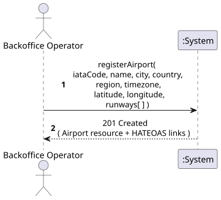
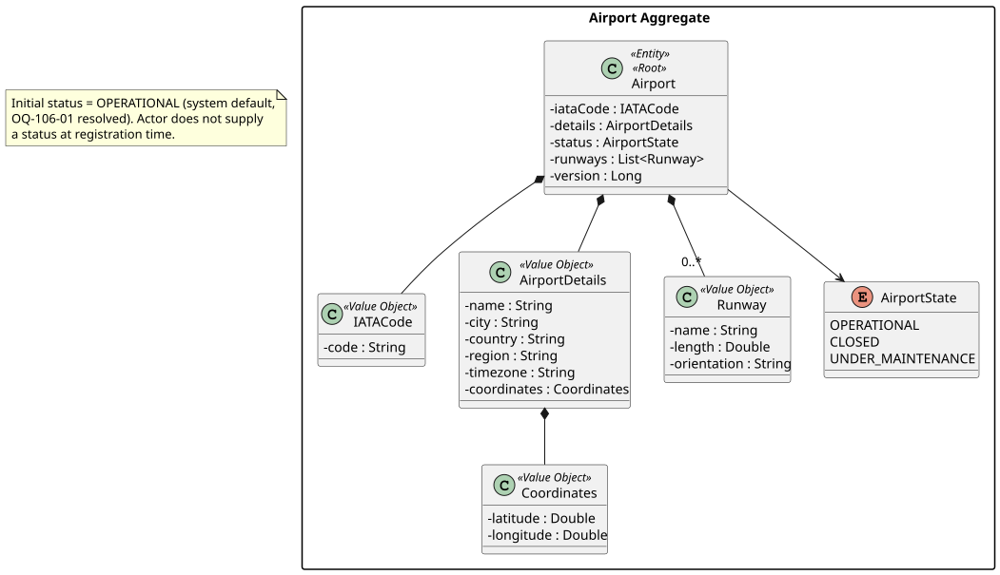
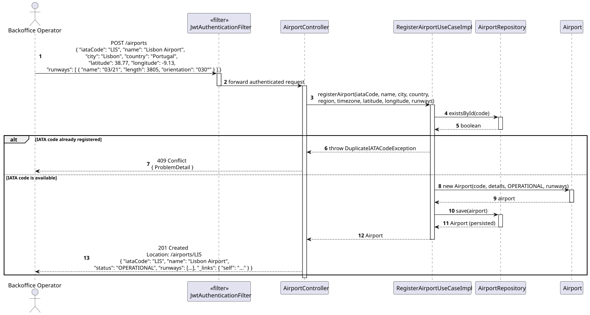
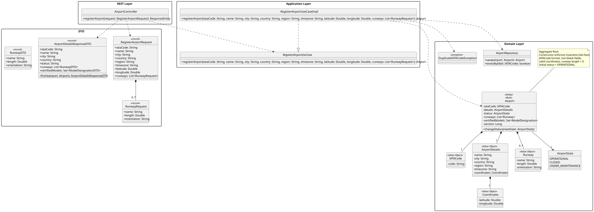

# US106 - Register Airport

## 1. Requirements Engineering

_This section captures the User Story description, requirements specification, acceptance criteria,
dependencies, input/output data, and a high-level Actor-System interaction._

### 1.1. User Story Description

> As a **Backoffice Operator**, I want to register an airport with details including IATA code, name,
> city, country, timezone, coordinates, and runway information (name, length, orientation, …).

### 1.2. Customer Specifications and Clarifications

_No direct customer clarification exists for US106 in the forum QA log._

**Relevant clarifications from adjacent topics:**

- **[Conversation 008 – US207]** The customer confirmed that facilities (terminals, gates, services)
  should be modelled as structured data. This applies to **Phase 2 (US207)** only. US106 (Phase 1)
  does not include facility registration.
- **[Conversation 011 – US211]** "Region" is a supranational geographic zone (e.g., Europe, North
  America), distinct from country and city. The `AirportDetails` value object includes a `region`
  field; it is not required by US106 but is part of the Airport aggregate.

**Interpretation:**

US106 covers the **initial registration** of an Airport with its core identifying and geographic
data. Facilities (US207), contacts (US208), and photos (US207) are out of scope for this US and
belong to Phase 2.

> **✅ RESOLVED (OQ-106-01):** Initial `AirportStatus` defaults to `OPERATIONAL` (system default).
> The actor does not supply a status at registration time.

> **✅ RESOLVED (OQ-106-02):** At least one `Runway` is mandatory at registration time.
> Enforced via `@NotEmpty` on the `runways` field of `RegisterAirportRequest`.

### 1.3. Acceptance Criteria

**Standard (from assignment §5 — apply to all user stories):**

- AC1: Analysis and design documentation (domain model excerpt, design justification, sequence
  diagram when necessary, unit tests).
- AC2: OpenAPI specification provided.
- AC3: Postman collection with sample requests and automated tests.
- AC4: Proper handling of concurrent access.
- AC5: Error handling with appropriate HTTP status codes and meaningful error messages.
- AC6: Input validation for all API endpoint parameters.
- AC7: Security considerations — authentication, authorisation, and data protection enforced.

**Domain-specific acceptance criteria:**

- AC8: The `IATACode` must be exactly **3 uppercase alphabetic characters** (IATA standard,
  assignment §9). Any other format must return HTTP 400 Bad Request.
- AC9: The `IATACode` must be **unique** in the system. A second registration attempt with the same
  IATA code must be rejected with HTTP 409 Conflict.
- AC10: All mandatory fields (IATA code, name, city, country, timezone, coordinates) must be
  present; absence of any required field returns HTTP 400 Bad Request.
- AC11: Runway information must include at minimum a **name**, a **length** (positive numeric value,
  in metres), and an **orientation** string. Invalid values return HTTP 400.
- AC12: The newly registered Airport is returned in the response body with **HTTP 201 Created** and
  a HATEOAS self-link to the airport resource (NFR §3.6.1).
- AC13: Only authenticated users with the **Backoffice Operator** role may invoke this operation
  (HTTP 401 if unauthenticated, HTTP 403 if wrong role).

### 1.4. Found out Dependencies

| Dependency | Type | Reason |
|:---|:---|:---|
| WP#0A – Bootstrap | Prerequisite | Backoffice Operator credentials must exist before this US can be invoked. |
| US106a – Add Airport Certification | Successor | Certifying an aircraft model requires the airport to exist. |
| US107 – View Airport Details | Successor | Viewing airport details requires the airport to exist. |
| US109 – Update Airport Status | Successor | Updating status requires the airport to exist. |
| US110 – Create Flight Route (WP#3A) | Consumer | Routes reference airports by IATA code; airports must be registered first. |

### 1.5. Input and Output Data

**Input — typed by actor:**

| Field | Type | Mandatory | Validation Rule |
|:---|:---|:---:|:---|
| `iataCode` | String | ✅ | Exactly 3 uppercase letters; system-unique |
| `name` | String | ✅ | Non-empty |
| `city` | String | ✅ | Non-empty |
| `country` | String | ✅ | Non-empty |
| `region` | String | ❌ | Supranational zone (e.g., Europe, North America) |
| `timezone` | String | ✅ | Valid timezone identifier (e.g., `Europe/Lisbon`) |
| `latitude` | Double | ✅ | Range \[−90, 90\] |
| `longitude` | Double | ✅ | Range \[−180, 180\] |
| `runways` | List | ✅ (TBC — OQ-106-02) | One or more runway entries |
| `runway.name` | String | ✅ | Non-empty |
| `runway.length` | Double | ✅ | Positive number (metres) |
| `runway.orientation` | String | ✅ | Non-empty (e.g., "09L/27R") |

**Output:**

| Scenario | HTTP Status | Body |
|:---|:---:|:---|
| Successful registration | 201 Created | Full Airport representation + HATEOAS links |
| Validation failure | 400 Bad Request | Error message describing the invalid field(s) |
| Unauthenticated | 401 Unauthorized | — |
| Wrong role | 403 Forbidden | — |
| IATA code already registered | 409 Conflict | Error message |

### 1.6. System Sequence Diagram (SSD)

_High-level Actor-System interaction for US106._

_PlantUML source: [US106-SSD.puml](puml/US106-SSD.puml)_

### 1.7. Other Relevant Remarks

- **Data validation constraint:** IATA code validation (3-letter format) is explicitly required by
  the assignment (§9, Important Notes — Data Validation).
- **Coordinates:** `Coordinates` is defined in the glossary ("Geographic location (latitude and
  longitude) of an airport") and required by US106. It has been added to the domain model as a
  dedicated `Coordinates <<Value Object>>` (attributes: `latitude : Double`, `longitude : Double`)
  composed directly into the `Airport` aggregate.
- **Frequency:** Airport registration is a low-frequency administrative operation.
- **Diagram conventions:** All diagrams in this US (SSD, SD, CD) follow the project-wide conventions in [diagram-conventions.md](../diagram-conventions.md), including the authorization matrix, JSON-literal arrow style, and exception-propagation patterns.

---

## 2. Analysis

### 2.1. Relevant Domain Model Excerpt

The following classes from the **Airport Aggregate** are directly involved in this US:

| Class | Stereotype | Role in this US |
|:---|:---|:---|
| `Airport` | Entity, Aggregate Root | The primary aggregate being created. Its identity is the `IATACode`. |
| `IATACode` | Value Object | Encapsulates and validates the 3-letter IATA identifier. |
| `AirportDetails` | Value Object | Holds descriptive data: name, city, country, region, timezone. |
| `AirportStatus` | Value Object | Operational state. Initial value: `OPERATIONAL` (system default — OQ-106-01 resolved). |
| `Runway` | Value Object | Name, length, orientation of a landing strip. |
| `Coordinates` | Value Object | Latitude and longitude of the airport. |

_PlantUML source: [US106-DM.puml](puml/US106-DM.puml)_

### 2.2. Other Remarks

Both `Runway` and `Coordinates` are now present in the Airport aggregate in `DM.puml`:
- `Runway <<Value Object>>` — attributes: `name : String`, `length : Double`, `orientation : String`
- `Coordinates <<Value Object>>` — attributes: `latitude : Double`, `longitude : Double`

No outstanding domain model inconsistencies for this US.

---

## 3. Design — User Story Realization

### 3.1. Rationale

**Grounds on SSD interactions and identified input/output data.**

| Interaction ID | Question: Which class is responsible for… | Answer | Justification (with patterns) |
|:---|:---|:---|:---|
| Step 1 | Receiving the HTTP request and parsing/validating the DTO? | `AirportController` | Controller layer — translates HTTP to application-layer calls; responsible for HTTP-level input validation (`@Valid`). |
| Step 2 | Orchestrating the use case, checking IATA uniqueness, and invoking the domain? | `RegisterAirportUseCaseImpl` | Application layer (Pure Fabrication) — coordinates domain objects and repository without encoding business rules. |
| Step 3 | Enforcing business invariants (IATA format, coordinate ranges, runway validity) and creating the Airport aggregate? | `Airport` domain entity | Domain layer — invariants belong to the Aggregate Root to avoid an anemic domain model (slide "Anemic Domain Model", 1_Intro_Base_Design_Principles). |
| Step 4 | Verifying IATA code uniqueness across all persisted airports? | `AirportRepository.existsById()` | Repository — queries for an existing Airport by `IATACode` before accepting the new one. |
| Step 5 | Persisting the new Airport aggregate? | `AirportRepository.save()` | Repository abstraction — decouples domain from persistence technology. |

#### HTTP Method Decision — POST vs PUT

The slide "Create User Account" (6_REST) notes that when the **client supplies the resource identifier**, `PUT /airports/{iataCode}` is semantically defensible because the operation is idempotent (registering LIS twice produces the same state).

**Decision: `POST /airports` is used.** Justification:

1. **Collection semantics** — `POST` to a collection is the idiomatic REST pattern for "add a member to this collection". The IATA code is part of the body, not a pre-determined URI segment chosen by the client.
2. **Non-idempotency is correct** — registering the same IATA twice should fail (409), which aligns with `POST` not being idempotent. Using `PUT` would set an expectation of idempotency that we deliberately reject.
3. **Location header** — the `201 Created` response includes a `Location: /airports/{iataCode}` header, which gives the client the canonical URI of the new resource — achieving the same discoverability benefit of `PUT` without its semantic baggage.

If the business requirement changes so that registering an airport is idempotent (same data → update existing), switching to `PUT /airports/{iataCode}` would be the correct move.

### Systematization

Conceptual classes promoted to software classes:

- `Airport`
- `IATACode`
- `AirportDetails`
- `Runway`
- `Coordinates`
- `AirportState`

Pure Fabrication (software-only) classes:

- `AirportController`
- `RegisterAirportUseCaseImpl`
- `AirportRepository` (interface, domain layer)
- `RegisterAirportRequest` (input DTO)
- `AirportDetailsResponseDTO` (output DTO)

### 3.2. Sequence Diagram (SD)

_PlantUML source: [US106-SD.puml](puml/US106-SD.puml)_

### 3.3. Class Diagram (CD)

_PlantUML source: [US106-CD.puml](puml/US106-CD.puml)_

---

## 4. Tests

### 4.1. Unit Tests — Domain

**`IATACodeTest`** (`src/test/…/domain/airport/IATACodeTest.java`):

- `valid_iata_code_is_accepted` — 3-letter uppercase codes pass construction.
- `iata_code_rejects_non_three_letters` — codes with length ≠ 3 throw `IllegalArgumentException`.
- `iata_code_rejects_lowercase` — mixed-case codes are rejected.
- `iata_code_rejects_digits` — non-alphabetic characters are rejected.
- `iata_codes_are_equal_when_code_matches` — value-equality semantics verified.

**`AirportTest`** (`src/test/…/domain/airport/AirportTest.java`):

- `airport_is_created_with_operational_status` — initial status defaults to `OPERATIONAL`.
- `airport_cannot_be_created_with_null_iata` — null `IATACode` throws.
- `airport_cannot_be_created_with_null_details` — null `AirportDetails` throws.
- `can_add_new_certification` — `addCertification()` adds a `ModelDesignation` to the set.
- `cannot_add_duplicate_certification` — duplicate throws `ModelAlreadyCertifiedException`.
- `can_change_status_to_valid_transition` — `changeStatus(CLOSED)` from `OPERATIONAL` succeeds.
- `cannot_change_status_to_invalid_transition` — same state throws `InvalidStatusTransitionException`.

### 4.2. Unit Tests — Use Case

**`RegisterAirportUseCaseImplTest`** (`src/test/…/usecases/airport/RegisterAirportUseCaseImplTest.java`):

- `registers_airport_successfully` — when IATA code is unique, `save()` is called and the result is returned.
- `throws_duplicate_when_iata_already_exists` — when code already exists, `DuplicateIATACodeException` is thrown and `save()` is never called.

### 4.3. Slice Tests — Controller

**`AirportControllerTest`** (`src/test/…/api/airport/AirportControllerTest.java`):

- `post_airport_returns_201` — valid request with `BACKOFFICE_OPERATOR` role returns 201.
- `post_airport_returns_409_on_duplicate` — duplicate IATA maps to 409.
- `post_airport_returns_401_without_token` — unauthenticated request returns 401.
- `post_airport_returns_403_for_wrong_role` — `ATCC` role returns 403.

## 5. Construction (Implementation)

### 5.1. Classes Created / Modified

| Class | Package | Type | Role |
|:---|:---|:---|:---|
| `AirportController` | `api.airport` | Spring `@RestController` | Exposes `POST /airports`; delegates to use case; builds HATEOAS response. |
| `RegisterAirportRequest` | `api.airport.dto` | Java `record` | Input DTO; `@Valid` Bean Validation annotations enforce mandatory fields and format rules. |
| `AirportDetailsResponseDTO` | `api.airport.dto` | Java `record` | Output DTO; `from(Airport)` static factory method maps the aggregate. |
| `RunwayDTO` / `RunwayRequest` | `api.airport.dto` | Java `record` | Runway input (request) and output (response) representations. |
| `RegisterAirportUseCase` | `usecases.airport.register` | Interface | Application-layer contract. |
| `RegisterAirportUseCaseImpl` | `usecases.airport.register` | `@Service` | Checks uniqueness via `existsById`, creates `Airport`, persists, returns aggregate. |
| `Airport` | `domain.airport` | `@Entity` | Aggregate root; `@EmbeddedId` on `IATACode`; `@ElementCollection` for runways. |
| `IATACode` | `domain.airport` | `@Embeddable` VO | Enforces 3-letter regex; used as JPA `@EmbeddedId`. |
| `AirportDetails` | `domain.airport` | `@Embeddable` VO | Name, city, country, region, timezone, coordinates. |
| `Coordinates` | `domain.airport` | `@Embeddable` VO | Latitude/longitude; embedded inside `AirportDetails`. |
| `Runway` | `domain.airport` | `@Embeddable` VO | Name, length, orientation; stored in `airport_runways` collection table. |
| `AirportState` | `domain.airport` | `enum` | Three states: `OPERATIONAL`, `CLOSED`, `UNDER_MAINTENANCE`; each implements `canTransitionTo`. |
| `AirportRepository` | `domain.airport` | `JpaRepository` interface | Spring Data generates implementation; `searchByCriteria` is a custom JPQL query. |
| `DuplicateIATACodeException` | `domain.airport.exceptions` | `RuntimeException` | Thrown when an airport with the same IATA code already exists. |
| `GlobalExceptionHandler` | `api` | `@RestControllerAdvice` | Maps exceptions to RFC 9457 `ProblemDetail` responses: 409 for duplicate, 400 for validation. |
| `Bootstrapper` | root package | `CommandLineRunner` | Seeds three Portuguese airports (LIS, OPO, FAO) and four system users on first startup. |

### 5.2. Key Design Decisions

- **`@EmbeddedId`** — `IATACode` is a Value Object persisted as the primary key of `airports`, consistent with DDD "Value Objects in the Database" guidance.
- **Initial status** — `OPERATIONAL` is the default when no status is provided at construction (resolves OQ-106-01: system default).
- **At least one runway** — `RegisterAirportRequest` applies `@NotEmpty` on the runways list (resolves OQ-106-02: at least one runway is mandatory).
- **HATEOAS** — `AirportController.buildDetailModel()` generates typed links via `WebMvcLinkBuilder`: `self`, `update-status`, `add-certification`, `search`.
- **OpenAPI** — `@Operation` / `@ApiResponse` annotations on each handler method; Springdoc generates the spec at `/v3/api-docs`.

---

## 6. Integration and Demo

### 6.1. Prerequisites

1. Start the application (`mvn spring-boot:run` or run from IDE).
2. The `Bootstrapper` seeds LIS, OPO, FAO airports and four users on first startup.

### 6.2. Postman Steps

Use the collection at `docs/postman/AISafe.postman_collection.json` with environment `AISafe Local` (base URL `http://localhost:8080`).

1. **Authenticate** — run _Auth → Login (backoffice)_. The test script stores the token in `{{jwtToken}}`.
2. **Register a new airport** — run _WP#2A Airports → US106 — Register Airport (201)_. Expects HTTP 201 and `iataCode = TST` in the response.
3. **Duplicate rejection** — run _US106 — Register Duplicate (409)_. Attempts to register `LIS` again; expects HTTP 409.

### 6.3. OpenAPI

Swagger UI is available at `http://localhost:8080/swagger-ui.html`. The `POST /airports` endpoint is documented under the **Airports** tag.

---

## 7. Observations

- OQ-106-01 resolved: initial status defaults to `OPERATIONAL`.
- OQ-106-02 resolved: at least one runway is mandatory (`@NotEmpty`).
- HATEOAS links are included in the Airport resource representation per NFR §3.6.1.
- OpenAPI specification is generated by Springdoc at `/v3/api-docs`; Swagger UI at `/swagger-ui.html`.
