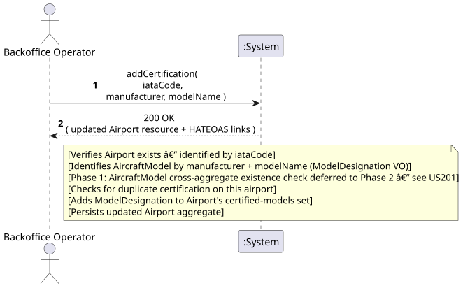
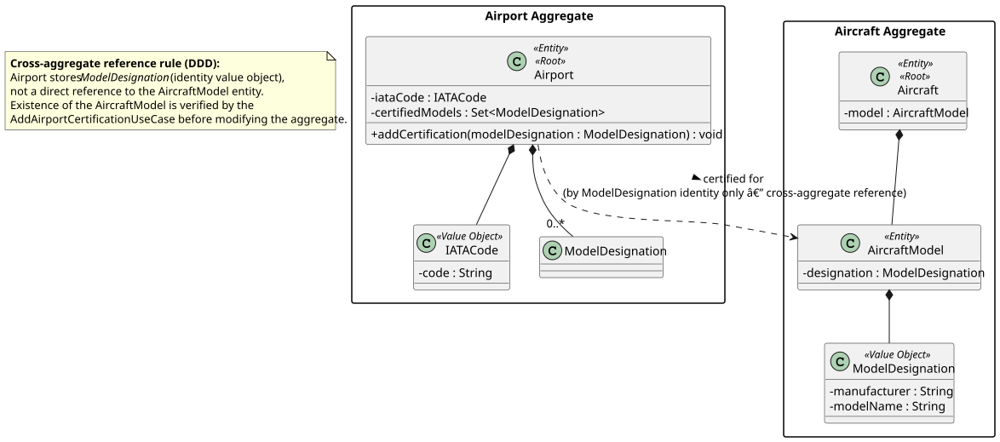
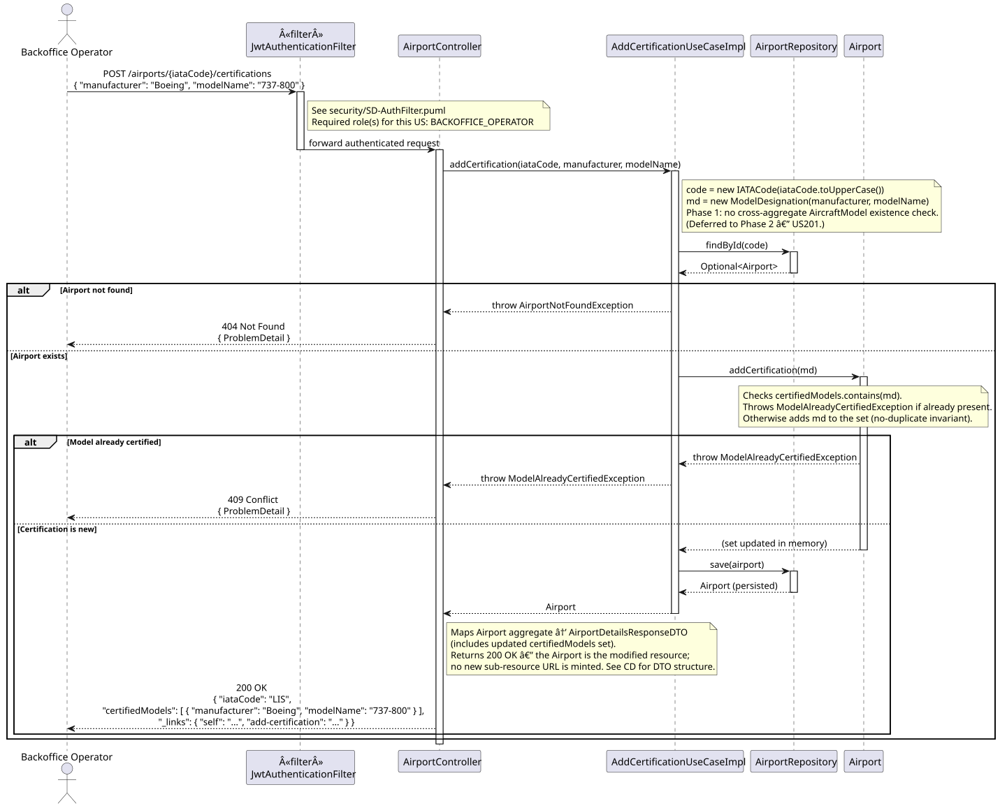
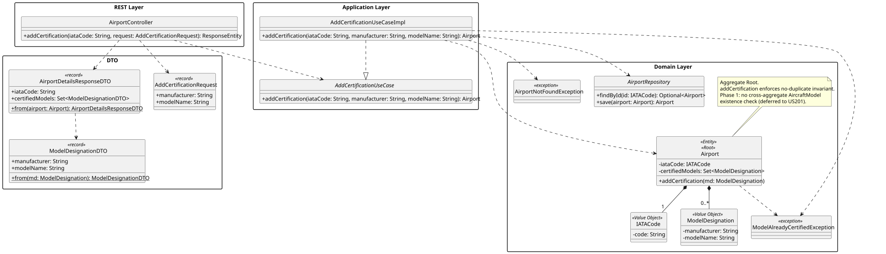

# US106a - Add Airport Certification

## 1. Requirements Engineering

### 1.1. User Story Description

> As a **Backoffice Operator** or **ATCC**, I want to add an airplane certification to the airport,
> indicating that a particular airplane model can fly to/from the airport.

### 1.2. Customer Specifications and Clarifications

_No direct customer clarification exists for US106a in the forum QA log._

### 1.3. Acceptance Criteria

- AC1: The Airport identified by the given IATA code must exist; otherwise HTTP 404 Not Found.
- AC2: The AircraftModel identified by the provided identifier must exist; otherwise HTTP 404 Not
  Found.
- AC3: Duplicate certifications (same Airport + same AircraftModel) must be rejected with HTTP 409
  Conflict (pending final decision on OQ-106a-04).
- AC4: Successful certification returns **HTTP 201 Created** with the certification representation
  and HATEOAS links.
- AC5: Both **Backoffice Operator** and **ATCC** roles are authorised. Other roles receive HTTP 403.

### 1.4. Found out Dependencies

| Dependency | Type | Reason |
|:---|:---|:---|
| US106 – Register Airport | Prerequisite | The Airport must exist before certifications can be added to it. |
| US101 – Register Aircraft Model (WP#1A) | Prerequisite | The AircraftModel must be registered before it can be certified at any airport. |
| US107 – View Airport Details | Consumer | Airport details view should include the list of certified aircraft models. |

### 1.5. Input and Output Data

**Input — typed/selected by actor:**

| Field | Type | Mandatory | Validation Rule |
|:---|:---|:---:|:---|
| `iataCode` | String (path param) | YES | Existing Airport IATA code (3 uppercase letters) |
| `aircraftModelId` | String/ID (body) | YES | Identifier of an existing AircraftModel (format TBC — OQ-106a-01) |

**Output:**

| Scenario | HTTP Status | Body |
|:---|:---:|:---|
| Successful certification | 201 Created | Certification record + HATEOAS links |
| Validation failure | 400 Bad Request | Error message |
| Unauthenticated | 401 Unauthorized | — |
| Wrong role | 403 Forbidden | — |
| Airport not found | 404 Not Found | Error message |
| AircraftModel not found | 404 Not Found | Error message |
| Duplicate certification | 409 Conflict | Error message |

### 1.6. System Sequence Diagram (SSD)

_High-level Actor-System interaction for US106a._

_PlantUML source: [US106a-SSD.puml](puml/US106a-SSD.puml)_

### 1.7. Other Relevant Remarks

- **Cross-aggregate operation:** This US spans two aggregate boundaries — the `Airport` aggregate
  and the `AircraftModel` aggregate. Per DDD principles, the Airport aggregate stores only the
  **identity** of the AircraftModel (not the full object). The `AddAirportCertificationUseCase`
  is responsible for verifying the existence of the referenced AircraftModel before modifying the
  Airport aggregate.

---

## 2. Analysis

### 2.1. Relevant Domain Model Excerpt

| Class | Stereotype | Role in this US |
|:---|:---|:---|
| `Airport` | Entity, Aggregate Root | The aggregate being modified; identified by `IATACode`. |
| `IATACode` | Value Object | Identity of the Airport aggregate. |
| `AircraftModel` | Entity, Aggregate Root *(external aggregate)* | The model being certified; **referenced by identity only** from within the Airport aggregate. |
| `ModelDesignation` | Value Object | Identity of the AircraftModel (manufacturer + model name) — the cross-aggregate reference key. |

**Cross-aggregate reference:** The domain model states `Airport --> AircraftModel : certified for`.
In a DDD-consistent implementation, the Airport aggregate must store a set of `ModelDesignation`
value objects (identities), **not** direct references to `AircraftModel` instances.

_PlantUML source: [US106a-DM.puml](puml/US106a-DM.puml)_

### 2.2. Other Remarks

**Glossary gap:** "Airport Certification" (or "Aircraft Certification") as a named domain concept
is absent from the glossary. The current model represents this as an unlabelled association. If
the concept gains its own lifecycle (creation, listing, revocation), it should become a named Value
Object within the Airport aggregate and receive a glossary entry.

**DDD cross-aggregate pattern:** To preserve aggregate boundaries, the use case layer must:
1. Resolve the AircraftModel's existence via `AircraftModelRepository`.
2. Pass the AircraftModel's identity (e.g., `ModelDesignation`) to the Airport aggregate method.
3. The Airport entity enforces the no-duplicate invariant on its internal certified-models
   collection.

---

## 3. Design — User Story Realization

### 3.1. Rationale

| Interaction ID | Question: Which class is responsible for… | Answer | Justification (with patterns) |
|:---|:---|:---|:---|
| Step 1 | Receiving the HTTP POST request? | `AirportRestController` | Controller layer translates HTTP to a use-case call. |
| Step 2 | Verifying the Airport exists and orchestrating the operation? | `AddAirportCertificationUseCase` | Application layer (Pure Fabrication) — coordinates cross-aggregate lookup without encoding domain business rules. |
| Step 3 | Verifying the AircraftModel exists (cross-aggregate)? | `AircraftModelRepository` | Repository for the external aggregate, queried by the use case. |
| Step 4 | Enforcing the no-duplicate invariant and recording the certification? | `Airport` domain entity | Domain layer — the Aggregate Root manages its own collection of certified models and enforces its invariants. |
| Step 5 | Persisting the updated Airport aggregate? | `AirportRepository` | Repository saves the modified aggregate. |

### Systematization

Conceptual classes promoted to software classes:

- `Airport`
- `IATACode`
- `ModelDesignation` *(cross-aggregate reference identity)*

Pure Fabrication (software-only) classes:

- `AirportRestController`
- `AddAirportCertificationUseCase`
- `AirportRepository` (interface)
- `AircraftModelRepository` (interface — cross-aggregate existence check)
- `AddCertificationRequest` (input DTO)
- `CertificationResponseDTO` (output DTO)

### 3.2. Sequence Diagram (SD)

_PlantUML source: [US106a-SD.puml](puml/US106a-SD.puml)_

### 3.3. Class Diagram (CD)

_PlantUML source: [US106a-CD.puml](puml/US106a-CD.puml)_

---

## 4. Tests

### 4.1. Unit Tests — Domain

**`AirportTest`** (`src/test/…/domain/airport/AirportTest.java`):

- `can_add_new_certification` — `addCertification()` adds a `ModelDesignation` to the `certifiedModels` set.
- `cannot_add_duplicate_certification` — adding the same `ModelDesignation` twice throws `ModelAlreadyCertifiedException`.

### 4.2. Unit Tests — Use Case

No dedicated use-case test class for US106a in Phase 1 (the logic is tested indirectly via the domain test above and via the controller slice test).

### 4.3. Slice Tests — Controller

**`AirportControllerTest`** — tests for `POST /airports/{iataCode}/certifications`:

- Verify 201 is returned when the airport exists and the model is not yet certified.
- Verify 409 is returned when the same model is submitted again.
- Verify 404 is returned when the airport does not exist (via `AirportNotFoundException`).

---

## 5. Construction (Implementation)

### 5.1. Classes Created / Modified

| Class | Package | Type | Role |
|:---|:---|:---|:---|
| `AirportController` | `api.airport` | Spring `@RestController` | Exposes `POST /airports/{iataCode}/certifications`; returns 201 with updated Airport representation. |
| `AddCertificationRequest` | `api.airport.dto` | Java `record` | Input DTO with `manufacturer` and `modelName` fields. |
| `ModelDesignationDTO` | `api.airport.dto` | Java `record` | Output representation of a `ModelDesignation` VO. |
| `AddCertificationUseCase` | `usecases.airport.addcertification` | Interface | Application-layer contract. |
| `AddCertificationUseCaseImpl` | `usecases.airport.addcertification` | `@Service` | Loads Airport, constructs `ModelDesignation`, delegates to `Airport.addCertification()`, saves. |
| `Airport.addCertification()` | `domain.airport` | Domain method | Enforces no-duplicate invariant; throws `ModelAlreadyCertifiedException`. |
| `ModelDesignation` | `domain.shared` | `@Embeddable` VO | Cross-aggregate identity reference (manufacturer + modelName); stored in `airport_certified_models`. |
| `ModelAlreadyCertifiedException` | `domain.airport.exceptions` | `RuntimeException` | Thrown by domain when certification already exists → mapped to 409. |

### 5.2. Key Design Decisions

- **Phase 1 simplification:** OQ-106a-01 resolved by using `ModelDesignation` (manufacturer + modelName) as the identifier. No cross-aggregate check against a separate `AircraftModel` repository is performed in Phase 1 — the domain simply stores the identity reference.
- **No-duplicate enforcement in the domain** — `Airport.addCertification()` checks `certifiedModels.contains(modelDesignation)` before adding. The invariant lives in the Aggregate Root, not in the use case.
- **Response** — returns the full updated `AirportDetailsResponseDTO` (same as US107 response), including the updated `certifiedModels` set and HATEOAS links.

---

## 6. Integration and Demo

### 6.1. Prerequisites

1. Application running (`mvn spring-boot:run`).
2. Authenticated as `backoffice` / `backoffice123` (token stored in `{{jwtToken}}`).
3. Airport `LIS` already exists (bootstrapped automatically).

### 6.2. Postman Steps

1. **Authenticate** — run _Auth → Login (backoffice)_.
2. **Add certification** — run _US106a — Add Certification LIS (201)_. Sends `{"manufacturer":"Airbus","modelName":"A320"}` to `POST /airports/LIS/certifications`. Expects HTTP 201 and `certifiedModels.length > 0`.
3. **Duplicate rejection** — run _US106a — Duplicate Certification (409)_. Same body; expects HTTP 409.

### 6.3. OpenAPI

`POST /airports/{iataCode}/certifications` is documented under the **Airports** tag in Swagger UI at `http://localhost:8080/swagger-ui.html`.

---

## 7. Observations

- OQ-106a-01 resolved: `ModelDesignation` (manufacturer + modelName) is the certification key in Phase 1.
- OQ-106a-04 resolved: duplicate certification is rejected with HTTP 409 (not idempotent).
- OQ-106a-02 and OQ-106a-03 (runway compatibility check and revocation) are deferred to Phase 2.
- HATEOAS links included per NFR §3.6.1.
