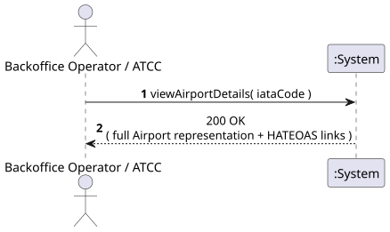
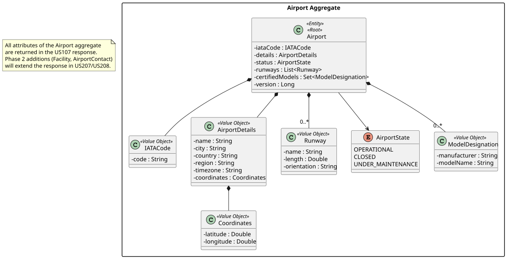
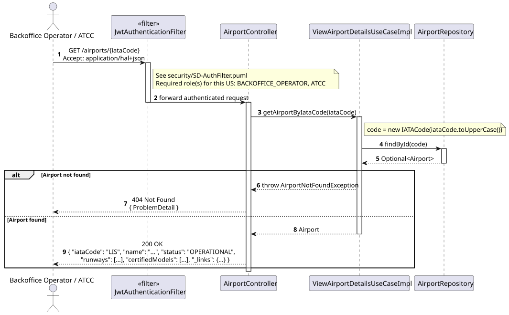
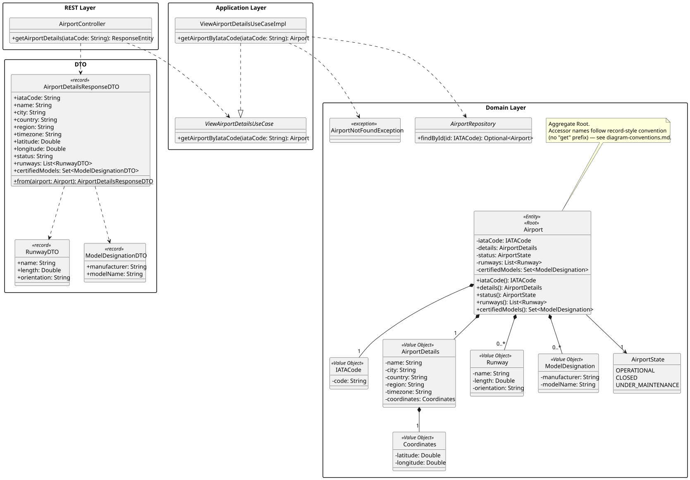

# US107 - View Airport Details

## 1. Requirements Engineering

_This section captures the User Story description, requirements specification, acceptance criteria,
dependencies, input/output data, and a high-level Actor-System interaction._

### 1.1. User Story Description

> As a **Backoffice Operator** or **ATCC**, I want to view an airport's details given its IATA code.

### 1.2. Customer Specifications and Clarifications

_No direct customer clarification exists for US107 in the forum QA log._

**Relevant clarifications from adjacent topics:**

- **[Conversation 008 – US207]** Facilities (terminals, gates, services) are **Phase 2** data
  (US207). In Phase 1, the airport details view does not include facility information.
- **[Conversation 014 – US208]** Contact information (type, value, description per contact) is
  **Phase 2** data (US208). In Phase 1, the airport details view does not include contacts.
- **[Conversation 011 – US211]** Region is a supranational concept included in `AirportDetails`
  and therefore visible in the details response.

**Interpretation:**

US107 is a **pure query** operation. The system retrieves a single Airport aggregate by its IATA
code and returns its current state, including all Phase 1 attributes (IATA code, details,
coordinates, runways, operational status, certified aircraft models). Phase 2 attributes
(facilities, contacts, photos) will extend the response once implemented in US207/US208.

### 1.3. Acceptance Criteria

**Standard (from assignment §5 — apply to all user stories):**

- AC1: Analysis and design documentation (domain model excerpt, design justification, sequence
  diagram when necessary, unit tests).
- AC2: OpenAPI specification provided.
- AC3: Postman collection with sample requests and automated tests.
- AC4: Error handling with appropriate HTTP status codes and meaningful error messages.
- AC5: Input validation for all API endpoint parameters.
- AC6: Security considerations enforced.

**Domain-specific acceptance criteria:**

- AC7: The IATA code provided must be exactly 3 uppercase letters; any other format returns
  HTTP 400 Bad Request.
- AC8: If no Airport with the given IATA code exists, return **HTTP 404 Not Found**.
- AC9: The response **must include** all registered Phase 1 attributes: IATA code, name, city,
  country, region, timezone, coordinates (latitude/longitude), operational status, list of runways
  (name, length, orientation per runway), and list of certified aircraft models.
- AC10: Response includes **HATEOAS links** (self, and links to related operations such as update
  status and add certification).
- AC11: Both **Backoffice Operator** and **ATCC** roles are authorised. Unauthenticated requests
  return HTTP 401; other roles return HTTP 403.

### 1.4. Found out Dependencies

| Dependency | Type | Reason |
|:---|:---|:---|
| US106 – Register Airport | Prerequisite | Airport must exist to be viewed. |
| US106a – Add Airport Certification | Optional predecessor | Certifications appear in the details response; US107 reveals whatever certifications exist at query time. |

_US107 is a query — no state change occurs; no other US depends on its execution._

### 1.5. Input and Output Data

**Input — selected/typed by actor:**

| Field | Type | Mandatory | Validation Rule |
|:---|:---|:---:|:---|
| `iataCode` | String (path parameter) | ✅ | Exactly 3 uppercase letters |

**Output:**

| Scenario | HTTP Status | Body |
|:---|:---:|:---|
| Airport found | 200 OK | Full Airport representation + HATEOAS links |
| Invalid IATA format | 400 Bad Request | Error message |
| Unauthenticated | 401 Unauthorized | — |
| Wrong role | 403 Forbidden | — |
| Airport not found | 404 Not Found | Error message |

_Full Airport representation includes: iataCode, name, city, country, region, timezone, latitude,
longitude, status, runways[ ], certifiedModels[ ], _links{ }._

### 1.6. System Sequence Diagram (SSD)

_High-level Actor-System interaction for US107._

_PlantUML source: [US107-SSD.puml](puml/US107-SSD.puml)_

### 1.7. Other Relevant Remarks

- **Read-only operation:** No state change occurs; concurrent-access handling is not required for
  this US specifically (reads do not conflict under standard isolation levels).
- **Phase 2 extensibility:** The response DTO should be designed so that Phase 2 attributes
  (facilities from US207, contacts from US208) can be added to the JSON representation without
  breaking existing consumers.
- **Domain model dependency:** `Runway` and `Coordinates` are now part of the Airport aggregate
  in `DM.puml` and will be included in the response returned by this US.
- **Diagram conventions:** All diagrams in this US (SSD, SD, CD) follow the project-wide conventions in [diagram-conventions.md](../diagram-conventions.md), including the authorization matrix, JSON-literal arrow style, and no-get accessor naming for domain classes.

---

## 2. Analysis

### 2.1. Relevant Domain Model Excerpt

All classes within the Airport aggregate are relevant to this US, as the response exposes the
full aggregate state.

| Class | Stereotype | Role in this US |
|:---|:---|:---|
| `Airport` | Entity, Aggregate Root | The aggregate being retrieved; identified by `IATACode`. |
| `IATACode` | Value Object | The lookup key provided by the actor. |
| `AirportDetails` | Value Object | Descriptive data returned: name, city, country, region, timezone. |
| `AirportStatus` | Value Object | Current operational state returned. |
| `Runway` | Value Object | List of runways returned (name, length, orientation). |
| `Coordinates` | Value Object | Latitude/longitude returned. |
| `ModelDesignation` | Value Object *(cross-ref)* | Identities of certified aircraft models returned. |

_PlantUML source: [US107-DM.puml](puml/US107-DM.puml)_

### 2.2. Other Remarks

Both `Runway` and `Coordinates` are now present in the Airport aggregate in `DM.puml`. No
outstanding domain model inconsistencies affect this US.

---

## 3. Design — User Story Realization

### 3.1. Rationale

| Interaction ID | Question: Which class is responsible for… | Answer | Justification (with patterns) |
|:---|:---|:---|:---|
| Step 1 | Receiving the HTTP GET request and extracting the IATA code path parameter? | `AirportRestController` | Controller layer handles HTTP concerns. |
| Step 2 | Orchestrating the query — finding the airport by IATA code? | `ViewAirportDetailsUseCase` | Application layer (Pure Fabrication) — no domain invariant needs enforcing for a pure read; the use case simply delegates to the repository. |
| Step 3 | Retrieving the Airport aggregate from persistent storage by IATA code? | `AirportRepository` | Repository pattern — decouples the application from the persistence technology. |
| Step 4 | Mapping the domain aggregate to the response DTO? | `AirportRestController` (or dedicated Mapper) | Presentation-layer responsibility — keeps the domain model clean of HTTP concerns. |

### Systematization

Conceptual classes promoted to software classes:

- `Airport`
- `IATACode`
- `AirportDetails`
- `AirportStatus`
- `Runway`
- `Coordinates`

Pure Fabrication (software-only) classes:

- `AirportRestController`
- `ViewAirportDetailsUseCase`
- `AirportRepository` (interface)
- `AirportDetailsResponseDTO` (output DTO)

### 3.2. Sequence Diagram (SD)

_PlantUML source: [US107-SD.puml](puml/US107-SD.puml)_

### 3.3. Class Diagram (CD)

_PlantUML source: [US107-CD.puml](puml/US107-CD.puml)_

---

## 4. Tests

### 4.1. Unit Tests — Use Case

**`ViewAirportDetailsUseCaseImplTest`** (`src/test/…/usecases/airport/ViewAirportDetailsUseCaseImplTest.java`):

- `returns_airport_when_found` — when repository returns an airport, the use case returns it unchanged.
- `throws_not_found_when_absent` — when repository returns `Optional.empty()`, throws `AirportNotFoundException`.

### 4.2. Slice Tests — Controller

**`AirportControllerTest`** (`src/test/…/api/airport/AirportControllerTest.java`):

- `get_airport_returns_200_with_hateoas_links` — 200 response includes `iataCode`, `status`, `_links.self`, `_links.update-status`, `_links.add-certification`.
- `get_airport_atcc_role_is_authorized` — `ATCC` role receives 200.
- `get_airport_returns_404_when_not_found` — `AirportNotFoundException` maps to 404.
- `get_airport_returns_401_without_token` — unauthenticated request returns 401.
- `get_airport_returns_403_for_wrong_role` — `MAINTENANCE_TECHNICIAN` role returns 403.

---

## 5. Construction (Implementation)

### 5.1. Classes Created / Modified

| Class | Package | Type | Role |
|:---|:---|:---|:---|
| `AirportController` | `api.airport` | Spring `@RestController` | Exposes `GET /airports/{iataCode}`; delegates to use case; wraps result in `EntityModel` with HATEOAS links. |
| `AirportDetailsResponseDTO` | `api.airport.dto` | Java `record` | Full Airport representation: iataCode, name, city, country, region, timezone, latitude, longitude, status, runways, certifiedModels. |
| `RunwayDTO` | `api.airport.dto` | Java `record` | Runway representation in the response. |
| `ModelDesignationDTO` | `api.airport.dto` | Java `record` | Certified model representation in the response. |
| `ViewAirportDetailsUseCase` | `usecases.airport.viewdetails` | Interface | Application-layer contract for the read operation. |
| `ViewAirportDetailsUseCaseImpl` | `usecases.airport.viewdetails` | `@Service` | Calls `airportRepository.findById(iataCode)`, throws `AirportNotFoundException` if absent. |
| `AirportNotFoundException` | `domain.airport.exceptions` | `RuntimeException` | Thrown when no airport matches the IATA code → mapped to 404. |
| `GlobalExceptionHandler` | `api` | `@RestControllerAdvice` | Maps `AirportNotFoundException` to `ProblemDetail` with HTTP 404. |

### 5.2. Key Design Decisions

- **HATEOAS links** — `buildDetailModel()` in `AirportController` produces typed links via `WebMvcLinkBuilder`: `self` (GET /airports/{code}), `update-status` (PATCH /airports/{code}/status), `add-certification` (POST /airports/{code}/certifications), `search` (GET /airports).
- **Read-only transaction** — `ViewAirportDetailsUseCaseImpl` is annotated `@Transactional(readOnly = true)` to signal no write intent and enable read-optimisation in the JPA provider.
- **Phase 2 extensibility** — `AirportDetailsResponseDTO` is a `record`; adding Phase 2 fields (facilities, contacts) requires only adding new components to the record without removing existing ones.

---

## 6. Integration and Demo

### 6.1. Prerequisites

1. Application running (`mvn spring-boot:run`).
2. Airport `LIS` is bootstrapped automatically on first startup.

### 6.2. Postman Steps

1. **Authenticate** — run _Auth → Login (backoffice)_ or _Login (atcc)_.
2. **View airport** — run _US107 — View Airport LIS (200)_. Expects HTTP 200 with `iataCode = LIS`, `status`, `runways` array, `_links.self`, and `_links.update-status`.
3. **Not found** — run _US107 — Airport Not Found (404)_. Queries `GET /airports/XXX`; expects HTTP 404.

### 6.3. OpenAPI

`GET /airports/{iataCode}` is documented under the **Airports** tag in Swagger UI at `http://localhost:8080/swagger-ui.html`.

---

## 7. Observations

- `AirportDetailsResponseDTO` is intentionally a `record` to keep the response structure explicit and facilitate Phase 2 extension.
- HATEOAS links include `self`, `update-status`, and `add-certification` per NFR §3.6.1.
- Both `BACKOFFICE_OPERATOR` and `ATCC` roles are authorised; other roles receive 403.
