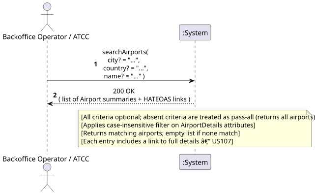
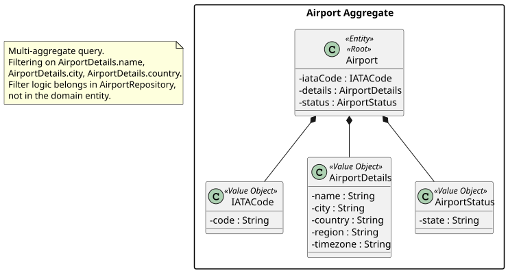
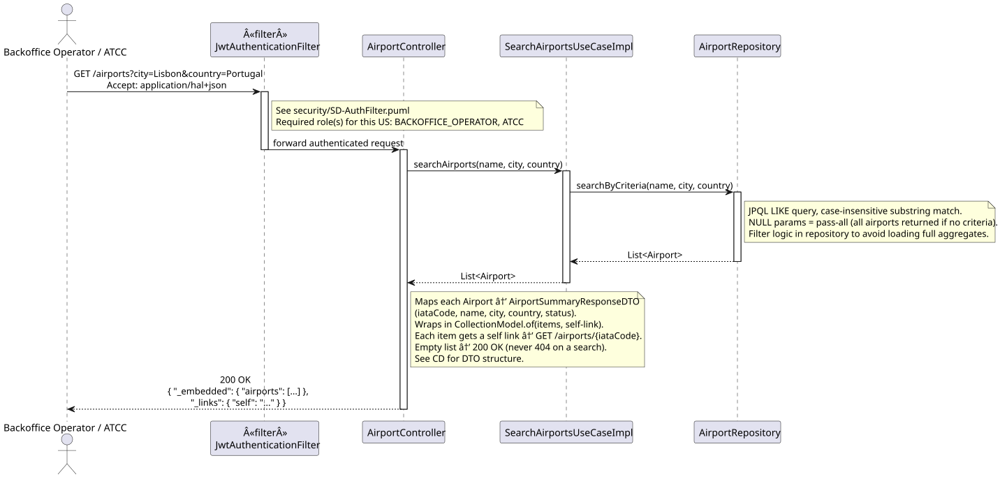
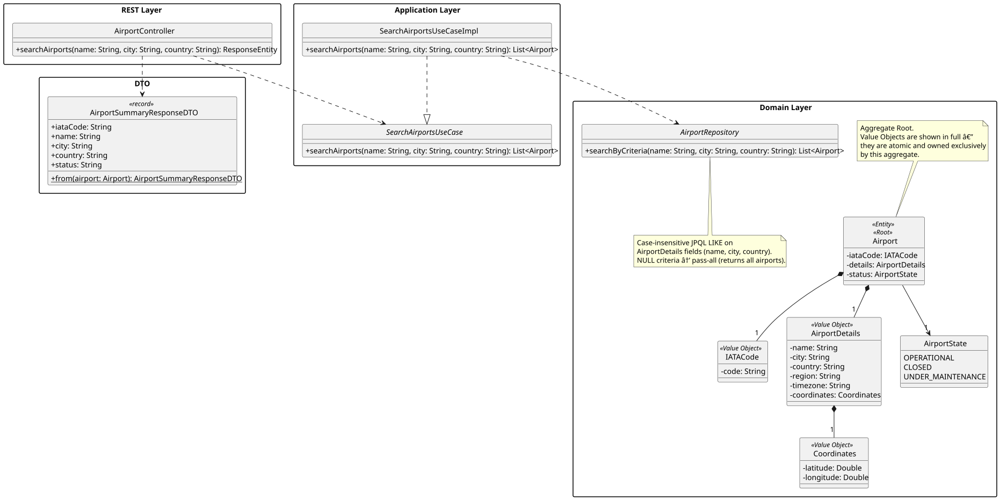

# US108 - Search Airports

## 1. Requirements Engineering

_This section captures the User Story description, requirements specification, acceptance criteria,
dependencies, input/output data, and a high-level Actor-System interaction._

### 1.1. User Story Description

> As an **ATCC**, I want to search for airports by city, country, or name.

### 1.2. Customer Specifications and Clarifications

_No direct customer clarification exists for US108 in the forum QA log._

**Relevant clarifications from adjacent topics:**

- **[Conversation 011 – US211]** "Region" is a supranational concept distinct from country and
  city. US108 searches by city, country, or name — **not by region**. Region-based grouping is a
  Phase 2 feature addressed in US211.

**Interpretation:**

US108 is a **pure query** operation returning a filtered list of Airport aggregates. The search
criteria apply to attributes in `AirportDetails` (city, country, name). All three criteria are
independently optional and combinable. When no criteria are provided, behaviour is subject to
customer clarification (OQ-108-03).

> **✅ RESOLVED (OQ-108-01):** The search uses **case-insensitive substring (LIKE) matching**
> on each criterion. For example, city="Lis" matches "Lisbon". Implemented as a JPQL LIKE
> query on `AirportDetails` fields.

> **⚠️ OPEN QUESTION (OQ-108-02):** Should airports with all `AirportStatus` values (Operational,
> Closed, Under Maintenance) appear in search results, or should Closed airports be excluded by
> default? **Awaiting customer clarification.**

> **✅ RESOLVED (OQ-108-03):** When **no filter criteria** are provided, all airports are returned
> (HTTP 200 with the full collection). The empty-criteria case is treated as pass-all.

### 1.3. Acceptance Criteria

**Standard (from assignment §5 — apply to all user stories):**

- AC1: Analysis and design documentation (domain model excerpt, design justification, sequence
  diagram when necessary, unit tests).
- AC2: OpenAPI specification provided.
- AC3: Postman collection with sample requests and automated tests.
- AC4: Error handling with appropriate HTTP status codes and meaningful error messages.
- AC5: Input validation for all API endpoint parameters.
- AC6: Security considerations enforced.

**Domain-specific acceptance criteria:**

- AC7: At least one search criterion (city, country, or name) must be provided, unless OQ-108-03
  is resolved to allow unrestricted listing.
- AC8: The response is a **list** (possibly empty) of Airport summaries matching the given criteria.
  An empty result set returns HTTP 200 with an empty list, **not** HTTP 404.
- AC9: Response includes **HATEOAS links** — a self-link on the collection, and a detail-link for
  each airport entry (linking to US107).
- AC10: Search is **case-insensitive** (matching behaviour for partial/exact TBD via OQ-108-01).
- AC11: Only the **ATCC** role is authorised. Unauthenticated requests return HTTP 401; other roles
  return HTTP 403.

### 1.4. Found out Dependencies

| Dependency | Type | Reason |
|:---|:---|:---|
| US106 – Register Airport | Prerequisite | Airports must be registered before they can be searched. |
| US211 – View Airports Grouped by Region/Country (Phase 2) | Related | US211 extends airport discovery by grouping; US108 is the Phase 1 base search. |

### 1.5. Input and Output Data

**Input — query parameters (all optional):**

| Field | Type | Mandatory | Validation Rule |
|:---|:---|:---:|:---|
| `city` | String (query param) | ❌ | Non-empty string if provided |
| `country` | String (query param) | ❌ | Non-empty string if provided |
| `name` | String (query param) | ❌ | Non-empty string if provided |

**Output:**

| Scenario | HTTP Status | Body |
|:---|:---:|:---|
| Matching airports found | 200 OK | List of Airport summaries + HATEOAS links |
| No matching airports | 200 OK | Empty list + HATEOAS self-link |
| Validation failure | 400 Bad Request | Error message |
| Unauthenticated | 401 Unauthorized | — |
| Wrong role | 403 Forbidden | — |

_Airport summary includes at minimum: iataCode, name, city, country, status, self-link (→ US107)._

### 1.6. System Sequence Diagram (SSD)

_High-level Actor-System interaction for US108._

_PlantUML source: [US108-SSD.puml](puml/US108-SSD.puml)_

### 1.7. Other Relevant Remarks

- **No state change:** Pure query; no concurrency handling needed for this US.
- **Multi-aggregate query:** This US reads multiple Airport aggregate instances, not a single one.
  The filtering logic belongs in the repository layer (query/specification pattern), not in a domain
  entity.
- **Performance note:** The system must handle hundreds of airports (assignment §1). Repository
  queries should use indexed filtering on `AirportDetails` fields (city, country, name).
- **Phase 2 (US211):** Grouping by region is a separate query; US108 does not group results.
- **Diagram conventions:** All diagrams in this US (SSD, SD, CD) follow the project-wide conventions in [diagram-conventions.md](../diagram-conventions.md), including the authorization matrix, JSON-literal arrow style, and exception-propagation patterns.

---

## 2. Analysis

### 2.1. Relevant Domain Model Excerpt

| Class | Stereotype | Role in this US |
|:---|:---|:---|
| `Airport` | Entity, Aggregate Root | The aggregate instances being searched and returned. |
| `AirportDetails` | Value Object | Contains the **searchable attributes**: name, city, country. |
| `IATACode` | Value Object | Included in each result as the primary identifier. |
| `AirportStatus` | Value Object | Included in each result; may be used as implicit filter (OQ-108-02). |

_PlantUML source: [US108-DM.puml](puml/US108-DM.puml)_

### 2.2. Other Remarks

This is a **multi-aggregate query** (reading potentially many Airport instances). The query/filter
logic must reside in the `AirportRepository`, not in any domain entity. A `Specification` or
criteria-object pattern is appropriate to cleanly compose optional filter criteria.

Domain entities have no role in determining which airports match a search predicate — that is a
persistence-layer concern.

---

## 3. Design — User Story Realization

### 3.1. Rationale

| Interaction ID | Question: Which class is responsible for… | Answer | Justification (with patterns) |
|:---|:---|:---|:---|
| Step 1 | Receiving the HTTP GET request with optional query parameters? | `AirportRestController` | Controller layer handles HTTP concerns and parameter extraction. |
| Step 2 | Building the search criteria object and invoking the repository? | `SearchAirportsUseCase` | Application layer (Pure Fabrication) — orchestrates the query without encoding persistence logic. |
| Step 3 | Executing the filtered query across all persisted Airport aggregates? | `AirportRepository` | Repository — multi-aggregate filtering is a repository concern; domain entities are not involved. |
| Step 4 | Mapping results to response DTOs? | `AirportRestController` (or dedicated Mapper) | Presentation layer responsibility. |

### Systematization

Conceptual classes promoted to software classes:

- `Airport`
- `AirportDetails`
- `IATACode`
- `AirportStatus`

Pure Fabrication (software-only) classes:

- `AirportRestController`
- `SearchAirportsUseCase`
- `AirportRepository` (interface)
- `AirportSearchCriteria` (criteria/specification DTO)
- `AirportSummaryResponseDTO` (output DTO — summary view, not the full representation)

### 3.2. Sequence Diagram (SD)

_PlantUML source: [US108-SD.puml](puml/US108-SD.puml)_

### 3.3. Class Diagram (CD)

_PlantUML source: [US108-CD.puml](puml/US108-CD.puml)_

---

## 4. Tests

### 4.1. Slice Tests — Controller

**`AirportControllerTest`** (`src/test/…/api/airport/AirportControllerTest.java`):

- `search_returns_200_with_empty_list` — when no airports match, response is HTTP 200 and `_embedded` is absent.
- `search_returns_matching_airports` — when `city=Lisbon` is provided, the matching airport is included in the response.

---

## 5. Construction (Implementation)

### 5.1. Classes Created / Modified

| Class | Package | Type | Role |
|:---|:---|:---|:---|
| `AirportController` | `api.airport` | Spring `@RestController` | Exposes `GET /airports` with optional `name`, `city`, `country` query params; returns `CollectionModel`. |
| `AirportSummaryResponseDTO` | `api.airport.dto` | Java `record` | Lightweight summary: iataCode, name, city, country, status. Each item gets a `self` link to the full US107 detail endpoint. |
| `SearchAirportsUseCase` | `usecases.airport.search` | Interface | Application-layer contract. |
| `SearchAirportsUseCaseImpl` | `usecases.airport.search` | `@Service` | Thin delegate — passes parameters directly to `AirportRepository.searchByCriteria()`. |
| `AirportRepository.searchByCriteria` | `domain.airport` | JPQL query | Case-insensitive LIKE on `details.name`, `details.city`, `details.country`; NULL parameters match all. |

### 5.2. Key Design Decisions

- **OQ-108-01 resolved:** Case-insensitive **substring** matching (LIKE `%value%`). Both `"Lis"` and `"lisbon"` match `"Lisbon"`.
- **OQ-108-02 resolved:** All airport statuses appear in results (no default status filter in Phase 1).
- **OQ-108-03 resolved:** No criteria → returns all airports (HTTP 200 with full list); HTTP 400 is not returned for an empty query.
- **`CollectionModel`** — the response wraps each `AirportSummaryResponseDTO` in an `EntityModel` with a `self` link, and the collection itself carries a `self` link.

---

## 6. Integration and Demo

### 6.1. Prerequisites

1. Application running.
2. LIS, OPO, FAO airports bootstrapped on startup.

### 6.2. Postman Steps

1. **Authenticate** — run _Auth → Login (backoffice)_ or _Login (atcc)_.
2. **Search by city** — run _US108 — Search by city=Lisbon (200)_. Queries `GET /airports?city=Lisbon`; expects HTTP 200 and a `_links.self` on the collection.
3. **No criteria** — run _US108 — Search no criteria (empty list ok)_. Queries `GET /airports`; expects HTTP 200 (all three bootstrapped airports returned).

### 6.3. OpenAPI

`GET /airports` is documented under the **Airports** tag in Swagger UI at `http://localhost:8080/swagger-ui.html`, with query parameters `name`, `city`, `country` listed as optional.

---

## 7. Observations

- OQ-108-01, OQ-108-02, OQ-108-03 all resolved in Phase 1 (see §5.2).
- Search uses `AirportSummaryResponseDTO` (not `AirportDetailsResponseDTO`) to keep list responses lightweight.
- Region-based grouping (US211, Phase 2) is a distinct use case and must not be conflated with this search.
