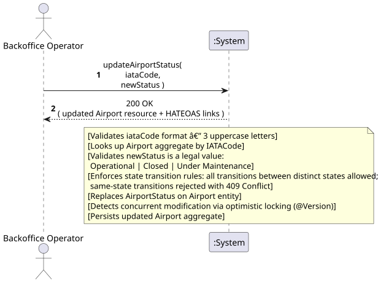
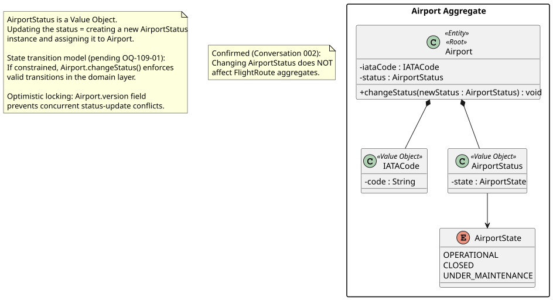
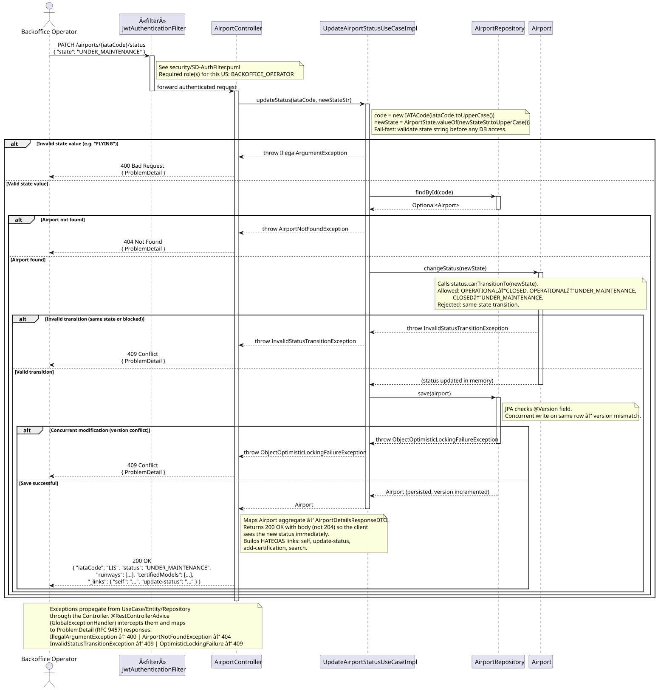
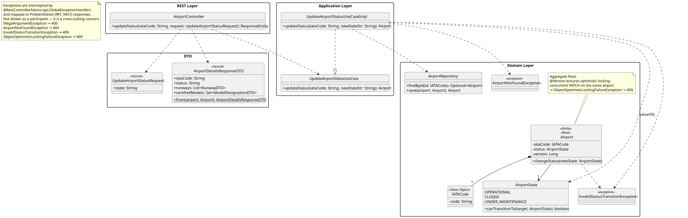

# US109 - Update Airport Operational Status

## 1. Requirements Engineering

_This section captures the User Story description, requirements specification, acceptance criteria,
dependencies, input/output data, and a high-level Actor-System interaction._

### 1.1. User Story Description

> As a **Backoffice Operator**, I want to update an airport's operational status (operational,
> closed, under maintenance).

### 1.2. Customer Specifications and Clarifications

**[Conversation 002 – Routes and Airport Status]** The customer explicitly clarified:
> "As rotas existem independentemente do estado operacional do aeroporto. Por exemplo: a rota
> LIS-OPO continua a existir mesmo que o aeroporto do Porto esteja temporariamente fechado para
> manutenção. No entanto, os voos agendados nessa rota poderiam ser afetados."

This means: **changing an airport's `AirportState` does NOT invalidate or cascade to existing
Flight Routes.** Scheduled flights on those routes may be affected in a future iteration.

**Interpretation:**

US109 is a **command** operation: it replaces the `AirportState` of an existing Airport aggregate.
The three valid states are `Operational`, `Closed`, and `Under Maintenance` (per glossary). The
status change is isolated to the Airport aggregate and does not propagate to other aggregates in
Phase 1.

### 1.3. Acceptance Criteria

**Standard (from assignment §5 — apply to all user stories):**

- AC1: Analysis and design documentation (domain model excerpt, design justification, sequence
  diagram when necessary, unit tests).
- AC2: OpenAPI specification provided.
- AC3: Postman collection with sample requests and automated tests.
- AC4: **Proper concurrent access handling** — the assignment (§9, Concurrency) explicitly flags
  status updates as a concurrency risk. Optimistic locking is required.
- AC5: Error handling with appropriate HTTP status codes and meaningful error messages.
- AC6: Input validation for all API endpoint parameters.
- AC7: Security considerations enforced.

**Domain-specific acceptance criteria:**

- AC8: The Airport identified by the given IATA code must exist; otherwise HTTP 404 Not Found.
- AC9: The new status value must be one of the three valid states: `Operational`, `Closed`,
  `Under Maintenance`. Any other value returns HTTP 400 Bad Request.
- AC10: Same-state transitions and any transition rejected by `canTransitionTo()` must return
  HTTP 409 Conflict (OQ-109-01 resolved).
- AC11: Concurrent status updates must be detected and handled safely — e.g., optimistic locking
  with a version field returning HTTP 409 Conflict on stale-state write.
- AC12: Successful update returns **HTTP 200 OK** with the updated Airport resource and HATEOAS links.
- AC13: Only the **Backoffice Operator** role is authorised. Unauthenticated requests return
  HTTP 401; other roles return HTTP 403.
- AC14: The status change does **not** affect existing Flight Routes (confirmed by Conversation 002).

### 1.4. Found out Dependencies

| Dependency | Type | Reason |
|:---|:---|:---|
| US106 – Register Airport | Prerequisite | The Airport must exist before its status can be updated. |
| US110 – Create Flight Route (WP#3A) | Informational | Routes referencing this airport are **not** affected by status changes (Conversation 002). The WP#3A team must be aware of this. |
| US212 – Schedule a Flight (Phase 2) | Future | Scheduled flights on routes using a Closed/Under Maintenance airport may be affected in a future iteration. |

### 1.5. Input and Output Data

**Input — typed/selected by actor:**

| Field | Type | Mandatory | Validation Rule |
|:---|:---|:---:|:---|
| `iataCode` | String (path param) | YES | Existing Airport IATA code (3 uppercase letters) |
| `status` | String (body) |YES | One of: `Operational` \| `Closed` \| `Under Maintenance` |

**Output:**

| Scenario | HTTP Status | Body |
|:---|:---:|:---|
| Successful update | 200 OK | Updated Airport resource + HATEOAS links |
| Invalid status value or format | 400 Bad Request | Error message |
| Unauthenticated | 401 Unauthorized | — |
| Wrong role | 403 Forbidden | — |
| Airport not found | 404 Not Found | Error message |
| Invalid state transition or same-state | 409 Conflict | ProblemDetail with reason |
| Concurrent modification conflict | 409 Conflict | Error message |

### 1.6. System Sequence Diagram (SSD)

_High-level Actor-System interaction for US109._

_PlantUML source: [US109-SSD.puml](puml/US109-SSD.puml)_

---

## 2. Analysis

### 2.1. Relevant Domain Model Excerpt

| Class | Stereotype | Role in this US |
|:---|:---|:---|
| `Airport` | Entity, Aggregate Root | The aggregate whose status is being changed. |
| `IATACode` | Value Object | Identifies the Airport aggregate to be updated (path parameter). |
| `AirportState` | `enum` | Encapsulates the operational state. Each constant implements `canTransitionTo(target)`; the airport entity field is replaced with the new enum constant on update. |

**Valid states** (from glossary):

| State | Description |
|:---|:---|
| `Operational` | Airport is fully functional. |
| `Closed` | Airport is not accepting flights. |
| `Under Maintenance` | Airport is undergoing maintenance work. |

_PlantUML source: [US109-DM.puml](puml/US109-DM.puml)_

---

## 3. Design — User Story Realization

### 3.1. Rationale

| Interaction ID | Question: Which class is responsible for… | Answer | Justification (with patterns) |
|:---|:---|:---|:---|
| Step 1 | Receiving the HTTP request and parsing the new status? | `AirportController` | Controller layer — handles HTTP, extracts path parameter and request body. |
| Step 2 | Orchestrating the status update — finding the airport and coordinating the domain operation? | `UpdateAirportStatusUseCaseImpl` | Application layer (Pure Fabrication) — coordinates retrieval and persistence without encoding domain rules. |
| Step 3 | Retrieving the Airport aggregate (including its current version for optimistic locking)? | `AirportRepository.findById()` | Repository — loads the aggregate for modification. |
| Step 4 | Validating the new status value and enforcing the transition invariant? | `Airport.changeStatus()` | Domain layer — business invariants (valid states, valid transitions) belong in the Aggregate Root (slide "Anemic Domain Model", 1_Intro_Base_Design_Principles). |
| Step 5 | Persisting the updated aggregate, detecting concurrent modification via version check? | `AirportRepository.save()` | Repository — optimistic locking is enforced at persistence level via JPA `@Version`. |

### Systematization

Conceptual classes promoted to software classes:

- `Airport`
- `IATACode`
- `AirportState`

Pure Fabrication (software-only) classes:

- `AirportController`
- `UpdateAirportStatusUseCaseImpl`
- `AirportRepository` (interface, domain layer)
- `UpdateAirportStatusRequest` (input DTO)
- `AirportDetailsResponseDTO` (output DTO — same as US107 response)

### 3.2. Sequence Diagram (SD)

_PlantUML source: [US109-SD.puml](puml/US109-SD.puml)_

### 3.3. Class Diagram (CD)

_PlantUML source: [US109-CD.puml](puml/US109-CD.puml)_

---

## 4. Tests

### 4.1. Unit Tests — Domain

**`AirportTest`** (`src/test/…/airports/domain/AirportTest.java`):

- `can_change_status_to_valid_transition` — `changeStatus(CLOSED)` from `OPERATIONAL` succeeds.
- `cannot_change_status_to_invalid_transition` — `changeStatus(OPERATIONAL)` when already `OPERATIONAL` throws `InvalidStatusTransitionException`.

**`AirportState` (inline)** — each enum constant's `canTransitionTo` is exercised by the above tests:

- `OPERATIONAL` → `CLOSED` ✔, `OPERATIONAL` → `UNDER_MAINTENANCE` ✔, `OPERATIONAL` → `OPERATIONAL` ✘
- `CLOSED` → `OPERATIONAL` ✔, `CLOSED` → `UNDER_MAINTENANCE` ✔, `CLOSED` → `CLOSED` ✘
- `UNDER_MAINTENANCE` → `OPERATIONAL` ✔, `UNDER_MAINTENANCE` → `CLOSED` ✔

### 4.2. Unit Tests — Use Case

**`UpdateAirportStatusUseCaseImplTest`** (`src/test/…/airports/services/UpdateAirportStatusUseCaseImplTest.java`):

- `updates_status_for_valid_transition` — `OPERATIONAL → CLOSED` persists and returns updated airport.
- `throws_not_found_for_missing_airport` — unknown IATA throws `AirportNotFoundException`.
- `throws_illegal_argument_for_unknown_state` — `"FLYING"` as state throws `IllegalArgumentException` (→ 400).
- `throws_invalid_transition_when_same_state` — `OPERATIONAL → OPERATIONAL` throws `InvalidStatusTransitionException` (→ 409).

### 4.3. Slice Tests — Controller

**`AirportControllerTest`**:

- `patch_status_returns_200` — valid PATCH with `BACKOFFICE_OPERATOR` role returns 200.
- `patch_status_returns_403_for_atcc_role` — `ATCC` role cannot update status; returns 403.

---

## 5. Construction (Implementation)

### 5.1. Classes Created / Modified

| Class | Package | Type | Role |
|:---|:---|:---|:---|
| `AirportController` | `airports.controllers` | Spring `@RestController` | Exposes `PATCH /airports/{iataCode}/status`; returns 200 with updated Airport representation. |
| `UpdateAirportStatusRequest` | `airports.dto` | Java `record` | Input DTO with a single `state: String` field. |
| `UpdateAirportStatusUseCase` | `airports.services` | Interface | Application-layer contract. |
| `UpdateAirportStatusUseCaseImpl` | `airports.services` | `@Service` | Loads airport, calls `AirportState.valueOf(state)`, calls `airport.changeStatus(newState)`, saves. |
| `AirportState` | `airports.domain` | `enum` | Each constant implements `canTransitionTo(target)`; all transitions allowed except same-state. |
| `Airport.changeStatus()` | `airports.domain` | Domain method | Validates transition via `status.canTransitionTo(newState)`; throws `InvalidStatusTransitionException` on failure. |
| `Airport` (`@Version`) | `airports.domain` | `@Entity` field | `Long version` annotated `@Version` for JPA optimistic locking. |
| `InvalidStatusTransitionException` | `airports.domain` | `RuntimeException` | Thrown on invalid transition → `GlobalExceptionHandler` maps to 409. |
| `GlobalExceptionHandler` | `exceptions` | `@RestControllerAdvice` | Handles: `AirportNotFoundException` → 404, `InvalidStatusTransitionException` → 409, `ObjectOptimisticLockingFailureException` → 409, `IllegalArgumentException` → 400. |

### 5.2. Key Design Decisions

- **OQ-109-01 resolved:** Transitions are constrained — same-state re-assignment is rejected. All cross-state transitions are permitted (OPERATIONAL ↔ CLOSED ↔ UNDER_MAINTENANCE).
- **OQ-109-02 resolved:** Same-state transition is rejected with HTTP 409 (not idempotent).
- **`PATCH` not `PUT`** — only the status field changes; PATCH semantics are correct and self-documenting.
- **Optimistic locking** — `@Version Long version` on `Airport`; JPA throws `ObjectOptimisticLockingFailureException` if two concurrent PATCHes target the same row with the same version. `GlobalExceptionHandler` maps this to HTTP 409.
- **State machine in the domain** — `AirportState` is an enum with per-constant `canTransitionTo` implementations; no transition logic leaks into the use case or controller.
- **200 OK with body** — returns the updated resource representation rather than 204, so clients see the new state immediately.

---

## 6. Integration and Demo

### 6.1. Prerequisites

1. Application running.
2. `OPO` airport bootstrapped with `OPERATIONAL` status.

### 6.2. Postman Steps

1. **Authenticate** — run _Auth → Login (backoffice)_.
2. **Update to CLOSED** — run _US109 — Update Status CLOSED (200)_. Sends `PATCH /airports/OPO/status` with `{"state":"CLOSED"}`; expects HTTP 200 and `status = "CLOSED"`.
3. **Invalid transition** — run _US109 — Invalid Transition (409)_. Tries `PATCH /airports/LIS/status` with `{"state":"OPERATIONAL"}` when LIS is already `OPERATIONAL`; expects HTTP 409.
4. **Invalid state value** — run _US109 — Invalid State Value (400)_. Sends `{"state":"FLYING"}`; expects HTTP 400.

### 6.3. OpenAPI

`PATCH /airports/{iataCode}/status` is documented under the **Airports** tag in Swagger UI at `http://localhost:8080/swagger-ui.html`.

---