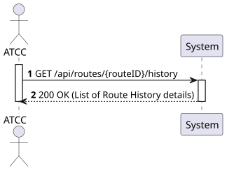
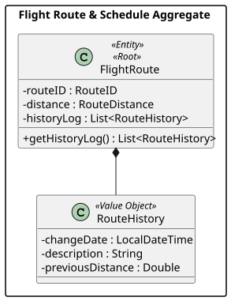
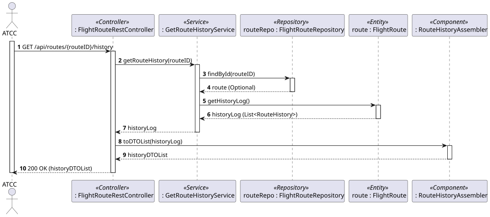
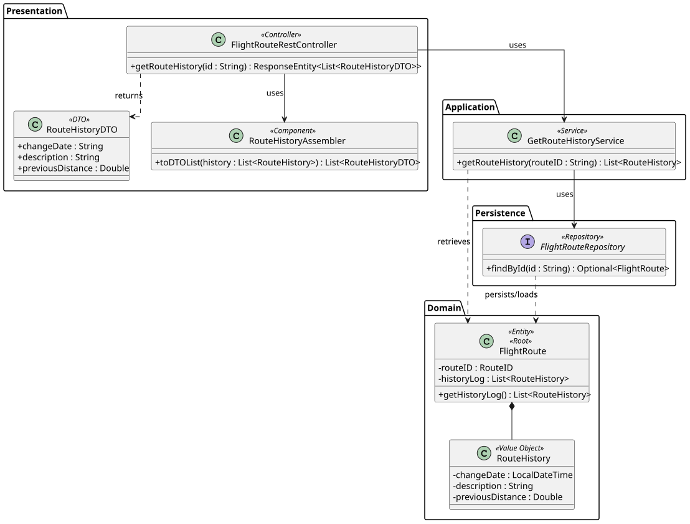

# US111 - Keep track of route history

## 1. Requirements Engineering

### 1.1. User Story Description

As an ATCC (Air Transport Company Collaborator), I want to keep track of route history.

### 1.2. Customer Specifications and Clarifications 

- **Clarification from Phase 0 (Domain Model Feedback):** A route must be able to change over time, but the system must store information to allow looking back at its previous states. To support this, a `RouteHistory` Value Object was introduced as a list within the `FlightRoute` aggregate. 
- **Assumption:** "Keeping track" in this context refers to the ability to view the chronological log of changes made to a specific route. The actual act of changing the route (which generates the history) is covered by US112.

### 1.3. Acceptance Criteria

- **AC1:** The system must return the complete history log of a specific flight route given its Route ID.
- **AC2:** If the provided Route ID does not exist, the system must return a "404 Not Found" error.
- **AC3:** The history log should include the date and time of the change, a description of what changed, and the previous values.
- **AC4:** The API endpoint must follow RESTful principles (e.g., `GET /api/routes/{id}/history`) and return "200 OK" on success.
- **AC5:** The operation must be restricted to users with the 'ATCC' role (requires JWT authentication/authorization).

### 1.4. Found out Dependencies

- **Dependency to US110:** A route must first be created before it can have a history.
- **Dependency to US112:** The history records are actually generated when a route is updated or deactivated (US112). This US strictly queries that data.

### 1.5 Input and Output Data

**Input Data:**
- Typed data: 
  - Route ID (passed as a Path Variable in the URL)

**Output Data:**
- List of Route History objects (JSON format), containing:
  - Change Date (Timestamp)
  - Description of the change
  - Previous Distance (if changed)
- Appropriate HTTP Status ("200 OK" or "404 Not Found").

### 1.6. System Sequence Diagram (SSD)



### 1.7 Other Relevant Remarks

- Since `RouteHistory` is a Value Object (an `@ElementCollection` in JPA terms) tightly coupled to `FlightRoute`, we do not need a separate Repository for it. We retrieve the `FlightRoute` via its Repository and simply access its history list.


## 2. Analysis

### 2.1. Relevant Domain Model Excerpt 



### 2.2. Other Remarks

Following Domain-Driven Design (DDD) principles, the `FlightRoute` (Aggregate Root) is the *Information Expert* regarding its own history. Therefore, fetching the history is simply a matter of fetching the Route and asking for its `historyLog`.


## 3. Design - User Story Realization

### 3.1. Rationale

**The rationale grounds on the SSD interactions and the identified input/output data.**

| Interaction ID | Question: Which class is responsible for... | Answer  | Justification (with patterns)  |
|:-------------  |:--------------------- |:------------|:---------------------------- |
| Step 1         | ...receiving the HTTP GET request with the Route ID? | FlightRouteRestController | **Controller (REST):** Acts as the entry point for the API, handling HTTP requests. |
| Step 2         | ...coordinating the retrieval of the history? | GetRouteHistoryService | **Application Service / Use Case Controller:** Orchestrates the flow to fulfill the specific use case. |
| Step 3         | ...finding the route in the database using the ID? | FlightRouteRepository | **Repository:** Accesses the persistence layer to find aggregates by their identity. |
| Step 4         | ...providing the actual history log? | FlightRoute | **Information Expert:** The aggregate root knows its own internal state (the history list). |
| Step 5         | ...converting the domain objects to a JSON-friendly format? | RouteHistoryAssembler | **DTO (Data Transfer Object):** Separates domain entities from the presentation layer. |
| Step 6         | ...returning the formatted response to the client? | FlightRouteRestController | **Controller:** Formats the DTO list and sends the HTTP response (200 OK). |

### Systematization

According to the taken rationale, the conceptual classes promoted to software classes are:
- FlightRoute
- RouteHistory (Value Object)

Other software classes (i.e. Pure Fabrication) identified:
- FlightRouteRestController
- GetRouteHistoryService
- FlightRouteRepository
- RouteHistoryDTO
- RouteHistoryAssembler

### 3.2. Sequence Diagram (SD)



### 3.3. Class Diagram (CD)




## 4. Tests 

**Test 1:** Check that retrieving history for a non-existent route throws a ResourceNotFound exception.

```java
@Test
public void ensureExceptionIsThrownIfRouteDoesNotExist() {
    // Mock FlightRouteRepository to return Optional.empty()
    assertThrows(ResourceNotFoundException.class, () -> {
        getRouteHistoryService.getRouteHistory("INVALID_ID");
    });
}
```
**Test 2:** Check that an empty list is returned if the route exists but has never been updated.

```java
@Test
public void ensureEmptyListIsReturnedWhenNoHistoryExists() {
    // Create a new FlightRoute (history is naturally empty)
    // Mock Repository to return this route
    List<RouteHistoryDTO> history = getRouteHistoryService.getRouteHistory("VALID_ID");
    assertTrue(history.isEmpty());
}
```
## 5. Construction (Implementation)

_In this section, it is suggested to provide, if necessary, some evidence that the construction/implementation is in accordance with the previously carried out design. Furthermore, it is recommended to mention/describe the existence of other relevant files (e.g. configuration) and highlight relevant commits._

_It is also recommended to organize this content by subsections._


## 6. Integration and Demo 

_In this section, it is suggested to describe the efforts made to integrate this functionality with the other features of the system._


## 7. Observations

_In this section, it is suggested to present a critical perspective on the developed work, pointing, for example, to other alternatives and or future related work._
