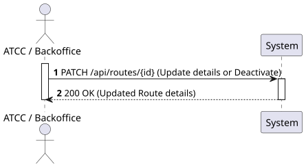
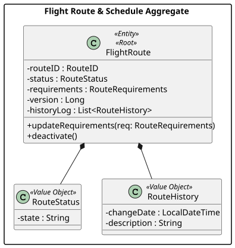
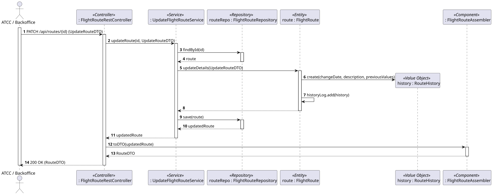
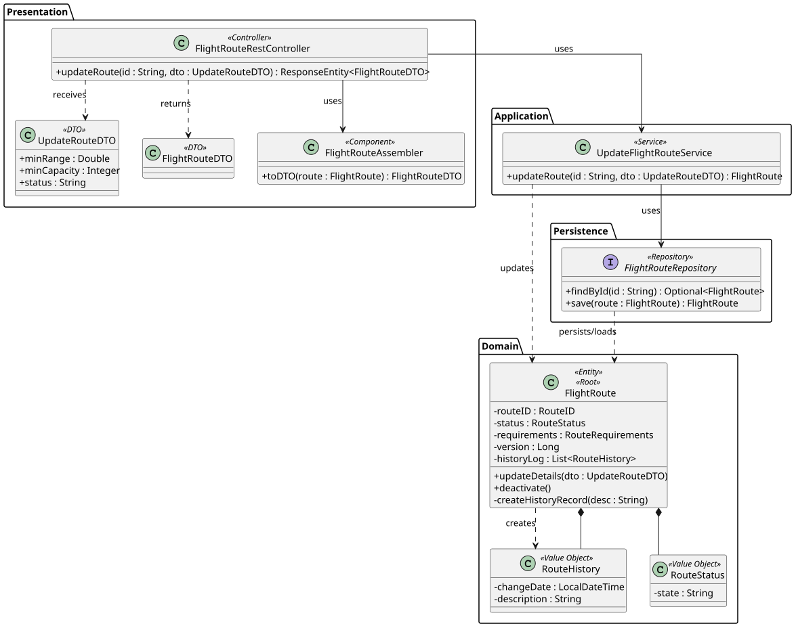

# US112 - Update or deactivate a route

## 1. Requirements Engineering

### 1.1. User Story Description

As an ATCC or Backoffice Operator, I want to update or deactivate a route.

### 1.2. Customer Specifications and Clarifications 

- **Clarification from Assignment:** Proper handling of concurrent requests is essential, especially for modifying route information.
- **Assumption (History):** Any update to the route's operational details (or its deactivation) must automatically generate a new `RouteHistory` entry within the aggregate to support US111.
- **Assumption (Deactivation):** Deactivating a route does not delete it from the database (only a status change), as it might have historical scheduled flights associated with it.

### 1.3. Acceptance Criteria

- **AC1:** The system must allow updating specific route requirements (e.g., minRange, minCapacity) or estimated flight time.
- **AC2:** The system must allow changing the route status to "Inactive" (deactivation).
- **AC3:** Every successful update or deactivation must append a new history record to the route's history log.
- **AC4:** The system must implement Optimistic Locking to prevent lost updates when multiple users try to modify the same route concurrently. A `409 Conflict` should be returned in such cases.
- **AC5:** The API endpoint must follow RESTful principles (e.g., `PATCH /api/routes/{id}`) and return "200 OK" on success.
- **AC6:** The operation must be restricted to users with the 'ATCC' or 'Backoffice Operator' roles.

### 1.4. Found out Dependencies

- **Dependency to US110:** A route must exist before it can be updated.
- **Dependency to US111:** This US is responsible for generating the history data that US111 displays.

### 1.5 Input and Output Data

**Input Data:**
- Typed data (via JSON payload for PATCH request):
  - Estimated Flight Time (optional)
  - Minimum Range Requirement (optional)
  - Minimum Capacity Requirement (optional)
  - Route Status (optional - Active/Inactive)
- Route ID (passed as a Path Variable in the URL)
- Version/ETag (for concurrency control, passed in headers or body)

**Output Data:**
- Success message / "200 OK" HTTP Status
- JSON representation of the updated Route (DTO).
- Error "409 Conflict" if a concurrency collision occurs.

### 1.6. System Sequence Diagram (SSD)



### 1.7 Other Relevant Remarks

- By adhering to Domain-Driven Design (DDD), the logic to append the history log should reside within the `FlightRoute` entity itself. When a mutator method (e.g., `updateRequirements()`) is called, the entity internally instantiates the `RouteHistory` Value Object and adds it to its list.


## 2. Analysis

### 2.1. Relevant Domain Model Excerpt 



### 2.2. Other Remarks

A `RouteStatus` Value Object was introduced to the `FlightRoute` aggregate to explicitly manage the active/inactive state required for deactivation. An internal `version` attribute is assumed for Optimistic Locking (JPA `@Version`).


## 3. Design - User Story Realization

### 3.1. Rationale

**The rationale grounds on the SSD interactions and the identified input/output data.**

| Interaction ID | Question: Which class is responsible for... | Answer  | Justification (with patterns)  |
|:-------------  |:--------------------- |:------------|:---------------------------- |
| Step 1         | ...receiving the HTTP PATCH request and JSON payload? | FlightRouteRestController | **Controller (REST):** Acts as the entry point for the API, handling HTTP requests and routing them. |
| Step 2         | ...coordinating the update logic and concurrency handling? | UpdateFlightRouteService | **Application Service / Use Case Controller:** Orchestrates the flow, fetches the entity, and delegates business logic. |
| Step 3         | ...finding the existing route in the database using the ID? | FlightRouteRepository | **Repository:** Accesses the persistence layer to find the aggregate. |
| Step 4         | ...applying the updates and registering the history? | FlightRoute | **Information Expert / Creator:** The aggregate root knows its current state, applies the new rules, and creates its own `RouteHistory` entries. |
| Step 5         | ...saving the updated route and enforcing optimistic locking? | FlightRouteRepository | **Repository:** Persists the updated state. JPA handles the `@Version` check automatically. |
| Step 6         | ...converting the updated entity to a JSON-friendly format? | FlightRouteAssembler | **DTO (Data Transfer Object):** Separates domain entities from the presentation layer. |
| Step 7         | ...returning the formatted response to the client? | FlightRouteRestController | **Controller:** Formats the DTO and sends the HTTP response (200 OK). |

### Systematization

According to the taken rationale, the conceptual classes promoted to software classes are:
- FlightRoute
- RouteRequirements, RouteStatus, RouteHistory (Value Objects)

Other software classes (i.e. Pure Fabrication) identified:
- FlightRouteRestController
- UpdateFlightRouteService
- FlightRouteRepository
- FlightRouteDTO
- FlightRouteAssembler

### 3.2. Sequence Diagram (SD)



### 3.3. Class Diagram (CD)




## 4. Tests 

**Test 1:** Check that updating a route automatically increases its history log size by 1.

```java
@Test
public void ensureUpdatingRouteAddsHistoryRecord() {
    FlightRoute route = // ... create route
    int initialHistorySize = route.getHistoryLog().size();
    
    route.updateRequirements(new RouteRequirements(600.0, 200));
    
    assertEquals(initialHistorySize + 1, route.getHistoryLog().size());
}
```
Test 2: Check that concurrent updates fail with Optimistic Locking exception.
```java
@Test
public void ensureConcurrentUpdateThrowsException() {
    // This typically requires an integration test (@SpringBootTest) 
    // where two transactions try to save the same entity version.
    // Expected outcome: ObjectOptimisticLockingFailureException.class
}
```
## 5. Construction (Implementation)

_In this section, it is suggested to provide, if necessary, some evidence that the construction/implementation is in accordance with the previously carried out design. Furthermore, it is recommended to mention/describe the existence of other relevant files (e.g. configuration) and highlight relevant commits._

_It is also recommended to organize this content by subsections._


## 6. Integration and Demo 

_In this section, it is suggested to describe the efforts made to integrate this functionality with the other features of the system._


## 7. Observations

_In this section, it is suggested to present a critical perspective on the developed work, pointing, for example, to other alternatives and or future related work._
