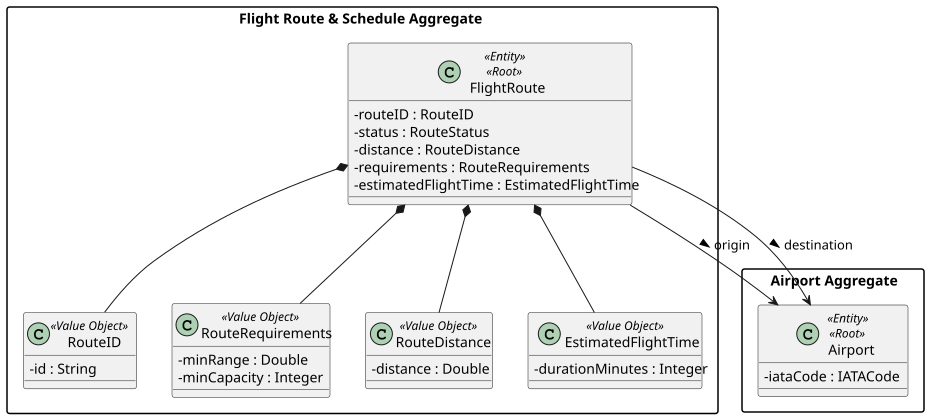
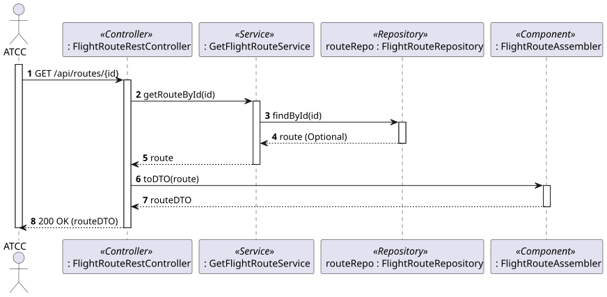
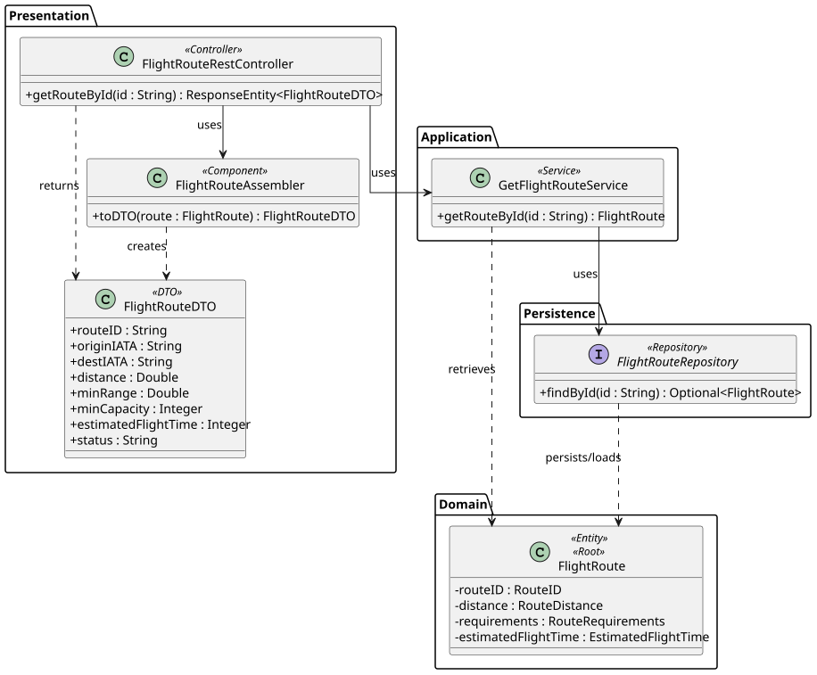

# US113 - View details of a route

## 1. Requirements Engineering

### 1.1. User Story Description

As an ATCC (Air Transport Company Collaborator),  I want to view all routes from a specific airport, and to view the details of a route given its ID.

### 1.2. Customer Specifications and Clarifications 

- **Clarification from Forum:** For US113, the ATCC needs to view the details of a route given its "ID". The Route ID is a system-generated identifier (e.g., standard numeric or UUID) rather than a business-formatted string.

### 1.3. Acceptance Criteria

- **AC1:** The system must return the full details of a specific flight route given its valid Route ID.
- **AC2:** The details must include the origin airport, destination airport, route distance, estimated flight time, minimum range, and minimum seating capacity.
- **AC3:** If the provided Route ID does not exist in the system, a "404 Not Found" error must be returned.
- **AC4:** The API endpoint must follow RESTful principles (e.g., `GET /api/routes/{id}`) and return "200 OK" on success.
- **AC5:** The operation must be restricted to users with the 'ATCC' role (requires JWT authentication/authorization).

### 1.4. Found out Dependencies

- **Dependency to US110:** A route must be created first before its details can be viewed.

### 1.5 Input and Output Data

**Input Data:**
- Typed data: 
  - Route ID (passed as a Path Variable in the URL)

**Output Data:**
- JSON representation of the Route (DTO) containing:
  - Route ID
  - Origin Airport (IATA Code)
  - Destination Airport (IATA Code)
  - Route Distance
  - Route Status (Active/Inactive)
  - Estimated Flight Time
  - Minimum Range
  - Minimum Capacity
- Appropriate HTTP Status ("200 OK" or "404 Not Found").

### 1.6. System Sequence Diagram (SSD)


### 1.7 Other Relevant Remarks

- Because this is a simple read operation without complex business logic, the application service mainly acts as a pass-through to the repository and handles the "Not Found" exception.


## 2. Analysis

### 2.1. Relevant Domain Model Excerpt 



### 2.2. Other Remarks

The `FlightRoute` aggregate root holds references to the Origin and Destination airports. When presenting the route details, the system typically only needs to expose the `IATACode` of these airports, keeping the payload lightweight.


## 3. Design - User Story Realization

### 3.1. Rationale

**The rationale grounds on the SSD interactions and the identified input/output data.**

| Interaction ID | Question: Which class is responsible for... | Answer  | Justification (with patterns)  |
|:-------------  |:--------------------- |:------------|:---------------------------- |
| Step 1         | ...receiving the HTTP GET request with the Route ID? | FlightRouteRestController | **Controller (REST):** Acts as the entry point for the API, handling HTTP requests. |
| Step 2         | ...coordinating the retrieval of the route? | GetFlightRouteService | **Application Service / Use Case Controller:** Orchestrates the flow to fulfill the read use case. |
| Step 3         | ...finding the route in the database using the ID? | FlightRouteRepository | **Repository:** Accesses the persistence layer to find aggregates by their identity. |
| Step 4         | ...converting the domain object to a JSON-friendly format? | FlightRouteAssembler | **DTO (Data Transfer Object):** Separates domain entities from the presentation layer. |
| Step 5         | ...returning the formatted response to the client? | FlightRouteRestController | **Controller:** Formats the DTO and sends the HTTP response (200 OK). |

### Systematization

According to the taken rationale, the conceptual classes promoted to software classes are:
- FlightRoute
- RouteDistance, RouteRequirements, EstimatedFlightTime, RouteID (Value Objects)

Other software classes (i.e. Pure Fabrication) identified:
- FlightRouteRestController
- GetFlightRouteService
- FlightRouteRepository
- FlightRouteDTO
- FlightRouteAssembler

### 3.2. Sequence Diagram (SD)



### 3.3. Class Diagram (CD)




## 4. Tests 

**Test 1:** Check that retrieving a non-existent route throws a ResourceNotFound exception.

```java
@Test
public void ensureExceptionIsThrownIfRouteDoesNotExist() {
    // Mock FlightRouteRepository to return Optional.empty()
    assertThrows(ResourceNotFoundException.class, () -> {
        getFlightRouteService.getRouteById("INVALID_ID");
    });
}
```
**Test 2:** Check that a valid route is correctly retrieved and its details match.

```java
@Test
public void ensureExceptionIsThrownIfRouteDoesNotExist() {
    // Mock FlightRouteRepository to return Optional.empty()
    assertThrows(ResourceNotFoundException.class, () -> {
        getFlightRouteService.getRouteById("INVALID_ID");
    });
}
```
## 5. Construction (Implementation)

_In this section, it is suggested to provide, if necessary, some evidence that the construction/implementation is in accordance with the previously carried out design. Furthermore, it is recommended to mention/describe the existence of other relevant files (e.g. configuration) and highlight relevant commits._

_It is also recommended to organize this content by subsections._


## 6. Integration and Demo 

_In this section, it is suggested to describe the efforts made to integrate this functionality with the other features of the system._


## 7. Observations

_In this section, it is suggested to present a critical perspective on the developed work, pointing, for example, to other alternatives and or future related work._
