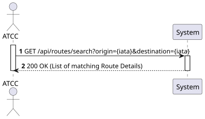
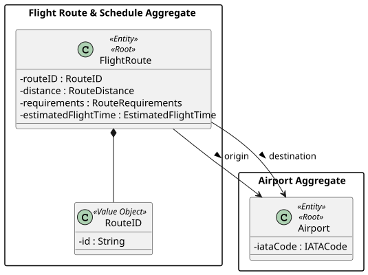
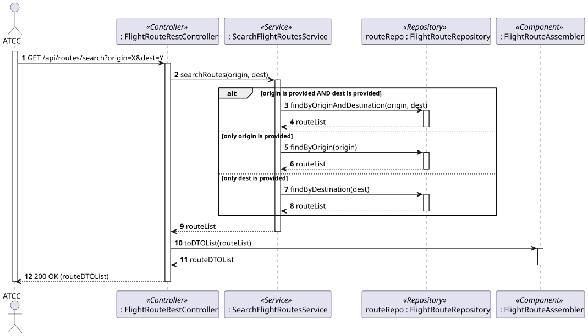
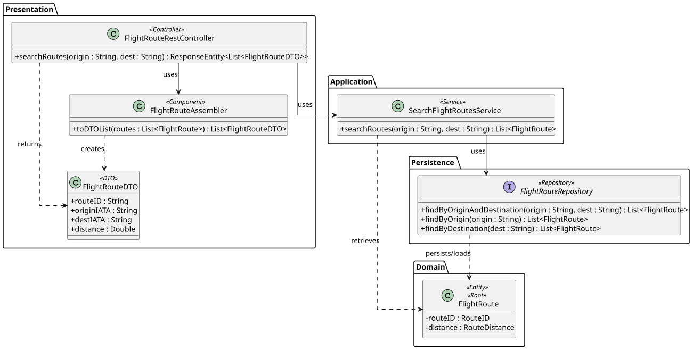

# US114 - Search for routes by origin, destination, or both

## 1. Requirements Engineering

### 1.1. User Story Description

As an ATCC (Air Transport Company Collaborator), I want to search for routes by origin, destination, or both.

### 1.2. Customer Specifications and Clarifications 

- **Assumption:** The search should return a list of active and inactive routes matching the criteria, unless specified otherwise.
- **Assumption (REST API):** Since the criteria are optional filters, this is best implemented using query parameters in a GET request (e.g., `/api/routes/search?origin=LIS&destination=OPO`). This approach naturally covers the missing requirement from US113 ("view all routes from a specific airport") by simply providing the `origin` parameter alone.

### 1.3. Acceptance Criteria

- **AC1:** The system must allow searching using only the origin airport (IATA code).
- **AC2:** The system must allow searching using only the destination airport (IATA code).
- **AC3:** The system must allow searching using both origin and destination airports simultaneously.
- **AC4:** If no routes match the search criteria, the system should return an empty list with a "200 OK" status.
- **AC5:** The API endpoint must follow RESTful principles.
- **AC6:** The operation must be restricted to users with the 'ATCC' role (requires JWT authentication/authorization).

### 1.4. Found out Dependencies

- **Dependency to US110:** Routes must exist in the system to be searched.

### 1.5 Input and Output Data

**Input Data:**
- Typed data (via URL Query Parameters):
  - Origin Airport (IATA Code) - Optional
  - Destination Airport (IATA Code) - Optional

**Output Data:**
- JSON representation of a List of Routes (DTOs) containing:
  - Route ID
  - Origin Airport
  - Destination Airport
  - Route Distance
  - Estimated Flight Time
- HTTP Status "200 OK".

### 1.6. System Sequence Diagram (SSD)



### 1.7 Other Relevant Remarks

- At the persistence layer, this can be implemented using Spring Data JPA derived queries (e.g., `findByOriginAndDestination`, `findByOrigin`, `findByDestination`) or using JPA Specifications for dynamic query building based on which parameters are present.


## 2. Analysis

### 2.1. Relevant Domain Model Excerpt 



### 2.2. Other Remarks

The domain model is the same as US113, focusing on the `FlightRoute` and its association with `Airport` (origin and destination).


## 3. Design - User Story Realization

### 3.1. Rationale

**The rationale grounds on the SSD interactions and the identified input/output data.**

| Interaction ID | Question: Which class is responsible for... | Answer  | Justification (with patterns)  |
|:-------------  |:--------------------- |:------------|:---------------------------- |
| Step 1         | ...receiving the HTTP GET request and extracting query params? | FlightRouteRestController | **Controller (REST):** Acts as the entry point for the API, handling HTTP requests. |
| Step 2         | ...coordinating the search logic based on provided parameters? | SearchFlightRoutesService | **Application Service / Use Case Controller:** Orchestrates the flow to fulfill the specific use case. |
| Step 3         | ...querying the database using the dynamic criteria? | FlightRouteRepository | **Repository:** Accesses the persistence layer to find aggregates that match the criteria. |
| Step 4         | ...converting the retrieved domain objects to a JSON-friendly format? | FlightRouteAssembler | **DTO (Data Transfer Object):** Separates domain entities from the presentation layer. |
| Step 5         | ...returning the formatted response to the client? | FlightRouteRestController | **Controller:** Formats the DTO list and sends the HTTP response (200 OK). |

### Systematization

According to the taken rationale, the conceptual classes promoted to software classes are:
- FlightRoute
- RouteDistance, RouteRequirements, EstimatedFlightTime, RouteID (Value Objects)

Other software classes (i.e. Pure Fabrication) identified:
- FlightRouteRestController
- SearchFlightRoutesService
- FlightRouteRepository
- FlightRouteDTO
- FlightRouteAssembler

### 3.2. Sequence Diagram (SD)



### 3.3. Class Diagram (CD)




## 4. Tests 

**Test 1:** Check that searching with both origin and destination returns the correct list of routes.

```java
@Test
public void ensureSearchByOriginAndDestinationReturnsCorrectRoutes() {
    // Setup Mock Repository
    List<FlightRoute> routes = searchFlightRoutesService.searchRoutes("LIS", "OPO");
    assertNotNull(routes);
    // Assert all returned routes have LIS as origin and OPO as destination
}
```
**Test 2:** Check that searching with no matching criteria returns an empty list.

```java
@Test
public void ensureSearchByOriginAndDestinationReturnsCorrectRoutes() {
    // Setup Mock Repository
    List<FlightRoute> routes = searchFlightRoutesService.searchRoutes("LIS", "OPO");
    assertNotNull(routes);
    // Assert all returned routes have LIS as origin and OPO as destination
}
```
## 5. Construction (Implementation)

_In this section, it is suggested to provide, if necessary, some evidence that the construction/implementation is in accordance with the previously carried out design. Furthermore, it is recommended to mention/describe the existence of other relevant files (e.g. configuration) and highlight relevant commits._

_It is also recommended to organize this content by subsections._


## 6. Integration and Demo 

_In this section, it is suggested to describe the efforts made to integrate this functionality with the other features of the system._


## 7. Observations

_In this section, it is suggested to present a critical perspective on the developed work, pointing, for example, to other alternatives and or future related work._
