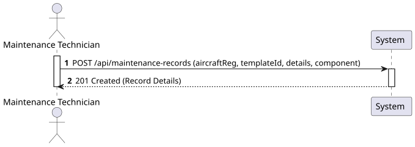
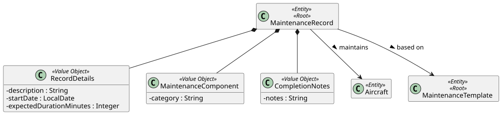
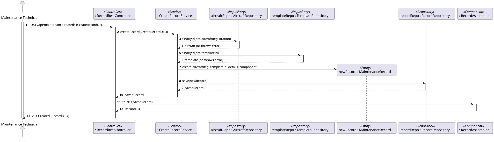
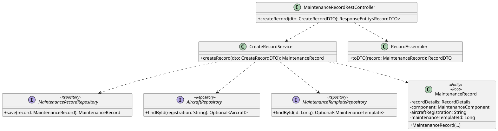

# US115a - Create Maintenance Record

## 1. Requirements Engineering

### 1.1. User Story Description

As a Maintenance Technician, I want to create a maintenance record for a specific aircraft, based on a maintenance template, specifying the start date, expected duration, and the component category.

### 1.2. Customer Specifications and Clarifications

- **Clarification from Forum:** The system must ensure that the aircraft being maintained is registered in the system and that the referenced maintenance template exists.

### 1.3. Acceptance Criteria

- **AC1:** The maintenance record must reference a valid Aircraft (by registration number).
- **AC2:** The maintenance record must reference a valid Maintenance Template.
- **AC3:** The record details must include a description, a valid start date (cannot be in the future without validation), and an expected duration in minutes.
- **AC4:** Only authenticated users with the 'Maintenance Technician' role can perform this operation.
- **AC5:** The system must prevent concurrent modifications to the same record (Optimistic Locking).

### 1.4. Found out Dependencies

- **Dependency to WP#1A (Aircraft Management):** Depends on the existence of the specific Aircraft instance (US102) to link the record to the physical airplane.
- **Dependency to US115a:** Depends on the existence of Maintenance Templates.

### 1.5 Input and Output Data

**Input Data:**
- Typed data (via JSON payload):
    - Aircraft Registration Number
    - Maintenance Template ID
    - Description
    - Start Date
    - Expected Duration (minutes)
    - Component Category (e.g., Engine, Airframe)

**Output Data:**
- Success message / "201 Created" HTTP Status.
- JSON representation of the created Maintenance Record (DTO).

### 1.6. System Sequence Diagram (SSD)



## 2. Analysis

### 2.1. Relevant Domain Model Excerpt



## 3. Design - User Story Realization

### 3.1. Rationale

| Interaction ID | Question: Which class is responsible for... | Answer | Justification (with patterns) |
|:---|:---|:---|:---|
| Step 1 | ...receiving the HTTP POST request? | `MaintenanceRecordRestController` | **Controller:** Acts as the API entry point. |
| Step 2 | ...coordinating the record creation logic? | `CreateMaintenanceRecordService` | **Application Service:** Orchestrates domain objects to fulfill the use case. |
| Step 3 | ...verifying if the Aircraft exists? | `AircraftRepository` | **Repository:** Accesses the persistence layer to find the aircraft. |
| Step 4 | ...verifying if the Template exists? | `MaintenanceTemplateRepository` | **Repository:** Validates the template dependency. |
| Step 5 | ...instantiating the new Record? | `MaintenanceRecord` | **Creator:** Responsible for creating the aggregate root entity. |
| Step 6 | ...saving the new record? | `MaintenanceRecordRepository` | **Repository:** Persists the newly created aggregate root. |
| Step 7 | ...returning the response? | `MaintenanceRecordRestController` | **Controller:** Formats the DTO and sends the HTTP response. |

### Systematization ##

According to the taken rationale, the conceptual classes promoted to software classes are:

- `MaintenanceRecord`
- `RecordDetails`, `MaintenanceComponent` (Value Objects)

Other software classes (i.e. Pure Fabrication) identified:

- `MaintenanceRecordRestController`
- `CreateMaintenanceRecordService`
- `MaintenanceRecordRepository`
- `CreateRecordDTO`
- `RecordDTO`
- `RecordAssembler`

### 3.2. Sequence Diagram (SD)



### 3.3. Class Diagram (CD)



## 4. Tests

**Test 1:** Check that a Maintenance Record cannot be created with a negative expected duration.

```java
@Test
public void ensureExpectedDurationCannotBeNegative() {
    assertThrows(IllegalArgumentException.class, () -> {
        new RecordDetails("Oil Change", LocalDate.now(), -30);
    });
}
```

**Test 2:** Check that the start date cannot be null.

```java
@Test
public void ensureStartDateCannotBeNull() {
    assertThrows(IllegalArgumentException.class, () -> {
        new RecordDetails("Tire check", null, 60);
    });
}
```

## 5. Construction (Implementation)

_To be completed during the implementation phase._

## 6. Integration and Demo

_To be completed during the implementation phase._

## 7. Observations

_To be completed after the implementation._