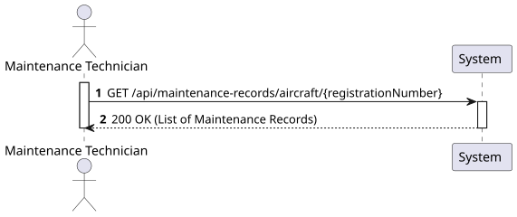
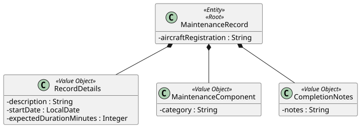
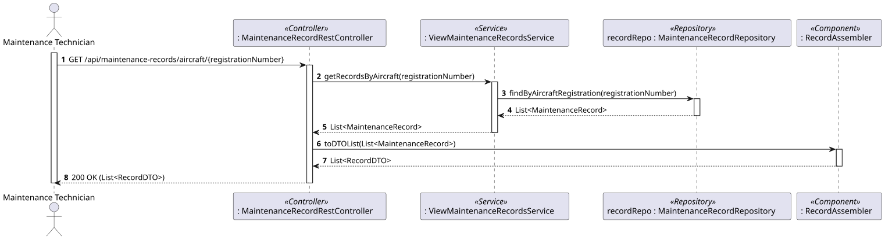
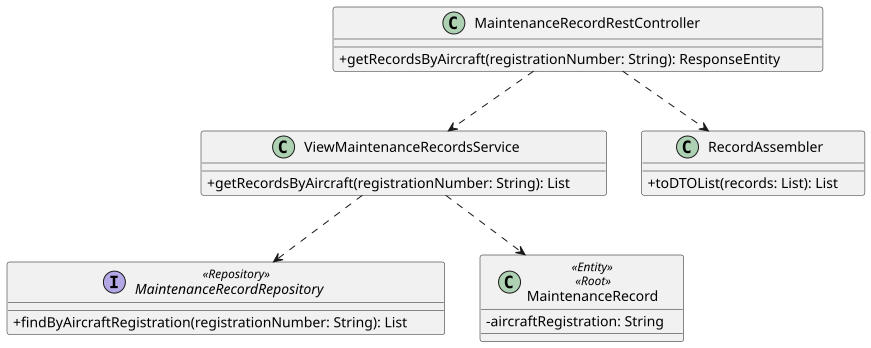

# US116 - View Maintenance Records of a Specific Aircraft

## 1. Requirements Engineering

### 1.1. User Story Description

As a Maintenance Technician or Fleet Manager, I want to view all maintenance records of a specific aircraft to track its technical history.

### 1.2. Customer Specifications and Clarifications

- The system must list all maintenance operations performed or scheduled for an aircraft identified by its unique Registration Number.

### 1.3. Acceptance Criteria

- **AC1:** The user must provide a valid aircraft registration number.
- **AC2:** If the aircraft has no maintenance records, the system must return an empty list with HTTP Status 200 OK.
- **AC3:** The system must return the complete history, including description, start date, duration, component category, and completion notes (if the maintenance is already concluded).
- **AC4:** Only authorized users (Maintenance Technician or Fleet Manager) can access this information.

### 1.4. Found out Dependencies

- **Dependency to Aircraft Aggregate:** Relies on the existence of the Aircraft instance to validate the registration number.
- **Dependency to US115b:** Relies on the previous creation of maintenance records to populate the list.

### 1.5 Input and Output Data

**Input Data:**
- Aircraft Registration Number (via URL Path Variable).

**Output Data:**
- HTTP 200 OK Status.
- JSON list of Maintenance Record DTOs.

### 1.6. System Sequence Diagram (SSD)



## 2. Analysis

### 2.1. Relevant Domain Model Excerpt



## 3. Design - User Story Realization

### 3.1. Rationale

| Interaction ID | Question: Which class is responsible for... | Answer | Justification (with patterns) |
|:---|:---|:---|:---|
| Step 1 | ...receiving the HTTP GET request? | `MaintenanceRecordRestController` | **Controller:** Acts as the API entry point for handling incoming requests. |
| Step 2 | ...coordinating the retrieval logic? | `ViewMaintenanceRecordsService` | **Application Service:** Coordinates the business flow without containing core business logic. |
| Step 3 | ...fetching the records from the database? | `MaintenanceRecordRepository` | **Repository:** Encapsulates the persistence mechanism to query records by registration number. |
| Step 4 | ...converting the entities to a readable format? | `RecordAssembler` | **DTO Assembler:** Responsable for transforming Domain Objects into Data Transfer Objects. |
| Step 5 | ...returning the response? | `MaintenanceRecordRestController` | **Controller:** Formats the list of DTOs into an HTTP response. |

### Systematization

According to the taken rationale, the conceptual classes promoted to software classes are:

- `MaintenanceRecord`

Other software classes identified:

- `MaintenanceRecordRestController`
- `ViewMaintenanceRecordsService`
- `MaintenanceRecordRepository`
- `RecordDTO`
- `RecordAssembler`

### 3.2. Sequence Diagram (SD)



### 3.3. Class Diagram (CD)



## 4. Tests

**Test 1:** Ensure that searching for an aircraft with multiple records returns the correct size and data.

```java
// Test logic will be implemented in the construction phase to verify that the repository correctly filters by registration number.
```

## 5. Construction (Implementation)

_To be completed during the implementation phase._

## 6. Integration and Demo

_To be completed during the implementation phase._

## 7. Observations

_To be completed after the implementation._