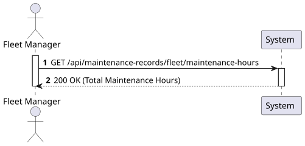
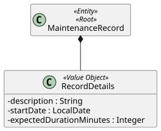
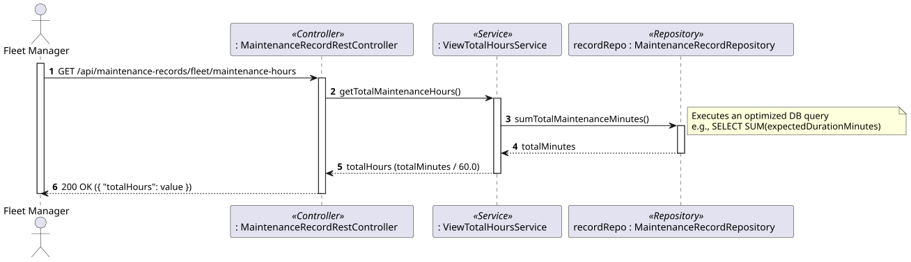
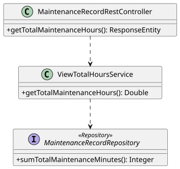

# US117 - View Total Maintenance Hours for the Fleet

## 1. Requirements Engineering

### 1.1. User Story Description

As a Fleet Manager, I want to view the total number of maintenance hours for the fleet's aircraft to analyze maintenance overhead.

### 1.2. Customer Specifications and Clarifications

- The system must calculate the sum of the expected duration of all maintenance records across all aircraft in the company's fleet.
- Since records store duration in minutes (`expectedDurationMinutes`), the system must convert the final sum to hours.

### 1.3. Acceptance Criteria

- **AC1:** The system must aggregate the duration of all existing maintenance records correctly.
- **AC2:** The output must be formatted or converted into total hours (e.g., if total minutes = 150, total hours = 2.5).
- **AC3:** Only authenticated users with appropriate roles (e.g., 'Fleet Manager') can view this metric.
- **AC4:** The system should return HTTP 200 OK with the calculated total.

### 1.4. Found out Dependencies

- **Dependency to US115b (Create Maintenance Record):** Depends on the existence of maintenance records with recorded expected durations to perform the calculation.

### 1.5 Input and Output Data

**Input Data:**
- None (Global fleet metric requested via a GET parameterless endpoint).

**Output Data:**
- HTTP 200 OK Status.
- A JSON object containing the total maintenance hours.

### 1.6. System Sequence Diagram (SSD)



## 2. Analysis

### 2.1. Relevant Domain Model Excerpt



## 3. Design - User Story Realization

### 3.1. Rationale

| Interaction ID | Question: Which class is responsible for... | Answer | Justification (with patterns) |
|:---|:---|:---|:---|
| Step 1 | ...receiving the HTTP GET request? | `MaintenanceRecordRestController` | **Controller:** Acts as the API entry point. |
| Step 2 | ...coordinating the calculation logic? | `ViewTotalMaintenanceHoursService` | **Application Service:** Orchestrates domain operations and calculations. |
| Step 3 | ...summing the minutes from the database? | `MaintenanceRecordRepository` | **Repository:** Executes an optimized DB query (e.g., JPQL `SUM`) to calculate the total without loading all objects into memory. |
| Step 4 | ...converting minutes to hours? | `ViewTotalMaintenanceHoursService` | **Service:** Applies the business logic (Total Minutes / 60). |
| Step 5 | ...returning the response? | `MaintenanceRecordRestController` | **Controller:** Formats the primitive value into an HTTP response. |

### Systematization

According to the taken rationale, the conceptual classes promoted to software classes are:

- `MaintenanceRecord`
- `RecordDetails`

Other software classes (i.e. Pure Fabrication) identified:

- `MaintenanceRecordRestController`
- `ViewTotalMaintenanceHoursService`
- `MaintenanceRecordRepository`

### 3.2. Sequence Diagram (SD)



### 3.3. Class Diagram (CD)



## 4. Tests

**Test 1:** Check that the conversion from minutes to hours is calculated correctly.

```java
@Test
public void ensureMinutesAreCorrectlyConvertedToHours() {
    // Expected behavior: Service receives 150 minutes from repository and returns 2.5 hours.
}
```

## 5. Construction (Implementation)

_To be completed during the implementation phase._

## 6. Integration and Demo

_To be completed during the implementation phase._

## 7. Observations

_To be completed after the implementation._