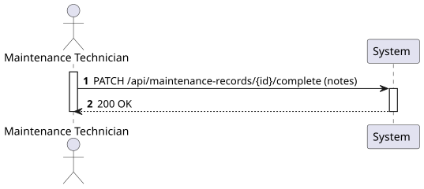
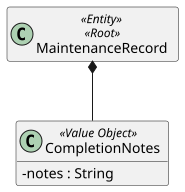
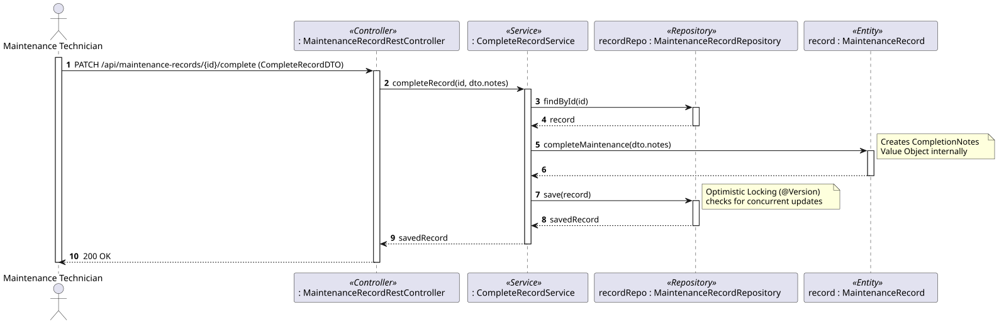
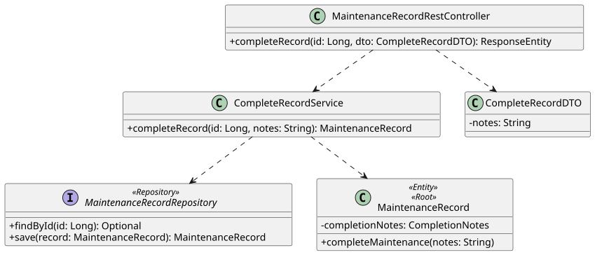

# US119 - Complete a Maintenance Record

## 1. Requirements Engineering

### 1.1. User Story Description

As a Maintenance Technician, I want to update a maintenance record to mark it as completed and add completion notes.

### 1.2. Customer Specifications and Clarifications

- The system must allow a technician to input optional or mandatory remarks (`CompletionNotes`) once a maintenance task is finished.
- Modifying an existing record requires handling concurrent access to prevent two users from overwriting each other's changes simultaneously.

### 1.3. Acceptance Criteria

- **AC1:** The system must verify if the provided maintenance record ID exists.
- **AC2:** The system must allow the addition of completion notes.
- **AC3:** Concurrent updates must be safely handled (e.g., using Optimistic Locking).
- **AC4:** Only authenticated users with the 'Maintenance Technician' role can perform this operation.
- **AC5:** The API endpoint must follow RESTful principles, using a `PATCH` request and returning "200 OK" on success.

### 1.4. Found out Dependencies

- **Dependency to US115b (Create Maintenance Record):** A record must be created first before it can be updated and marked as completed.

### 1.5 Input and Output Data

**Input Data:**
- Record ID (via URL Path Variable).
- Typed data (via JSON payload):
    - Completion Notes (String).

**Output Data:**
- HTTP 200 OK Status.
- Success message or the updated JSON representation of the Maintenance Record.

### 1.6. System Sequence Diagram (SSD)



## 2. Analysis

### 2.1. Relevant Domain Model Excerpt



## 3. Design - User Story Realization

### 3.1. Rationale

| Interaction ID | Question: Which class is responsible for... | Answer | Justification (with patterns) |
|:---|:---|:---|:---|
| Step 1 | ...receiving the HTTP PATCH request? | `MaintenanceRecordRestController` | **Controller:** Acts as the API entry point. |
| Step 2 | ...coordinating the update logic? | `CompleteMaintenanceRecordService` | **Application Service:** Orchestrates domain operations. |
| Step 3 | ...finding the record to be updated? | `MaintenanceRecordRepository` | **Repository:** Accesses the persistence layer to fetch the entity by ID. |
| Step 4 | ...instantiating the Completion Notes? | `MaintenanceRecord` | **Information Expert:** The aggregate root knows how to update its own state and create its Value Objects. |
| Step 5 | ...saving the updated record? | `MaintenanceRecordRepository` | **Repository:** Persists the updated aggregate root (handling Optimistic Locking implicitly). |
| Step 6 | ...returning the response? | `MaintenanceRecordRestController` | **Controller:** Sends the HTTP response indicating success. |

### Systematization

According to the taken rationale, the conceptual classes promoted to software classes are:

- `MaintenanceRecord`
- `CompletionNotes` (Value Object)

Other software classes (i.e. Pure Fabrication) identified:

- `MaintenanceRecordRestController`
- `CompleteMaintenanceRecordService`
- `MaintenanceRecordRepository`
- `CompleteRecordDTO`

### 3.2. Sequence Diagram (SD)



### 3.3. Class Diagram (CD)



## 4. Tests

**Test 1:** Ensure that trying to complete a non-existent record throws an appropriate exception (e.g., NotFoundException).

```java
@Test
public void ensureCannotCompleteNonExistentRecord() {
    // Assert that the service throws an exception when the repository returns empty for a given ID.
}
```

## 5. Construction (Implementation)

_To be completed during the implementation phase._

## 6. Integration and Demo

_To be completed during the implementation phase._

## 7. Observations

_To be completed after the implementation._