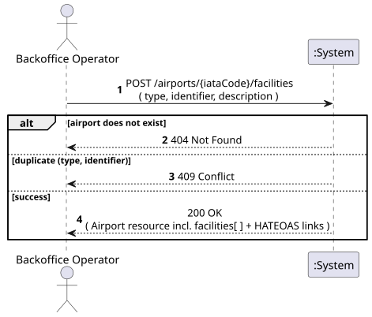
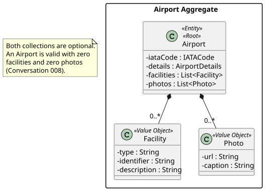
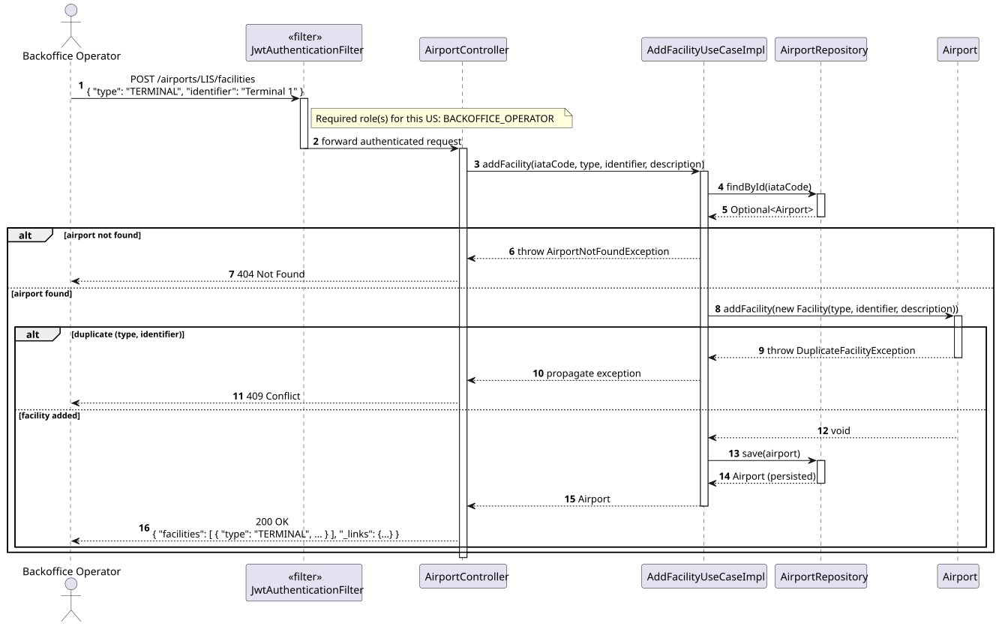
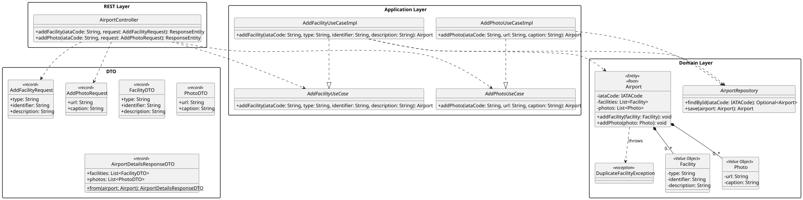

# US207 - Register an airport with optional photos and detailed facilities information

## 1. Requirements Engineering

_This section captures the User Story description, requirements specification, acceptance criteria,
dependencies, input/output data, and a high-level Actor-System interaction._

### 1.1. User Story Description

> As a **Backoffice Operator**, I want to register an airport with optional photos and detailed
> facilities information (terminals, gates, services).

### 1.2. Customer Specifications and Clarifications

**[Conversation 008 – US207, Detailed facilities information structure]** The customer was asked
whether facilities should be structured data or a free-text field:

> "Por enquanto, não me parece haver nenhuma funcionalidade planeada que necessite desta informação.
> No entanto, modelar como dados estruturados parece mais coerente com o nível de detalhe
> solicitado."

This means: **facilities must be modelled as structured data** (a list of typed entries — e.g.
Terminal, Gate, Service — each with an identifier and description), not as a single free-text
field, even though no other US currently queries this data directly.

**Interpretation:**

US207 **extends** the Phase 1 `Airport` aggregate (US106) with two new **optional** collections:
`facilities` and `photos`. Because both are optional, this US is realised in two complementary
ways: (a) they may be supplied at registration time as additional fields of the existing
`POST /airports` request, and (b) they may be added incrementally to an **already registered**
airport (including the three airports bootstrapped in Phase 1 — LIS, OPO, FAO) through two new
additive endpoints, following the same pattern already established by US106a (`add-certification`).

### 1.3. Acceptance Criteria

**Standard (from assignment §5 — apply to all user stories):**

- AC1: Analysis and design documentation (domain model excerpt, design justification, sequence
  diagram when necessary, unit tests).
- AC2: OpenAPI specification provided.
- AC3: Postman collection with sample requests and automated tests.
- AC4: Proper handling of concurrent access.
- AC5: Error handling with appropriate HTTP status codes and meaningful error messages.
- AC6: Input validation for all API endpoint parameters.
- AC7: Security considerations enforced.

**Domain-specific acceptance criteria:**

- AC8: `facilities` and `photos` are **optional** — an airport may be registered, and may remain
  valid, with zero facilities and zero photos (per Conversation 008, no functionality currently
  depends on this data).
- AC9: Each `Facility` entry has a mandatory **type** (e.g. `TERMINAL`, `GATE`, `SERVICE`), a
  mandatory **identifier** (e.g. "Terminal 1", "Gate A12"), and an optional **description**.
- AC10: A facility with the same `(type, identifier)` pair cannot be added twice to the same
  airport; a duplicate attempt returns **HTTP 409 Conflict**.
- AC11: Each `Photo` entry has a mandatory **url** (non-blank, well-formed) and an optional
  **caption**. Invalid URLs return **HTTP 400 Bad Request**.
- AC12: The target airport (by IATA code) must exist for either additive operation; otherwise
  **HTTP 404 Not Found**.
- AC13: A successful addition returns **HTTP 200 OK** with the updated Airport representation and
  HATEOAS links (the same pattern as US106a — no new sub-resource URL is created).
- AC14: When supplied at registration time (`POST /airports`), `facilities` and `photos` are
  accepted as optional array fields, validated the same way, and persisted together with the new
  Airport in a single transaction; registration still returns **HTTP 201 Created**.
- AC15: Only the **Backoffice Operator** role is authorised to register airports or add
  facilities/photos. Unauthenticated requests return HTTP 401; other roles return HTTP 403.

### 1.4. Found out Dependencies

| Dependency | Type | Reason |
|:---|:---|:---|
| US106 – Register Airport | Prerequisite | `Airport` must exist (either created together with facilities/photos, or beforehand) before facilities/photos can be attached to it. |
| US106a – Add Airport Certification | Sibling pattern | Establishes the additive "modify an existing aggregate without creating a new resource URL → 200 OK" convention reused here. |
| US107 – View Airport Details | Consumer | The details response is extended with `facilities[ ]` and `photos[ ]`. |

### 1.5. Input and Output Data

**Input — Add Facility (`POST /airports/{iataCode}/facilities`):**

| Field | Type | Mandatory | Validation Rule |
|:---|:---|:---:|:---|
| `type` | String | YES | Non-empty (e.g. `TERMINAL`, `GATE`, `SERVICE`) |
| `identifier` | String | YES | Non-empty (e.g. "Terminal 1") |
| `description` | String | NO | Free text |

**Input — Add Photo (`POST /airports/{iataCode}/photos`):**

| Field | Type | Mandatory | Validation Rule |
|:---|:---|:---:|:---|
| `url` | String | YES | Non-blank, well-formed URL |
| `caption` | String | NO | Free text |

**Input — Register Airport (`POST /airports`, extends US106):** unchanged mandatory fields, plus
two new optional array fields: `facilities[ ]` and `photos[ ]` (same shape as above).

**Output:**

| Scenario | HTTP Status | Body |
|:---|:---:|:---|
| Facility/Photo added | 200 OK | Updated Airport representation (incl. `facilities[ ]`/`photos[ ]`) + HATEOAS links |
| Airport registered (with/without facilities/photos) | 201 Created | Full Airport representation + HATEOAS links |
| Invalid input | 400 Bad Request | Error message |
| Unauthenticated | 401 Unauthorized | — |
| Wrong role | 403 Forbidden | — |
| Airport not found | 404 Not Found | Error message |
| Duplicate facility `(type, identifier)` | 409 Conflict | Error message |

### 1.6. System Sequence Diagram (SSD)

_High-level Actor-System interaction for US207 (Add Facility to an existing airport)._

_PlantUML source: [US207-SSD.puml](puml/US207-SSD.puml)_

### 1.7. Other Relevant Remarks

- **Optionality drives the design:** because facilities/photos are optional and currently consumed
  by no other use case (Conversation 008), the design favours two small, independent additive
  endpoints over forcing every registration to carry this data up front.
- **No size/type enum constraint:** `type` is kept as free text (not a closed enum) so the
  Backoffice Operator is not blocked from registering facility kinds not foreseen today — consistent
  with how `AircraftModel` features were also left as free text (Conversation 009).

---

## 2. Analysis

### 2.1. Relevant Domain Model Excerpt

| Class | Stereotype | Role in this US |
|:---|:---|:---|
| `Airport` | Entity, Aggregate Root | Owns the new `facilities` and `photos` collections; exposes `addFacility()`/`addPhoto()`. |
| `Facility` | Value Object *(new)* | type, identifier, description. |
| `Photo` | Value Object *(new)* | url, caption. |
| `IATACode` | Value Object | Identifies the target Airport (path parameter). |

_PlantUML source: [US207-DM.puml](puml/US207-DM.puml)_

### 2.2. Other Remarks

`Facility` and `AirportContact` were already anticipated in the global domain model
(`docs/sytem-documentation/global-artifacts/DM.puml`) as Value Objects of the Airport Aggregate, in
preparation for Phase 2. `Photo` is a new addition introduced by this US, modelled the same way:
an immutable, identity-less Value Object stored in an `@ElementCollection`.

---

## 3. Design — User Story Realization

### 3.1. Rationale

| Interaction ID | Question: Which class is responsible for… | Answer | Justification (with patterns) |
|:---|:---|:---|:---|
| Step 1 | Receiving the HTTP POST request and the facility/photo payload? | `AirportController` | Controller layer handles HTTP concerns and `@Valid` input validation. |
| Step 2 | Orchestrating the addition — finding the airport and invoking the domain operation? | `AddFacilityUseCaseImpl` / `AddPhotoUseCaseImpl` | Application layer (Pure Fabrication) — mirrors `AddCertificationUseCaseImpl` exactly. |
| Step 3 | Retrieving the Airport aggregate by IATA code? | `AirportRepository.findById()` | Repository — loads the aggregate for modification. |
| Step 4 | Enforcing the "no duplicate `(type, identifier)`" invariant? | `Airport.addFacility()` | Domain layer — invariants belong to the Aggregate Root (Information Expert; avoids an anemic domain model). |
| Step 5 | Persisting the updated aggregate? | `AirportRepository.save()` | Repository abstraction. |

### Systematization

Conceptual classes promoted to software classes:

- `Airport`
- `Facility`
- `Photo`
- `IATACode`

Pure Fabrication (software-only) classes:

- `AirportController`
- `AddFacilityUseCase` / `AddFacilityUseCaseImpl`
- `AddPhotoUseCase` / `AddPhotoUseCaseImpl`
- `AirportRepository` (interface)
- `AddFacilityRequest`, `AddPhotoRequest` (input DTOs)
- `FacilityDTO`, `PhotoDTO` (output DTOs, embedded in `AirportDetailsResponseDTO`)
- `DuplicateFacilityException`

### 3.2. Sequence Diagram (SD)

_PlantUML source: [US207-SD.puml](puml/US207-SD.puml)_

### 3.3. Class Diagram (CD)

_PlantUML source: [US207-CD.puml](puml/US207-CD.puml)_

---

## 4. Tests

### 4.1. Unit Tests — Domain

**`AirportTest`** (`src/test/…/airports/domain/AirportTest.java`):

- `can_add_facility_to_airport` — `addFacility()` adds a `Facility` to the collection.
- `cannot_add_duplicate_facility` — adding `(type, identifier)` twice throws `DuplicateFacilityException`.
- `can_add_photo_to_airport` — `addPhoto()` adds a `Photo` to the collection.
- `airport_can_be_registered_with_zero_facilities_and_photos` — both collections default to empty.

### 4.2. Unit Tests — Use Case

**`AddFacilityUseCaseImplTest`** (`src/test/…/airports/services/AddFacilityUseCaseImplTest.java`):

- `adds_facility_successfully` — valid request persists the updated airport.
- `throws_not_found_when_airport_missing` — unknown IATA code throws `AirportNotFoundException`.
- `throws_conflict_on_duplicate_facility` — repeated `(type, identifier)` throws `DuplicateFacilityException`.

### 4.3. Slice Tests — Controller

**`AirportControllerTest`**:

- `post_facility_returns_200` — valid request with `BACKOFFICE_OPERATOR` role returns 200.
- `post_facility_returns_404_when_airport_missing` — unknown IATA returns 404.
- `post_facility_returns_409_on_duplicate` — duplicate `(type, identifier)` returns 409.
- `post_photo_returns_400_on_blank_url` — blank `url` fails `@Valid` → 400.

---

## 5. Construction (Implementation)

### 5.1. Classes to Create / Modify

| Class | Package | Type | Role |
|:---|:---|:---|:---|
| `Facility` | `airports.domain` | `@Embeddable` VO | type, identifier, description. |
| `Photo` | `airports.domain` | `@Embeddable` VO | url, caption. |
| `Airport.addFacility()` / `Airport.addPhoto()` | `airports.domain` | Domain methods | Enforce invariants; append to the respective `@ElementCollection`. |
| `DuplicateFacilityException` | `airports.domain` | `RuntimeException` | Thrown on duplicate `(type, identifier)` → mapped to 409. |
| `AddFacilityUseCase` / `Impl` | `airports.services` | Interface / `@Service` | Loads airport, delegates to `Airport.addFacility()`, saves. |
| `AddPhotoUseCase` / `Impl` | `airports.services` | Interface / `@Service` | Loads airport, delegates to `Airport.addPhoto()`, saves. |
| `AddFacilityRequest`, `AddPhotoRequest` | `airports.dto` | `record` | Input DTOs with `@Valid` annotations. |
| `FacilityDTO`, `PhotoDTO` | `airports.dto` | `record` | Output DTOs; embedded as new fields of `AirportDetailsResponseDTO`. |
| `AirportController` | `airports.controllers` | `@RestController` | New endpoints `POST /airports/{iataCode}/facilities` and `POST /airports/{iataCode}/photos`. |
| `RegisterAirportRequest` / `AirportFactory` | `airports.dto` / `airports.factories` | `record` / `@Component` | Extended with optional `facilities[ ]` / `photos[ ]` so they can be supplied at registration time. |
| `GlobalExceptionHandler` | `exceptions` | `@RestControllerAdvice` | Adds mapping `DuplicateFacilityException` → 409. |

### 5.2. Key Design Decisions

- **Two complementary entry points, one invariant set:** whether facilities/photos are supplied at
  registration (US106 extension) or added later (new endpoints), they pass through the same domain
  methods (`Airport.addFacility`/`addPhoto`), so the duplicate-prevention invariant is enforced
  exactly once, in the domain, regardless of the calling path.
- **200 OK, not 201, for additive endpoints** — consistent with US106a: the response represents the
  *updated* Airport, not a newly created standalone resource.
- **`type` as free text, not enum** — keeps the design open for facility kinds not yet anticipated,
  per the customer's "no functionality depends on this yet" remark (Conversation 008).

---

## 6. Integration and Demo

### 6.1. Prerequisites

1. Application running (`mvn spring-boot:run`).
2. `LIS` is bootstrapped automatically and has no facilities/photos yet.

### 6.2. Postman Steps

1. **Authenticate** — run _Auth → Login (backoffice)_.
2. **Add a facility** — run _US207 — Add Facility to LIS (200)_. Sends
   `POST /airports/LIS/facilities` with `{"type":"TERMINAL","identifier":"Terminal 1"}`; expects
   HTTP 200 and the facility present in `facilities[ ]`.
3. **Duplicate facility** — run _US207 — Duplicate Facility (409)_. Repeats the previous request;
   expects HTTP 409.
4. **Add a photo** — run _US207 — Add Photo to LIS (200)_. Sends `POST /airports/LIS/photos` with
   `{"url":"https://example.com/lis.jpg"}`; expects HTTP 200.

### 6.3. OpenAPI

`POST /airports/{iataCode}/facilities` and `POST /airports/{iataCode}/photos` are documented under
the **Airports** tag in Swagger UI at `http://localhost:8080/swagger-ui.html`.

---

## 7. Observations

- `facilities` and `photos` are intentionally **not** part of `AirportSummaryResponseDTO` (US108) —
  they only appear in the full `AirportDetailsResponseDTO` (US107), keeping list responses
  lightweight, consistent with the rationale already applied to `runways`/`certifiedModels`.
- This US does not change `AirportState` or any operational invariant; it is purely additive.
