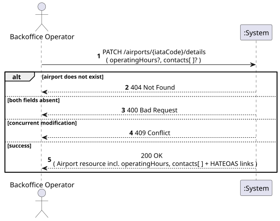
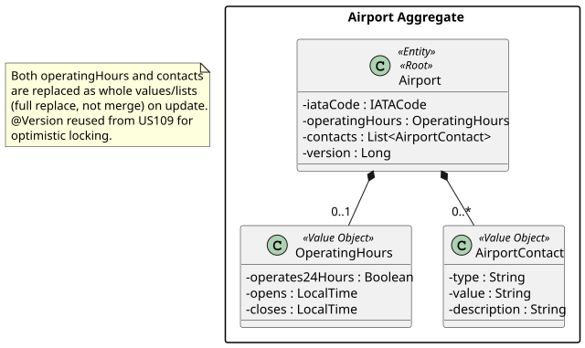
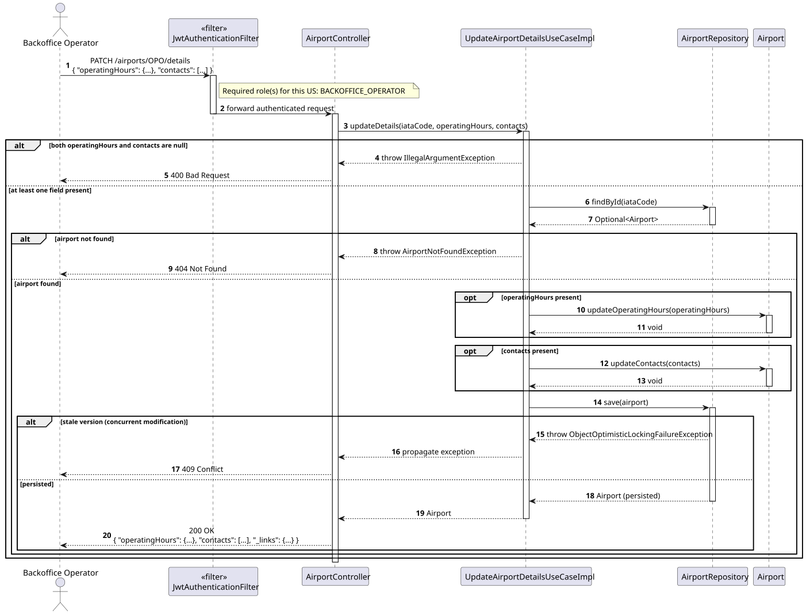
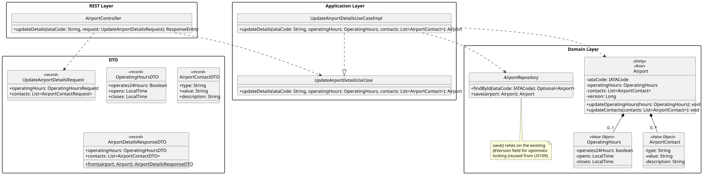

# US208 - Update airport details including operational hours and contact information

## 1. Requirements Engineering

_This section captures the User Story description, requirements specification, acceptance criteria,
dependencies, input/output data, and a high-level Actor-System interaction._

### 1.1. User Story Description

> As a **Backoffice Operator**, I want to update airport details including operational hours and
> contact information.

### 1.2. Customer Specifications and Clarifications

**[Conversation 014 – US208, Update Airport details and contact information]**

> "A US208 fala em atualizar os detalhes de um aeroporto incluindo horas em que estão operacionais
> e informações de contacto. [...] O cliente quererá ter a opção de ter mais que um número de
> telemóvel por aeroporto, ou eventualmente haver mais meios de contacto?"

Client response:

> "Sim, um aeroporto pode ter múltiplos contactos. Cada contacto deve ter um tipo (telefone, email,
> fax, etc.), o valor e uma descrição ou um departamento associado (opcional)."

This means: an Airport must support a **list** of contacts (1..*), each with `type`, `value`, and
an optional `description`/`department`. There is no single "the phone number" field — `Contact` is
a structured, repeatable Value Object.

**Interpretation:**

US208 is a **command** operation that updates two independent pieces of an existing `Airport`:
its `operatingHours` and its `contacts` list. Both are optional in the request — a caller may
update only one of them. Unlike US109 (which replaces a single enum value), this US replaces
**whole sub-objects** (the entire `OperatingHours` value, and/or the entire `contacts` list),
which keeps the update semantics simple and avoids needing per-contact add/remove sub-resources for
this iteration.

### 1.3. Acceptance Criteria

**Standard (from assignment §5 — apply to all user stories):**

- AC1: Analysis and design documentation (domain model excerpt, design justification, sequence
  diagram when necessary, unit tests).
- AC2: OpenAPI specification provided.
- AC3: Postman collection with sample requests and automated tests.
- AC4: Proper handling of concurrent access.
- AC5: Error handling with appropriate HTTP status codes and meaningful error messages.
- AC6: Input validation for all API endpoint parameters.
- AC7: Security considerations enforced.

**Domain-specific acceptance criteria:**

- AC8: The Airport identified by the given IATA code must exist; otherwise HTTP 404 Not Found.
- AC9: The request must supply **at least one** of `operatingHours` or `contacts`; a request with
  both absent returns HTTP 400 Bad Request (nothing to update).
- AC10: `operatingHours`, when provided, has either `operates24Hours = true` (no further fields
  required), or `operates24Hours = false` with both `opens` and `closes` times provided and
  `opens` strictly before `closes`; any other combination returns HTTP 400.
- AC11: Each entry in `contacts`, when provided, must have a non-blank **type** (e.g. `PHONE`,
  `EMAIL`, `FAX`) and a non-blank **value**; **description**/department is optional. An empty
  `contacts` list is a valid value (clears all contacts).
- AC12: When `contacts` is supplied, it **replaces** the airport's entire contact list (full
  replace, not merge/append).
- AC13: Concurrent updates must be detected via optimistic locking (the existing `Airport.version`
  field, already introduced for US109) — HTTP 409 Conflict on a stale write.
- AC14: Successful update returns **HTTP 200 OK** with the updated Airport resource and HATEOAS
  links.
- AC15: Only the **Backoffice Operator** role is authorised. Unauthenticated requests return HTTP
  401; other roles return HTTP 403.

### 1.4. Found out Dependencies

| Dependency | Type | Reason |
|:---|:---|:---|
| US106 – Register Airport | Prerequisite | The Airport must exist before its details can be updated. |
| US109 – Update Airport Status | Sibling pattern | Reuses the same optimistic-locking (`@Version`) mechanism for safe concurrent updates. |
| US107 – View Airport Details | Consumer | The details response is extended with `operatingHours` and `contacts[ ]`. |

### 1.5. Input and Output Data

**Input — `PATCH /airports/{iataCode}/details`:**

| Field | Type | Mandatory | Validation Rule |
|:---|:---|:---:|:---|
| `operatingHours.operates24Hours` | Boolean | Conditional | Required if `operatingHours` is present |
| `operatingHours.opens` | Time (`HH:mm`) | Conditional | Required if `operates24Hours = false` |
| `operatingHours.closes` | Time (`HH:mm`) | Conditional | Required if `operates24Hours = false`; must be after `opens` |
| `contacts[ ].type` | String | Conditional | Required for each contact entry if `contacts` is present |
| `contacts[ ].value` | String | Conditional | Required for each contact entry if `contacts` is present |
| `contacts[ ].description` | String | NO | Free text (e.g. department) |

_At least one of `operatingHours` or `contacts` must be present in the request body._

**Output:**

| Scenario | HTTP Status | Body |
|:---|:---:|:---|
| Successful update | 200 OK | Updated Airport resource (incl. `operatingHours`, `contacts[ ]`) + HATEOAS links |
| Neither field supplied, or invalid values | 400 Bad Request | Error message |
| Unauthenticated | 401 Unauthorized | — |
| Wrong role | 403 Forbidden | — |
| Airport not found | 404 Not Found | Error message |
| Concurrent modification conflict | 409 Conflict | Error message |

### 1.6. System Sequence Diagram (SSD)

_High-level Actor-System interaction for US208._

_PlantUML source: [US208-SSD.puml](puml/US208-SSD.puml)_

### 1.7. Other Relevant Remarks

- **Full replace, not merge, for `contacts`:** chosen to keep the operation idempotent and the
  domain method simple (`Airport.updateContacts(List<AirportContact>)`), avoiding the extra
  complexity of per-contact identity and add/remove endpoints, which the client did not request.
- **`PATCH` semantics:** consistent with US109 — the verb communicates that only part of the
  Airport's state changes, while the unspecified part (e.g. `runways`, `status`) is left untouched.

---

## 2. Analysis

### 2.1. Relevant Domain Model Excerpt

| Class | Stereotype | Role in this US |
|:---|:---|:---|
| `Airport` | Entity, Aggregate Root | The aggregate whose `operatingHours`/`contacts` are being replaced. |
| `OperatingHours` | Value Object *(new)* | `operates24Hours`, `opens`, `closes`. |
| `AirportContact` | Value Object | type, value, description (already anticipated in the global DM). |
| `IATACode` | Value Object | Identifies the target Airport (path parameter). |

_PlantUML source: [US208-DM.puml](puml/US208-DM.puml)_

### 2.2. Other Remarks

`AirportContact` was already present in the global domain model
(`docs/sytem-documentation/global-artifacts/DM.puml`) in anticipation of Phase 2. `OperatingHours`
is a new Value Object introduced by this US; like `Coordinates`, it validates its own internal
consistency (`opens < closes`) in its constructor, keeping the invariant out of the service layer.

---

## 3. Design — User Story Realization

### 3.1. Rationale

| Interaction ID | Question: Which class is responsible for… | Answer | Justification (with patterns) |
|:---|:---|:---|:---|
| Step 1 | Receiving the HTTP PATCH request and the optional fields? | `AirportController` | Controller layer — handles HTTP, extracts path parameter and request body. |
| Step 2 | Orchestrating the update — finding the airport and coordinating which fields to replace? | `UpdateAirportDetailsUseCaseImpl` | Application layer (Pure Fabrication) — decides *whether* to call `updateOperatingHours`/`updateContacts` based on which fields are present, without encoding their internal validation. |
| Step 3 | Retrieving the Airport aggregate (including its current version)? | `AirportRepository.findById()` | Repository — loads the aggregate for modification. |
| Step 4 | Validating and applying the new operating hours / contact list? | `Airport.updateOperatingHours()` / `Airport.updateContacts()` | Domain layer — invariants (`opens < closes`, non-blank contact fields) belong in the Aggregate Root. |
| Step 5 | Persisting the updated aggregate, detecting concurrent modification via version check? | `AirportRepository.save()` | Repository — optimistic locking enforced at persistence level via the existing JPA `@Version`. |

### Systematization

Conceptual classes promoted to software classes:

- `Airport`
- `OperatingHours`
- `AirportContact`
- `IATACode`

Pure Fabrication (software-only) classes:

- `AirportController`
- `UpdateAirportDetailsUseCase` / `UpdateAirportDetailsUseCaseImpl`
- `AirportRepository` (interface)
- `UpdateAirportDetailsRequest` (input DTO)
- `OperatingHoursDTO`, `AirportContactDTO` (output DTOs, embedded in `AirportDetailsResponseDTO`)

### 3.2. Sequence Diagram (SD)

_PlantUML source: [US208-SD.puml](puml/US208-SD.puml)_

### 3.3. Class Diagram (CD)

_PlantUML source: [US208-CD.puml](puml/US208-CD.puml)_

---

## 4. Tests

### 4.1. Unit Tests — Domain

**`OperatingHoursTest`** (`src/test/…/airports/domain/OperatingHoursTest.java`):

- `valid_hours_are_accepted` — `opens` before `closes` passes construction.
- `rejects_opens_after_closes` — `opens` ≥ `closes` throws `IllegalArgumentException`.
- `operates_24_hours_does_not_require_open_close_times` — `operates24Hours = true` skips the time check.

**`AirportTest`**:

- `can_update_operating_hours` — `updateOperatingHours()` replaces the previous value.
- `can_replace_contacts` — `updateContacts()` replaces the whole list, including clearing it with an empty list.

### 4.2. Unit Tests — Use Case

**`UpdateAirportDetailsUseCaseImplTest`** (`src/test/…/airports/services/UpdateAirportDetailsUseCaseImplTest.java`):

- `updates_only_operating_hours_when_contacts_absent` — `contacts` field untouched.
- `updates_only_contacts_when_operating_hours_absent` — `operatingHours` field untouched.
- `throws_not_found_for_missing_airport` — unknown IATA throws `AirportNotFoundException`.
- `throws_bad_request_when_both_fields_absent` — neither field present throws `IllegalArgumentException` (→ 400).

### 4.3. Slice Tests — Controller

**`AirportControllerTest`**:

- `patch_details_returns_200` — valid PATCH with `BACKOFFICE_OPERATOR` role returns 200.
- `patch_details_returns_403_for_atcc_role` — `ATCC` role cannot update details; returns 403.
- `patch_details_returns_409_on_concurrent_modification` — stale `version` returns 409.

---

## 5. Construction (Implementation)

### 5.1. Classes to Create / Modify

| Class | Package | Type | Role |
|:---|:---|:---|:---|
| `OperatingHours` | `airports.domain` | `@Embeddable` VO | `operates24Hours`, `opens`, `closes`; validates `opens < closes` in its constructor. |
| `AirportContact` | `airports.domain` | `@Embeddable` VO | type, value, description; stored in an `@ElementCollection`. |
| `Airport.updateOperatingHours()` / `Airport.updateContacts()` | `airports.domain` | Domain methods | Replace the respective field/collection. |
| `UpdateAirportDetailsUseCase` / `Impl` | `airports.services` | Interface / `@Service` | Loads airport, calls the relevant domain method(s) depending on which request fields are non-null, saves. |
| `UpdateAirportDetailsRequest` | `airports.dto` | `record` | `operatingHours: OperatingHoursRequest?`, `contacts: List<AirportContactRequest>?`, both optional. |
| `OperatingHoursDTO`, `AirportContactDTO` | `airports.dto` | `record` | Output DTOs; new fields of `AirportDetailsResponseDTO`. |
| `AirportController` | `airports.controllers` | `@RestController` | New endpoint `PATCH /airports/{iataCode}/details`. |
| `GlobalExceptionHandler` | `exceptions` | `@RestControllerAdvice` | Reuses existing mappings: `AirportNotFoundException` → 404, `IllegalArgumentException` → 400, `ObjectOptimisticLockingFailureException` → 409. |

### 5.2. Key Design Decisions

- **Reuses the existing `@Version` field** on `Airport` (introduced for US109) — no new
  concurrency-control mechanism is needed since both USs mutate the same aggregate.
- **Full-replace semantics for `contacts`** — deliberately simpler than per-item add/remove, since
  the customer only confirmed that *multiple* contacts must be supported (Conversation 014), not
  that they need to be individually addressable.
- **`OperatingHours` validates itself** — keeps the `opens < closes` invariant out of the use case,
  consistent with how `Coordinates` and `Runway` validate their own ranges.

---

## 6. Integration and Demo

### 6.1. Prerequisites

1. Application running (`mvn spring-boot:run`).
2. `OPO` airport bootstrapped with no `operatingHours`/`contacts` set.

### 6.2. Postman Steps

1. **Authenticate** — run _Auth → Login (backoffice)_.
2. **Update operating hours** — run _US208 — Update Operating Hours (200)_. Sends
   `PATCH /airports/OPO/details` with `{"operatingHours":{"operates24Hours":true}}`; expects HTTP
   200.
3. **Update contacts** — run _US208 — Update Contacts (200)_. Sends
   `{"contacts":[{"type":"PHONE","value":"+351221234567"},{"type":"EMAIL","value":"ops@opo.example"}]}`;
   expects HTTP 200 with both contacts present.
4. **Nothing to update** — run _US208 — Empty Body (400)_. Sends `{}`; expects HTTP 400.

### 6.3. OpenAPI

`PATCH /airports/{iataCode}/details` is documented under the **Airports** tag in Swagger UI at
`http://localhost:8080/swagger-ui.html`.

---

## 7. Observations

- This US, like US109, mutates the `Airport` aggregate in place — no new aggregate or repository is
  introduced.
- `operatingHours` and `contacts` are independent of `AirportState` (operational/closed/under
  maintenance); updating one does not affect the other.
