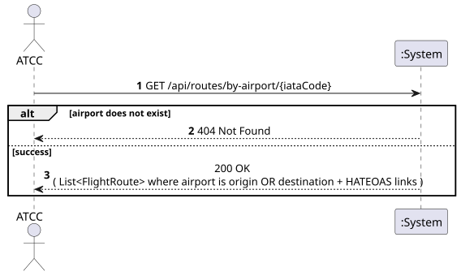
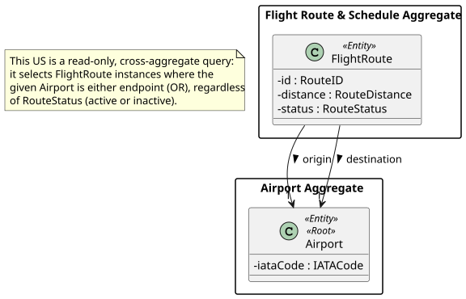
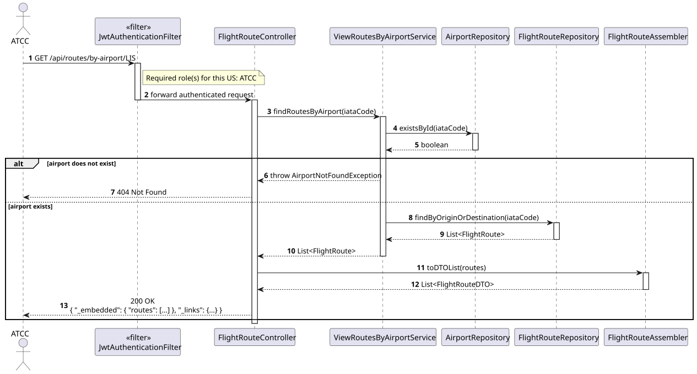
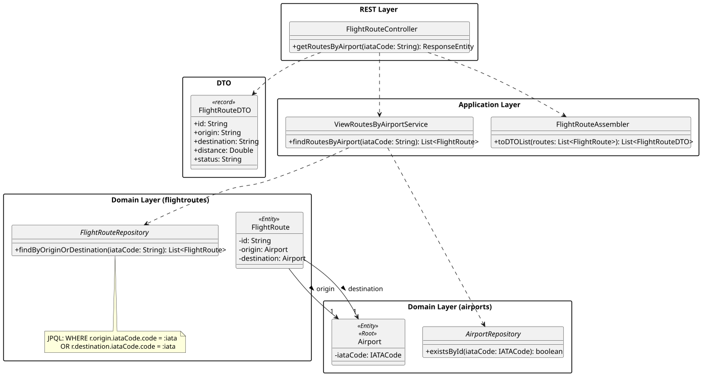

# US209 - View all routes that depart from or arrive at a specific airport

## 1. Requirements Engineering

_This section captures the User Story description, requirements specification, acceptance criteria,
dependencies, input/output data, and a high-level Actor-System interaction._

### 1.1. User Story Description

> As an **ATCC**, I want to view all routes that depart from or arrive at a specific airport.

### 1.2. Customer Specifications and Clarifications

_No direct customer clarification exists for US209 in the forum QA log._

**Relevant clarifications from adjacent topics:**

- **[Conversation 012 – Routes, Existência de Escalas]** "Uma rota é sempre entre um aeroporto de
  origem e um de destino" — every `FlightRoute` has exactly one `origin` and one `destination`, so
  "departs from or arrives at" unambiguously means: `origin == airport OR destination == airport`.
- **[Conversation 002 – WP#3A, Flight Routes]** Routes exist independently of airport operational
  state — an airport being `CLOSED`/`UNDER_MAINTENANCE` does not remove its routes from this
  listing.

**Interpretation:**

US209 differs from the already-implemented US113 ("view all routes **from** a specific airport",
`origin` only) by combining **both directions with an OR**: a route is included if the given
airport is either its origin or its destination. This is a new, dedicated query — it is not a
matter of calling US113/US114 twice and merging on the client side.

### 1.3. Acceptance Criteria

**Standard (from assignment §5 — apply to all user stories):**

- AC1: Analysis and design documentation (domain model excerpt, design justification, sequence
  diagram when necessary, unit tests).
- AC2: OpenAPI specification provided.
- AC3: Postman collection with sample requests and automated tests.
- AC4: Error handling with appropriate HTTP status codes and meaningful error messages.
- AC5: Input validation for all API endpoint parameters.
- AC6: Security considerations enforced.

**Domain-specific acceptance criteria:**

- AC7: The given IATA code must identify an existing Airport; otherwise HTTP 404 Not Found.
- AC8: The response includes every `FlightRoute` where the given airport is **either** the origin
  **or** the destination, regardless of `RouteStatus` (active or inactive) — this US does not
  filter by status (unlike US214/US215, which are Network-only/active-only by definition).
- AC9: If the airport exists but has no routes, the response is **HTTP 200 OK with an empty list**,
  not HTTP 404.
- AC10: Response includes **HATEOAS links** — a self-link on the collection and a detail-link for
  each route (linking to US113's `GET /api/routes/{id}`).
- AC11: Only the **ATCC** role is authorised. Unauthenticated requests return HTTP 401; other roles
  return HTTP 403.

### 1.4. Found out Dependencies

| Dependency | Type | Reason |
|:---|:---|:---|
| US106 – Register Airport | Prerequisite | The target Airport must exist to be queried. |
| US110 – Create Flight Route | Prerequisite | Routes referencing the airport must exist to appear in the result. |
| US113 – View Routes from a Specific Airport | Related/superseded-by-superset | US113's `findByOrigin` query is reused as half of this US's combined query; US113 itself is unchanged (still origin-only). |
| US112 – Update or Deactivate a Route | Informational | A deactivated route still appears in this listing (AC8); deactivation does not remove route history. |

### 1.5. Input and Output Data

**Input — `GET /api/routes/by-airport/{iataCode}`:**

| Field | Type | Mandatory | Validation Rule |
|:---|:---|:---:|:---|
| `iataCode` | String (path parameter) | YES | Existing Airport IATA code (3 uppercase letters) |

**Output:**

| Scenario | HTTP Status | Body |
|:---|:---:|:---|
| Airport found, routes returned (possibly empty) | 200 OK | List of `FlightRoute` representations + HATEOAS links |
| Unauthenticated | 401 Unauthorized | — |
| Wrong role | 403 Forbidden | — |
| Airport not found | 404 Not Found | Error message |

_Each route in the result includes: Route ID, origin/destination IATA codes, distance, estimated
flight time, requirements, status, and a `self` link to `GET /api/routes/{id}`._

### 1.6. System Sequence Diagram (SSD)

_High-level Actor-System interaction for US209._

_PlantUML source: [US209-SSD.puml](puml/US209-SSD.puml)_

### 1.7. Other Relevant Remarks

- **Bounded-context ownership:** although the use case is framed "by airport", the resource being
  listed is `FlightRoute`. Consistent with US113/US114 (already implemented in the `flightroutes`
  module), this US's endpoint and service also live in the `flightroutes` module — it only
  *depends on* `AirportRepository` to validate existence (AC7), it does not move route-querying
  logic into the `airports` module.
- **Distinct from US113/US114:** US113 is origin-only; US114 requires the caller to pass
  `origin`/`dest` as an AND-filter for a route *search*. Reusing either would force the client to
  issue two requests and merge results, duplicating server-side logic on the client. A single OR
  query at the repository level is both simpler to consume and more efficient (`findByOrigin` and
  `findByDestination` already exist individually; this US adds the combined `OR` query).

---

## 2. Analysis

### 2.1. Relevant Domain Model Excerpt

| Class | Stereotype | Role in this US |
|:---|:---|:---|
| `FlightRoute` | Entity | The aggregate instances being searched and returned. |
| `Airport` | Entity *(cross-aggregate reference)* | Identified by `IATACode`; referenced by `FlightRoute.origin`/`FlightRoute.destination`; existence is validated before querying. |
| `RouteDistance`, `RouteRequirements`, `EstimatedFlightTime`, `RouteStatus` | Value Objects | Included in each result item. |

_PlantUML source: [US209-DM.puml](puml/US209-DM.puml)_

### 2.2. Other Remarks

This is a **multi-aggregate, cross-context query** (it reads `FlightRoute` instances filtered by an
`Airport` identity). Just as in US108, the filtering condition belongs in the repository layer
(`FlightRouteRepository`), not in any domain entity — neither `Airport` nor `FlightRoute` is asked
"are you connected to X?" as a domain behaviour; it is answered by a JPQL query.

---

## 3. Design — User Story Realization

### 3.1. Rationale

| Interaction ID | Question: Which class is responsible for… | Answer | Justification (with patterns) |
|:---|:---|:---|:---|
| Step 1 | Receiving the HTTP GET request and the IATA code path parameter? | `FlightRouteController` | Controller layer handles HTTP concerns. |
| Step 2 | Orchestrating the query — verifying the airport exists, then fetching its routes? | `ViewRoutesByAirportService` | Application layer (Pure Fabrication) — coordinates two repositories without encoding persistence logic. |
| Step 3 | Verifying the Airport exists? | `AirportRepository.existsById()` | Repository — reused as-is from the `airports` module; no new Airport-side logic needed. |
| Step 4 | Executing the OR query across `FlightRoute.origin`/`FlightRoute.destination`? | `FlightRouteRepository.findByOriginOrDestination()` | Repository — multi-aggregate filtering is a repository concern. |
| Step 5 | Mapping results to response DTOs with HATEOAS links? | `FlightRouteAssembler` | DTO/Assembler — reused as-is from US110–US216, keeps domain free of HTTP concerns. |

### Systematization

Conceptual classes promoted to software classes:

- `FlightRoute`
- `Airport` *(cross-reference, no new behaviour)*

Pure Fabrication (software-only) classes:

- `FlightRouteController` (new endpoint on the existing controller)
- `ViewRoutesByAirportService`
- `FlightRouteRepository.findByOriginOrDestination` (new query method)
- `FlightRouteAssembler` (reused, unchanged)

### 3.2. Sequence Diagram (SD)

_PlantUML source: [US209-SD.puml](puml/US209-SD.puml)_

### 3.3. Class Diagram (CD)

_PlantUML source: [US209-CD.puml](puml/US209-CD.puml)_

---

## 4. Tests

### 4.1. Unit Tests — Use Case

**`ViewRoutesByAirportServiceTest`** (`src/test/…/flightroutes/services/ViewRoutesByAirportServiceTest.java`):

- `returns_routes_where_airport_is_origin_or_destination` — a route with the airport as origin and
  another with the airport as destination are both returned.
- `returns_empty_list_when_airport_has_no_routes` — existing airport, zero matching routes → empty
  list (not an exception).
- `throws_airport_not_found_for_unknown_iata` — unknown IATA throws `AirportNotFoundException`.

### 4.2. Integration Tests — Repository

**`FlightRouteRepositoryTest`**:

- `findByOriginOrDestination_includes_both_directions` — verifies the JPQL `OR` query against an
  in-memory/test database with routes in both directions.
- `findByOriginOrDestination_includes_inactive_routes` — a deactivated (`INACTIVE`) route is still
  returned (AC8).

### 4.3. Slice Tests — Controller

**`FlightRouteControllerTest`**:

- `get_routes_by_airport_returns_200_with_empty_list` — airport with no routes still returns 200.
- `get_routes_by_airport_returns_404_for_unknown_airport` — unknown IATA returns 404.
- `get_routes_by_airport_returns_403_for_backoffice_operator` — only `ATCC` is authorised.

---

## 5. Construction (Implementation)

### 5.1. Classes to Create / Modify

| Class | Package | Type | Role |
|:---|:---|:---|:---|
| `FlightRouteRepository.findByOriginOrDestination` | `flightroutes.repositories` | JPQL query | `SELECT r FROM FlightRoute r WHERE r.origin.iataCode.code = :iata OR r.destination.iataCode.code = :iata`. |
| `ViewRoutesByAirportService` | `flightroutes.services` | `@Service` | Validates airport existence via `AirportRepository.existsById()`, then delegates to the new repository query. |
| `FlightRouteController` | `flightroutes.controllers` | `@RestController` | New endpoint `GET /api/routes/by-airport/{iataCode}`, restricted to `ATCC`. |
| `AirportNotFoundException` | `airports.domain` | `RuntimeException` *(reused)* | Thrown by `ViewRoutesByAirportService` when the airport does not exist; already mapped to 404 by `GlobalExceptionHandler`. |

### 5.2. Key Design Decisions

- **New endpoint, not a query-param overload:** `GET /api/routes/by-airport/{iataCode}` is kept
  distinct from `GET /api/routes/search?origin=&dest=` (US114, AND-semantics) to avoid ambiguity
  between "either" and "both" filtering on the same URL.
- **Cross-module dependency is one-directional:** `ViewRoutesByAirportService` (in `flightroutes`)
  depends on `AirportRepository` (in `airports`) purely for an existence check — the same direction
  of dependency that already exists for `CreateFlightRouteService` (US110), so no new dependency
  cycle is introduced.
- **No pagination in this iteration:** consistent with US113/US114, which return plain lists;
  pagination can be added later (as already done for `ViewScheduledFlightsByAircraftService`,
  US213) without changing this US's contract.

---

## 6. Integration and Demo

### 6.1. Prerequisites

1. Application running (`mvn spring-boot:run`).
2. At least one route with `LIS` as origin and one with `LIS` as destination exist (e.g. via US110).

### 6.2. Postman Steps

1. **Authenticate** — run _Auth → Login (atcc)_.
2. **View routes by airport** — run _US209 — Routes by Airport LIS (200)_. Sends
   `GET /api/routes/by-airport/LIS`; expects HTTP 200 with routes where `LIS` is either origin or
   destination.
3. **Unknown airport** — run _US209 — Unknown Airport (404)_. Sends
   `GET /api/routes/by-airport/XXX`; expects HTTP 404.

### 6.3. OpenAPI

`GET /api/routes/by-airport/{iataCode}` is documented under the **Flight Routes** tag in Swagger
UI at `http://localhost:8080/swagger-ui.html`.

---

## 7. Observations

- This US deliberately does not reuse US113's controller method (`getRouteById`) or US114's
  `searchRoutes` method — both have different semantics (single-route lookup; AND-filtered search)
  and conflating them would have made the existing methods harder to read.
- `findByOriginOrDestination` complements (does not replace) the already-existing `findByOrigin`
  and `findByDestination` queries, which remain in use by `SearchFlightRoutesService` (US114).
