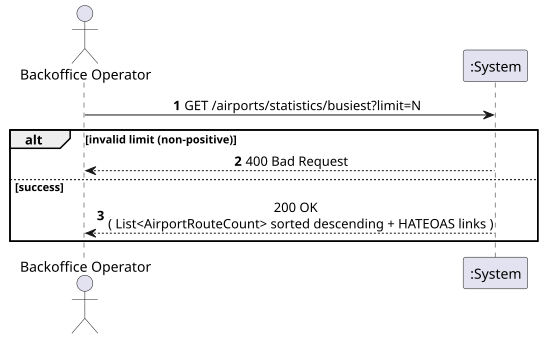
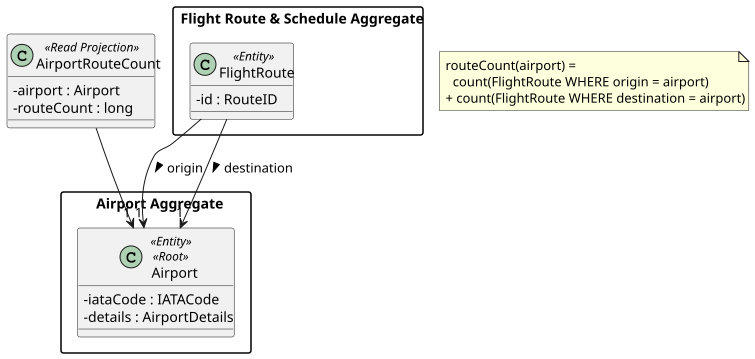
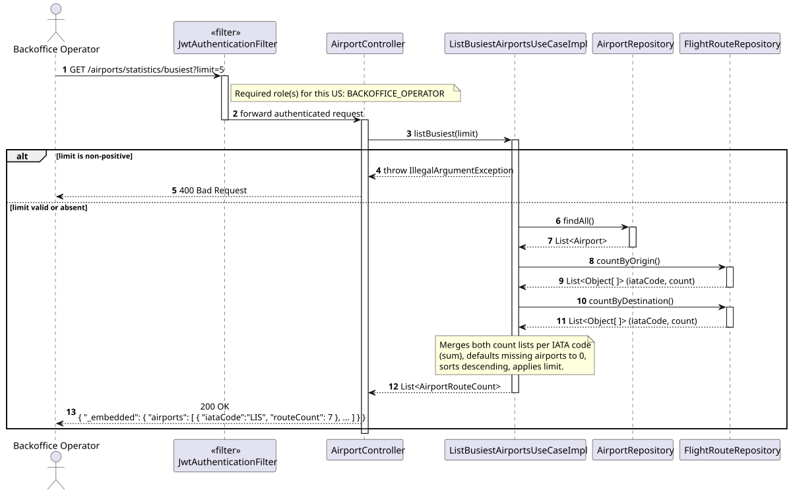
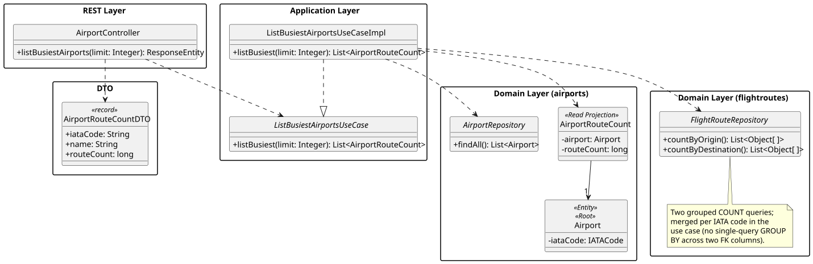

# US210 - Generate statistics on the busiest airports by number of routes

## 1. Requirements Engineering

_This section captures the User Story description, requirements specification, acceptance criteria,
dependencies, input/output data, and a high-level Actor-System interaction._

### 1.1. User Story Description

> As a **Backoffice Operator**, I want to generate statistics on the busiest airports by number of
> routes.

### 1.2. Customer Specifications and Clarifications

_No direct customer clarification exists for US210 in the forum QA log._

**Relevant clarifications from adjacent topics:**

- **[Conversation 012 – Routes, Existência de Escalas]** Every `FlightRoute` has exactly one
  `origin` and one `destination` — "number of routes" for an airport must therefore count routes
  where the airport is **either** endpoint, mirroring the same OR-semantics already established for
  US209.
- **Assignment §1 (Key Metrics):** the assignment's own metric list already establishes the
  pattern of "Top N by some count" (e.g. "Top 5 most utilized aircraft by flight hours"). US210
  follows the same shape, generalised to airports/routes.

**Interpretation:**

US210 is a **derived statistic**, not a stored attribute: "number of routes" for an airport is
computed by counting `FlightRoute` rows where the airport is origin or destination, exactly like
the **Route Popularity (Usage Count)** metric already defined in the glossary for US214 (count of
`ScheduledFlight` per `FlightRoute`). The result is a ranked list of airports, sorted by that count
in descending order.

### 1.3. Acceptance Criteria

**Standard (from assignment §5 — apply to all user stories):**

- AC1: Analysis and design documentation (domain model excerpt, design justification, sequence
  diagram when necessary, unit tests).
- AC2: OpenAPI specification provided.
- AC3: Postman collection with sample requests and automated tests.
- AC4: Error handling with appropriate HTTP status codes and meaningful error messages.
- AC5: Input validation for all API endpoint parameters.
- AC6: Security considerations enforced.

**Domain-specific acceptance criteria:**

- AC7: For every registered Airport, the system computes its **route count** = number of
  `FlightRoute` rows where the airport is the origin **plus** the number where it is the
  destination (a route connecting the airport to itself would be counted twice, but the system
  already disallows such routes — both endpoints differ by construction, US110).
- AC8: The result is a list of `(airport, routeCount)` pairs **sorted descending by `routeCount`**.
  Airports with zero routes are included with `routeCount = 0` (they are "the least busy", not
  absent from the statistic).
- AC9: An optional `limit` query parameter restricts the result to the top N airports (e.g.
  `?limit=5`, mirroring the assignment's "Top 5" framing for other metrics). If omitted, all
  airports are returned, sorted. `limit` must be a positive integer; otherwise HTTP 400.
- AC10: Response includes **HATEOAS links** — a self-link on the collection, and a detail-link for
  each airport (linking to US107).
- AC11: Only the **Backoffice Operator** role is authorised. Unauthenticated requests return HTTP
  401; other roles return HTTP 403.

### 1.4. Found out Dependencies

| Dependency | Type | Reason |
|:---|:---|:---|
| US106 – Register Airport | Prerequisite | Airports must exist to be ranked (even with zero routes). |
| US110 – Create Flight Route | Prerequisite | Route counts are derived from existing `FlightRoute` rows. |
| US209 – View Routes by Airport | Sibling pattern | Both USs answer "how many/which routes touch this airport"; US210 aggregates what US209 enumerates. |
| US214 – List Active Routes by Popularity | Related pattern | Establishes the "derived count, sorted list, optional Top-N" shape reused here. |

### 1.5. Input and Output Data

**Input — `GET /airports/statistics/busiest`:**

| Field | Type | Mandatory | Validation Rule |
|:---|:---|:---:|:---|
| `limit` | Integer (query parameter) | NO | Positive integer if provided |

**Output:**

| Scenario | HTTP Status | Body |
|:---|:---:|:---|
| Statistics computed | 200 OK | List of `(iataCode, name, routeCount)` sorted descending + HATEOAS links |
| Invalid `limit` (≤ 0 or non-numeric) | 400 Bad Request | Error message |
| Unauthenticated | 401 Unauthorized | — |
| Wrong role | 403 Forbidden | — |

### 1.6. System Sequence Diagram (SSD)

_High-level Actor-System interaction for US210._

_PlantUML source: [US210-SSD.puml](puml/US210-SSD.puml)_

### 1.7. Other Relevant Remarks

- **No new persisted attribute:** `routeCount` is never stored on `Airport`; it is recomputed on
  every request from `FlightRoute` data, the same approach already taken for Route Popularity
  (US214) — avoids the classic "stale denormalised counter" bug class.
- **Counting both directions in the service, not a single JPQL query:** JPQL cannot cleanly
  `GROUP BY` across two different foreign-key columns (`origin`, `destination`) in one query. The
  design runs two grouped count queries (one per column) and merges them in
  `ListBusiestAirportsUseCaseImpl`, the same "merge in the application layer" approach already used
  nowhere else in this codebase but directly analogous to how `findActiveRoutesWithUsage` (US214)
  performs its single-column aggregation.

---

## 2. Analysis

### 2.1. Relevant Domain Model Excerpt

| Class | Stereotype | Role in this US |
|:---|:---|:---|
| `Airport` | Entity, Aggregate Root | The aggregate being ranked. |
| `AirportRouteCount` | Read Projection *(new, not persisted)* | Pairs an `Airport` with its derived `routeCount`, mirroring `RouteUsage` (US214). |
| `FlightRoute` | Entity *(cross-aggregate reference)* | Source of the counts (`origin`, `destination`). |

_PlantUML source: [US210-DM.puml](puml/US210-DM.puml)_

### 2.2. Other Remarks

`AirportRouteCount` is **not** part of the persisted domain model — like `RouteUsage` (US214), it
is a plain read-only Java class populated by the application layer from two repository queries. It
exists purely to carry data across layers, not to enforce invariants.

---

## 3. Design — User Story Realization

### 3.1. Rationale

| Interaction ID | Question: Which class is responsible for… | Answer | Justification (with patterns) |
|:---|:---|:---|:---|
| Step 1 | Receiving the HTTP GET request and the optional `limit` parameter? | `AirportController` | Controller layer handles HTTP concerns. |
| Step 2 | Orchestrating the statistic — fetching counts, merging by airport, sorting, truncating to `limit`? | `ListBusiestAirportsUseCaseImpl` | Application layer (Pure Fabrication) — this orchestration is pure aggregation logic, not a domain invariant of any single aggregate. |
| Step 3 | Counting routes grouped by origin, and grouped by destination? | `FlightRouteRepository.countByOrigin()` / `countByDestination()` | Repository — grouping/counting is a persistence-layer concern, analogous to `findActiveRoutesWithUsage` (US214). |
| Step 4 | Listing all registered airports (so zero-route airports are included, AC8)? | `AirportRepository.findAll()` | Repository — provides the complete universe of airports to merge counts against. |
| Step 5 | Converting the merged, sorted result to a JSON/HATEOAS representation? | `AirportController` (assembler) | Presentation-layer responsibility. |

### Systematization

Conceptual classes promoted to software classes:

- `Airport`
- `FlightRoute` *(cross-reference, no new behaviour)*

Pure Fabrication (software-only) classes:

- `AirportController` (new endpoint)
- `ListBusiestAirportsUseCase` / `ListBusiestAirportsUseCaseImpl`
- `AirportRouteCount` (read projection)
- `FlightRouteRepository.countByOrigin` / `countByDestination` (new query methods)
- `AirportRouteCountDTO` (output DTO)

### 3.2. Sequence Diagram (SD)

_PlantUML source: [US210-SD.puml](puml/US210-SD.puml)_

### 3.3. Class Diagram (CD)

_PlantUML source: [US210-CD.puml](puml/US210-CD.puml)_

---

## 4. Tests

### 4.1. Unit Tests — Use Case

**`ListBusiestAirportsUseCaseImplTest`** (`src/test/…/airports/services/ListBusiestAirportsUseCaseImplTest.java`):

- `merges_origin_and_destination_counts_per_airport` — an airport that is origin of 2 routes and
  destination of 3 has `routeCount = 5`.
- `includes_airports_with_zero_routes` — an airport with no routes appears with `routeCount = 0`,
  ranked last.
- `sorts_descending_by_route_count` — the result list is ordered from busiest to least busy.
- `respects_limit_parameter` — `limit = 2` returns only the top 2 entries.
- `throws_illegal_argument_for_non_positive_limit` — `limit = 0` or negative throws
  `IllegalArgumentException` (→ 400).

### 4.2. Slice Tests — Controller

**`AirportControllerTest`**:

- `get_busiest_returns_200_sorted_descending` — default call (no `limit`) returns all airports,
  sorted.
- `get_busiest_returns_400_for_invalid_limit` — `?limit=abc` or `?limit=-1` returns 400.
- `get_busiest_returns_403_for_atcc_role` — only `BACKOFFICE_OPERATOR` is authorised.

---

## 5. Construction (Implementation)

### 5.1. Classes to Create / Modify

| Class | Package | Type | Role |
|:---|:---|:---|:---|
| `AirportRouteCount` | `airports.domain` | Read projection (plain class) | Pairs `Airport` with derived `routeCount`; not persisted. |
| `FlightRouteRepository.countByOrigin` | `flightroutes.repositories` | JPQL query | `SELECT r.origin.iataCode.code, COUNT(r) FROM FlightRoute r GROUP BY r.origin`. |
| `FlightRouteRepository.countByDestination` | `flightroutes.repositories` | JPQL query | `SELECT r.destination.iataCode.code, COUNT(r) FROM FlightRoute r GROUP BY r.destination`. |
| `ListBusiestAirportsUseCase` / `Impl` | `airports.services` | Interface / `@Service` | Fetches all airports, fetches both count queries, merges and sums per IATA code, sorts descending, applies `limit`. |
| `AirportRouteCountDTO` | `airports.dto` | `record` | `iataCode`, `name`, `routeCount`. |
| `AirportController` | `airports.controllers` | `@RestController` | New endpoint `GET /airports/statistics/busiest?limit=`. |

### 5.2. Key Design Decisions

- **Cross-module dependency, one direction:** `ListBusiestAirportsUseCaseImpl` (in `airports`)
  depends on `FlightRouteRepository` (in `flightroutes`). This is the mirror image of US209's
  dependency direction; since neither module depends on the other's *service* layer, no cycle is
  introduced — both directions only ever reach into the other module's repository.
- **`limit` is optional and unbounded by default** — unlike the assignment's literal "Top 5"
  examples, US210 itself does not fix N=5, so the design exposes the full ranked list by default and
  lets the caller opt into Top-N via `limit`.
- **Merging in Java, not SQL `UNION`:** keeps the query portable across the JPA provider without
  resorting to a native query, at the cost of two round-trips instead of one — acceptable given the
  bounded number of airports (assignment §1: "hundreds of airports").

---

## 6. Integration and Demo

### 6.1. Prerequisites

1. Application running (`mvn spring-boot:run`).
2. Several routes exist connecting `LIS`, `OPO`, `FAO` in varying numbers (e.g. via US110).

### 6.2. Postman Steps

1. **Authenticate** — run _Auth → Login (backoffice)_.
2. **Full ranking** — run _US210 — Busiest Airports (200)_. Sends
   `GET /airports/statistics/busiest`; expects HTTP 200 with all airports sorted descending by
   `routeCount`.
3. **Top 2** — run _US210 — Busiest Airports Top 2 (200)_. Sends
   `GET /airports/statistics/busiest?limit=2`; expects exactly 2 entries.
4. **Invalid limit** — run _US210 — Invalid Limit (400)_. Sends `?limit=0`; expects HTTP 400.

### 6.3. OpenAPI

`GET /airports/statistics/busiest` is documented under the **Airports** tag in Swagger UI at
`http://localhost:8080/swagger-ui.html`.

---

## 7. Observations

- This US is read-only and has no interaction with `AirportState`, `OperatingHours`, or `contacts`
  — it is purely a route-count aggregation.
- The design intentionally mirrors US214's "derived metric, computed at query time, never
  persisted" approach, keeping the project's two statistics features (route popularity per route,
  busiest airports by route count) architecturally consistent.
