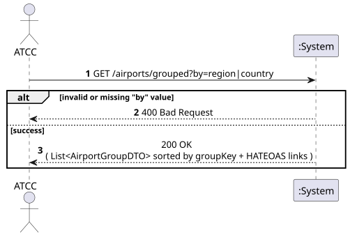
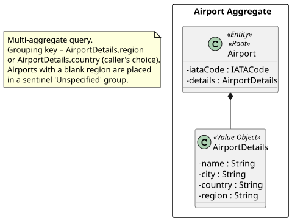
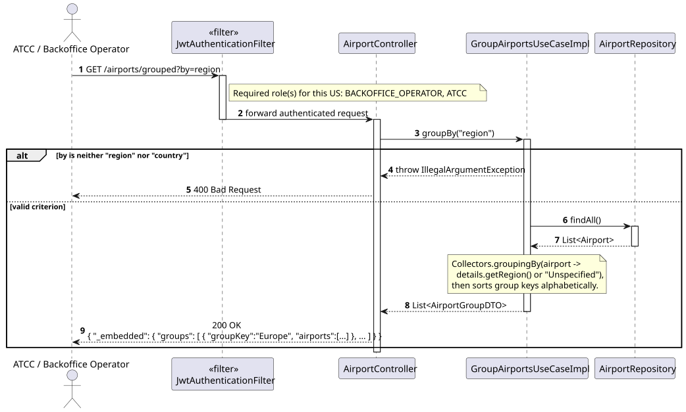
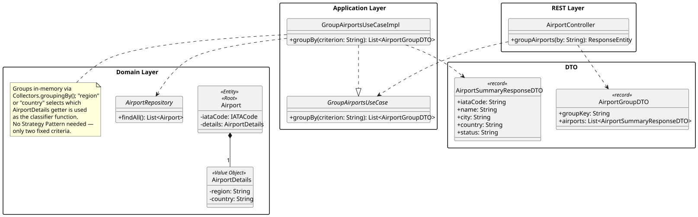

# US211 - View airports grouped by region or country

## 1. Requirements Engineering

_This section captures the User Story description, requirements specification, acceptance criteria,
dependencies, input/output data, and a high-level Actor-System interaction._

### 1.1. User Story Description

> As an **ATCC**, I want to view airports grouped by region or country.

### 1.2. Customer Specifications and Clarifications

**[Conversation 011 – US211, View Airports Grouped by Region or Country]**

> "A minha dúvida na US211 é sobre o significado do termo 'region'. Na caracterização do aeroporto
> são determinados o país e a cidade. 'Region', para o contexto desta US, tem o mesmo significado
> de cidade? Ou é um parâmetro diferente, mais abrangente em termos geográficos?"

Client response:

> "'Region' refere-se a uma zona geográfica mais abrangente que o país (Europa, América do Norte,
> Sudeste Asiático, etc.)."

This means: **region is a supranational concept**, distinct from and broader than `country`. It is
already present as a free-text field on `AirportDetails` (added for US106/US108 in anticipation of
this US — see Conversation 011's resolution in US108's documentation).

**Interpretation:**

US211 is a **pure query** operation that partitions all registered airports into groups, keyed by
either `region` or `country` (caller's choice via a parameter), and returns each group's member
airports. It does not introduce a new field — `region` and `country` already exist on
`AirportDetails`.

### 1.3. Acceptance Criteria

**Standard (from assignment §5 — apply to all user stories):**

- AC1: Analysis and design documentation (domain model excerpt, design justification, sequence
  diagram when necessary, unit tests).
- AC2: OpenAPI specification provided.
- AC3: Postman collection with sample requests and automated tests.
- AC4: Error handling with appropriate HTTP status codes and meaningful error messages.
- AC5: Input validation for all API endpoint parameters.
- AC6: Security considerations enforced.

**Domain-specific acceptance criteria:**

- AC7: The grouping criterion is selected via a `by` query parameter, accepting exactly `region` or
  `country` (case-insensitive); any other value returns HTTP 400 Bad Request.
- AC8: Airports are partitioned into groups such that **every** registered airport appears in
  exactly one group — there is no "ungrouped" airport silently dropped from the response.
- AC9: An airport whose `region` (or `country`) is `null`/blank is placed in a sentinel group named
  `"Unspecified"` rather than being excluded (relevant for `region`, which is optional per US106;
  `country` is mandatory so this case cannot occur for `by=country`).
- AC10: Groups are returned **sorted alphabetically by group key**, for deterministic output; within
  each group, airports are summarised the same way as in US108 (`AirportSummaryResponseDTO`).
- AC11: Response includes **HATEOAS links** — a self-link on the collection, and each airport entry
  carries its own detail-link (to US107), exactly as in US108.
- AC12: Both **ATCC** and **Backoffice Operator** roles are authorised (same authorisation matrix as
  US107/US108, since this is a read operation over the same data). Unauthenticated requests return
  HTTP 401; other roles return HTTP 403.

### 1.4. Found out Dependencies

| Dependency | Type | Reason |
|:---|:---|:---|
| US106 – Register Airport | Prerequisite | Airports (with their `region`/`country`) must be registered to be grouped. |
| US108 – Search Airports | Sibling pattern | Both read multiple `Airport` aggregates and reuse `AirportSummaryResponseDTO`; US108 filters, US211 partitions. |

### 1.5. Input and Output Data

**Input — `GET /airports/grouped`:**

| Field | Type | Mandatory | Validation Rule |
|:---|:---|:---:|:---|
| `by` | String (query parameter) | YES | Exactly `region` or `country` (case-insensitive) |

**Output:**

| Scenario | HTTP Status | Body |
|:---|:---:|:---|
| Grouping computed | 200 OK | List of `{ groupKey, airports[ ] }`, sorted alphabetically by `groupKey`, + HATEOAS links |
| Invalid/missing `by` value | 400 Bad Request | Error message listing the allowed values |
| Unauthenticated | 401 Unauthorized | — |
| Wrong role | 403 Forbidden | — |

### 1.6. System Sequence Diagram (SSD)

_High-level Actor-System interaction for US211._

_PlantUML source: [US211-SSD.puml](puml/US211-SSD.puml)_

### 1.7. Other Relevant Remarks

- **No Strategy Pattern needed:** unlike US214 (open-ended family of sort criteria, addressed with
  the Strategy Pattern), US211 has exactly two fixed, stable grouping criteria defined directly by
  the customer (`region`, `country`). Introducing a pluggable strategy abstraction here would add
  indirection without a corresponding extensibility need — a single `if/else` (or a two-entry
  lookup) in the use case is sufficient and easier to read.
- **List of groups, not a raw `Map`:** the response is shaped as `List<AirportGroupDTO>` rather
  than a JSON object keyed by group name, so that the collection can carry a single HATEOAS
  self-link and each group/airport entry stays a regular, independently-linkable resource
  representation.

---

## 2. Analysis

### 2.1. Relevant Domain Model Excerpt

| Class | Stereotype | Role in this US |
|:---|:---|:---|
| `Airport` | Entity, Aggregate Root | The aggregate instances being partitioned. |
| `AirportDetails` | Value Object | Contains the **grouping attributes**: `region`, `country`. |
| `IATACode` | Value Object | Included in each grouped result entry. |

_PlantUML source: [US211-DM.puml](puml/US211-DM.puml)_

### 2.2. Other Remarks

Exactly like US108, this is a **multi-aggregate query** — grouping is a read-side concern over many
`Airport` instances. No domain entity is asked "which group do you belong to?" as a behaviour;
`region`/`country` are plain attributes read directly off `AirportDetails` by the application
layer.

---

## 3. Design — User Story Realization

### 3.1. Rationale

| Interaction ID | Question: Which class is responsible for… | Answer | Justification (with patterns) |
|:---|:---|:---|:---|
| Step 1 | Receiving the HTTP GET request and the `by` parameter? | `AirportController` | Controller layer handles HTTP concerns and parameter extraction. |
| Step 2 | Validating `by` and orchestrating the grouping? | `GroupAirportsUseCaseImpl` | Application layer (Pure Fabrication) — selects the grouping key function and delegates fetching to the repository. |
| Step 3 | Retrieving all persisted Airport aggregates? | `AirportRepository.findAll()` | Repository — multi-aggregate read; no filtering needed since every airport belongs to some group. |
| Step 4 | Partitioning the airports by the chosen key (with `"Unspecified"` fallback) and sorting group keys? | `GroupAirportsUseCaseImpl` | Application layer — pure in-memory `Collectors.groupingBy` over already-loaded data; no domain invariant involved. |
| Step 5 | Mapping each group's airports to summary DTOs? | `AirportController` (assembler) | Presentation layer — reuses `AirportSummaryResponseDTO.from()` from US108. |

### Systematization

Conceptual classes promoted to software classes:

- `Airport`
- `AirportDetails`
- `IATACode`

Pure Fabrication (software-only) classes:

- `AirportController` (new endpoint)
- `GroupAirportsUseCase` / `GroupAirportsUseCaseImpl`
- `AirportRepository` (interface, reused)
- `AirportGroupDTO` (output DTO: `groupKey`, `airports[ ]`)
- `AirportSummaryResponseDTO` (reused from US108)

### 3.2. Sequence Diagram (SD)

_PlantUML source: [US211-SD.puml](puml/US211-SD.puml)_

### 3.3. Class Diagram (CD)

_PlantUML source: [US211-CD.puml](puml/US211-CD.puml)_

---

## 4. Tests

### 4.1. Unit Tests — Use Case

**`GroupAirportsUseCaseImplTest`** (`src/test/…/airports/services/GroupAirportsUseCaseImplTest.java`):

- `groups_airports_by_region` — airports with `region = "Europe"` and `region = "North America"`
  end up in two distinct groups.
- `groups_airports_by_country` — grouping by `country` partitions correctly.
- `airports_with_blank_region_go_to_unspecified_group` — `region = null` is placed under
  `"Unspecified"`, not dropped.
- `groups_are_sorted_alphabetically_by_key` — result order is deterministic.
- `throws_illegal_argument_for_invalid_by_value` — `by = "city"` throws `IllegalArgumentException`
  (→ 400).

### 4.2. Slice Tests — Controller

**`AirportControllerTest`**:

- `get_grouped_by_region_returns_200` — `BACKOFFICE_OPERATOR`/`ATCC` role returns 200 with grouped
  structure.
- `get_grouped_returns_400_for_missing_by_param` — no `by` parameter returns 400.
- `get_grouped_returns_401_without_token` — unauthenticated request returns 401.

---

## 5. Construction (Implementation)

### 5.1. Classes to Create / Modify

| Class | Package | Type | Role |
|:---|:---|:---|:---|
| `GroupAirportsUseCase` / `Impl` | `airports.services` | Interface / `@Service` | Validates `by`, fetches all airports, groups via `Collectors.groupingBy`, sorts group keys, maps to DTOs. |
| `AirportGroupDTO` | `airports.dto` | `record` | `groupKey: String`, `airports: List<AirportSummaryResponseDTO>`. |
| `AirportController` | `airports.controllers` | `@RestController` | New endpoint `GET /airports/grouped?by=region\|country`. |

### 5.2. Key Design Decisions

- **`Collectors.groupingBy` over a key-extractor function** — the same two-line implementation
  serves both `region` and `country` by swapping which `AirportDetails` getter is used as the
  classifier, avoiding code duplication without introducing a Strategy abstraction (see §1.7).
- **`"Unspecified"` sentinel, not exclusion** — guarantees AC8 (every airport appears in exactly one
  group), which is simpler to reason about and test than silently dropping airports with missing
  `region`.
- **Reuses `AirportSummaryResponseDTO`** (US108) for each group's member airports — no new
  per-airport representation is introduced, keeping the grouped response's payload size and shape
  consistent with the existing search endpoint.

---

## 6. Integration and Demo

### 6.1. Prerequisites

1. Application running (`mvn spring-boot:run`).
2. `LIS`, `OPO`, `FAO` bootstrapped, all with `country = "Portugal"`; at least one airport with a
   different `region`/`country` registered for the demo to show multiple groups.

### 6.2. Postman Steps

1. **Authenticate** — run _Auth → Login (atcc)_ or _Login (backoffice)_.
2. **Group by region** — run _US211 — Group by Region (200)_. Sends
   `GET /airports/grouped?by=region`; expects HTTP 200 with airports partitioned by `region`.
3. **Group by country** — run _US211 — Group by Country (200)_. Sends
   `GET /airports/grouped?by=country`; expects a `"Portugal"` group containing LIS, OPO, FAO.
4. **Invalid criterion** — run _US211 — Invalid By Value (400)_. Sends `?by=city`; expects HTTP 400.

### 6.3. OpenAPI

`GET /airports/grouped` is documented under the **Airports** tag in Swagger UI at
`http://localhost:8080/swagger-ui.html`, with the `by` parameter listed as required with allowed
values `region`, `country`.

---

## 7. Observations

- US211 is the last of the WP#2B "Enhanced Airport Features" read-side USs (alongside US209,
  US210) that compute a view over already-registered Airport data without mutating it.
- The `"Unspecified"` sentinel group is a deliberate, documented design choice rather than an
  oversight — it should be preserved if this US is later extended (e.g. with pagination per group).
