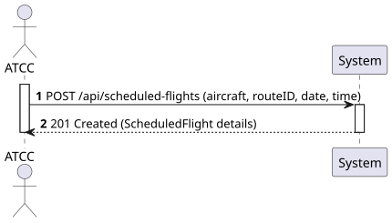
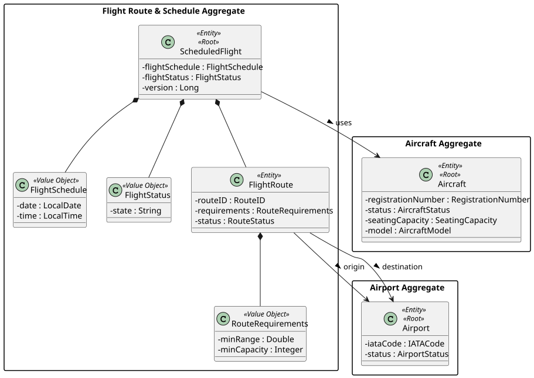
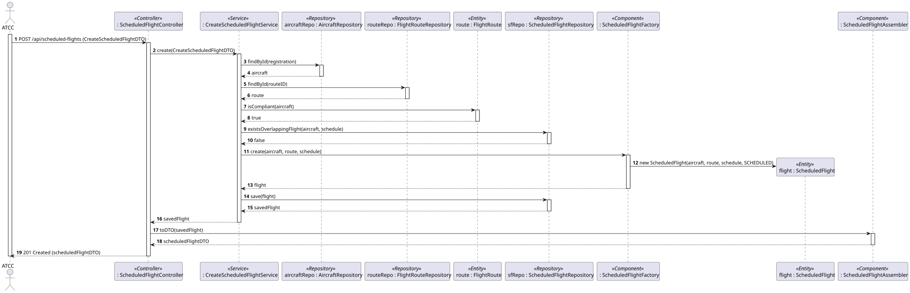
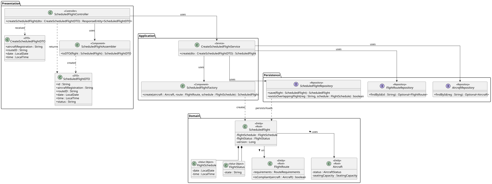

# US212 - Create a scheduled flight (assign an aircraft to a route)

## 1. Requirements Engineering

### 1.1. User Story Description

As an ATCC, I want to assign an aircraft to a route for a specific date and time to create a scheduled flight. These should comply with range requirements, airplane and airport availability.

### 1.2. Customer Specifications and Clarifications

- **Clarification from Forum (Conversation 002):** Routes exist independently of the operational state of an airport (e.g., LIS-OPO still exists even if OPO is temporarily closed). However, *scheduled flights on that route can be affected by the airport state*. Therefore, the airport availability check belongs to the scheduling of a flight, not to the route itself.
- **Clarification from Forum (Conversation 006):** A `ScheduledFlight` maintains a status lifecycle (`scheduled`, `delayed`, `in-flight`, `completed`, `canceled`). The client approved this lifecycle, but the **state transitions are future functionality** — for this US the flight is created with the default status `Scheduled` and no automatic transitions are implemented.
- **Clarification from Forum (Conversation 012):** A route is always point-to-point (origin → destination); there are no intermediate stops.
- **Assumption (Concurrency):** Creating a scheduled flight must handle concurrent requests so the same aircraft is not double-booked for overlapping schedules.

### 1.3. Acceptance Criteria

- **AC1:** The system must create a scheduled flight by associating an existing `Aircraft`, an existing `FlightRoute`, and a specific date and time (`FlightSchedule`).
- **AC2 (Range/Capacity):** The aircraft must comply with the route requirements — the aircraft model's maximum range must be greater than or equal to the route's minimum range, and the aircraft's seating capacity must be greater than or equal to the route's minimum capacity. Otherwise a `422 Unprocessable Entity` is returned.
- **AC3 (Aircraft availability):** The aircraft must be `available` (not inactive, in-flight, or under maintenance) and must not already have another scheduled flight overlapping the requested date/time. Otherwise a `409 Conflict` is returned.
- **AC4 (Airport availability):** Both the origin and destination airports of the route must be operational at the scheduled date/time. Otherwise a `409 Conflict` is returned.
- **AC5:** If the aircraft, route, origin or destination airport does not exist, a `404 Not Found` is returned.
- **AC6:** On success the API returns `201 Created` with the representation of the new scheduled flight (including HATEOAS links) and its default status `Scheduled`.
- **AC7:** The endpoint follows RESTful principles (`POST /api/scheduled-flights`) and is restricted to users with the `ATCC` role (requires JWT authentication/authorization).

### 1.4. Found out Dependencies

- **Dependency to US110:** A `FlightRoute` must exist before a flight can be scheduled on it.
- **Dependency to US101/US203 (Aircraft):** An `Aircraft` must exist, with a known model (range) and seating capacity, to validate route requirements and availability.
- **Dependency to US207/US208 (Airport):** The origin and destination airports must exist and have an operational status.
- **Provides for US213, US214:** This US generates the `ScheduledFlight` data later consulted by US213 (flights per aircraft) and used by US214 (route popularity).

### 1.5 Input and Output Data

**Input Data:**
- Typed data (via JSON payload for the POST request):
  - Aircraft Registration Number
  - Route ID
  - Flight date (LocalDate)
  - Flight time (LocalTime)

**Output Data:**
- JSON representation of the created `ScheduledFlight` (DTO) containing:
  - Scheduled Flight ID
  - Aircraft Registration Number
  - Route ID (origin / destination IATA codes)
  - Scheduled date and time
  - Flight Status (`Scheduled`)
  - HATEOAS links
- HTTP Status `201 Created`, or the appropriate error status (`404`, `409`, `422`).

### 1.6. System Sequence Diagram (SSD)



### 1.7 Other Relevant Remarks

- Following Domain-Driven Design (DDD), the eligibility rules (range/capacity compliance) are encapsulated as behaviour of the aggregates that own the data (the `Aircraft`/`AircraftModel` knows its range and capacity; the `FlightRoute` knows its requirements). The `CreateScheduledFlightService` orchestrates the checks and delegates the final instantiation to a `ScheduledFlightFactory`.
- State transitions of the flight status are explicitly out of scope for this iteration (see Conversation 006).

## 2. Analysis

### 2.1. Relevant Domain Model Excerpt



### 2.2. Other Remarks

The `ScheduledFlight` is the Aggregate Root of the *Flight Route & Schedule Aggregate*; it references the `FlightRoute` and the `Aircraft` (by identity) and embeds the `FlightSchedule` and `FlightStatus` Value Objects. A `version` attribute is assumed for Optimistic Locking (JPA `@Version`) to prevent double-booking under concurrent requests.

## 3. Design - User Story Realization

### 3.1. Rationale

**The rationale grounds on the SSD interactions and the identified input/output data.**

| Interaction ID | Question: Which class is responsible for... | Answer | Justification (with patterns) |
|:---|:---|:---|:---|
| Step 1 | ...receiving the HTTP POST request and JSON payload? | ScheduledFlightController | **Controller (REST):** Acts as the entry point for the API, handling HTTP requests and routing them. |
| Step 2 | ...coordinating the creation flow and the eligibility checks? | CreateScheduledFlightService | **Application Service / Use Case Controller:** Orchestrates the flow, fetches the aggregates, and delegates business rules. |
| Step 3 | ...retrieving the aircraft, route and airports by their identity? | AircraftRepository, FlightRouteRepository | **Repository:** Accesses the persistence layer to find the aggregates referenced by the request. |
| Step 4 | ...knowing whether the aircraft meets the route's range and capacity requirements? | FlightRoute (and Aircraft) | **Information Expert:** The `FlightRoute` owns the requirements and the `Aircraft`/`AircraftModel` owns range and capacity, so they answer the compliance question. |
| Step 5 | ...checking that the aircraft has no overlapping scheduled flight? | ScheduledFlightRepository | **Repository:** Queries existing scheduled flights for the aircraft around the requested schedule. |
| Step 6 | ...instantiating the new ScheduledFlight aggregate? | ScheduledFlightFactory | **Creator / Pure Fabrication:** Encapsulates the construction of the aggregate and its Value Objects (`FlightSchedule`, default `FlightStatus`). |
| Step 7 | ...persisting the new scheduled flight? | ScheduledFlightRepository | **Repository:** Persists the new aggregate; JPA enforces the `@Version` check. |
| Step 8 | ...converting the aggregate to a JSON/HATEOAS representation? | ScheduledFlightAssembler | **DTO (Data Transfer Object):** Separates domain entities from the presentation layer and adds links. |
| Step 9 | ...returning the formatted response to the client? | ScheduledFlightController | **Controller:** Formats the DTO and sends the HTTP response (201 Created). |

### Systematization

According to the taken rationale, the conceptual classes promoted to software classes are:
- ScheduledFlight, FlightRoute, Aircraft
- FlightSchedule, FlightStatus (Value Objects)

Other software classes (i.e. Pure Fabrication) identified:
- ScheduledFlightController
- CreateScheduledFlightService
- ScheduledFlightFactory
- ScheduledFlightRepository, FlightRouteRepository, AircraftRepository
- CreateScheduledFlightDTO, ScheduledFlightDTO
- ScheduledFlightAssembler

### 3.2. Sequence Diagram (SD)



### 3.3. Class Diagram (CD)



## 4. Tests

**Test 1:** Ensure a scheduled flight is created with the default status `Scheduled`.

```java
@Test
public void ensureScheduledFlightIsCreatedWithScheduledStatus() {
    Aircraft aircraft = // ... available aircraft compliant with the route
    FlightRoute route = // ... existing route
    FlightSchedule schedule = new FlightSchedule(LocalDate.now().plusDays(1), LocalTime.of(10, 0));

    ScheduledFlight flight = scheduledFlightFactory.create(aircraft, route, schedule);

    assertEquals("SCHEDULED", flight.getFlightStatus().getState());
}
```

**Test 2:** Ensure scheduling an aircraft that does not meet the route range requirement is rejected.

```java
@Test
public void ensureNonCompliantAircraftIsRejected() {
    // aircraft model maxRange < route minRange
    assertThrows(RouteRequirementsNotMetException.class, () -> {
        createScheduledFlightService.create(dtoWithNonCompliantAircraft);
    });
}
```

**Test 3:** Ensure double-booking an aircraft on an overlapping schedule fails (concurrency).

```java
@Test
public void ensureOverlappingScheduleIsRejected() {
    // an integration test (@SpringBootTest) where a second flight reuses the same
    // aircraft and overlapping schedule should fail with a 409 Conflict.
}
```

## 5. Construction (Implementation)

_To be completed during implementation. The `CreateScheduledFlightService` will load the `Aircraft`, `FlightRoute` and `Airport` aggregates, run the compliance and availability checks, delegate instantiation to `ScheduledFlightFactory`, and persist via `ScheduledFlightRepository`. Optimistic Locking (`@Version`) guards against concurrent double-booking._

## 6. Integration and Demo

_To demonstrate this US, perform a `POST /api/scheduled-flights` with a valid aircraft registration, route ID, date and time. The response is `201 Created` with the scheduled flight representation. Error cases (`404`, `409`, `422`) can be demonstrated with a non-existent aircraft, an unavailable aircraft, and a non-compliant aircraft respectively._

## 7. Observations

The design keeps the eligibility rules in the domain (Information Expert) while the service only orchestrates, which keeps the use case open for new rules without changing the controller. State-machine transitions for the flight status are intentionally deferred to a future iteration, as confirmed by the client.
