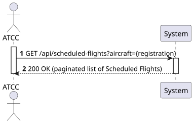
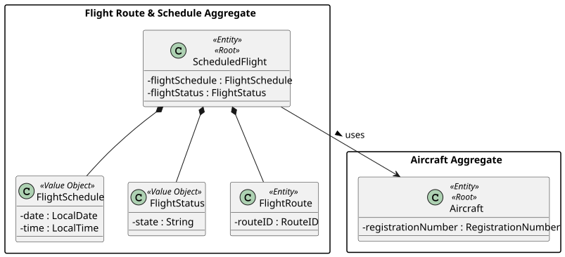
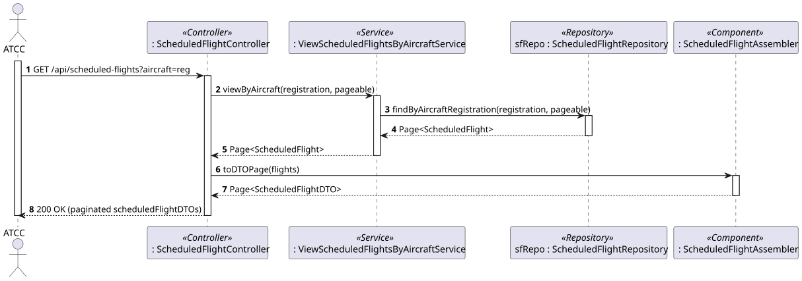
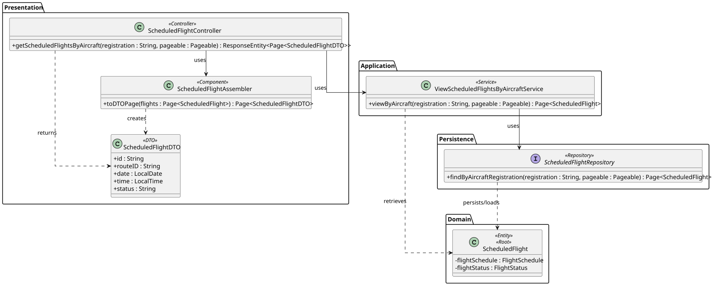

# US213 - View all scheduled flights for a specific aircraft

## 1. Requirements Engineering

### 1.1. User Story Description

As an ATCC, I want to view all scheduled flights for a specific aircraft.

### 1.2. Customer Specifications and Clarifications

- **Clarification from Forum (Conversation 006):** A `ScheduledFlight` has a status lifecycle (`scheduled`, `delayed`, `in-flight`, `completed`, `canceled`); all of these should be visible in the listing.
- **Assumption (Pagination):** As the number of scheduled flights for an aircraft may grow large over time, the result list must support pagination (non-functional requirement #6 of Phase 2).
- **Assumption:** The aircraft is identified by its Registration Number.

### 1.3. Acceptance Criteria

- **AC1:** The system must return all scheduled flights associated with a given aircraft registration number.
- **AC2:** Each scheduled flight in the list must include its route (origin/destination), scheduled date/time and status.
- **AC3:** If the aircraft has no scheduled flights, an empty (paginated) list is returned with `200 OK`.
- **AC4:** If the aircraft registration number does not exist, a `404 Not Found` is returned.
- **AC5:** The result must support pagination (e.g., `page`, `size` query parameters) and include HATEOAS links.
- **AC6:** The endpoint follows RESTful principles (`GET /api/scheduled-flights?aircraft={registration}`) and is restricted to users with the `ATCC` role (requires JWT authentication/authorization).

### 1.4. Found out Dependencies

- **Dependency to US212:** Scheduled flights must have been created before they can be listed.
- **Dependency to Aircraft (US101/US203):** The aircraft must exist to validate the registration number.

### 1.5 Input and Output Data

**Input Data:**
- Typed data (via URL query parameters):
  - Aircraft Registration Number
  - Pagination parameters (`page`, `size`) — optional

**Output Data:**
- JSON representation of a paginated list of `ScheduledFlight` (DTOs), each containing:
  - Scheduled Flight ID
  - Route ID (origin / destination IATA codes)
  - Scheduled date and time
  - Flight Status
  - HATEOAS links
- HTTP Status `200 OK`.

### 1.6. System Sequence Diagram (SSD)



### 1.7 Other Relevant Remarks

- At the persistence layer this is implemented with a Spring Data derived query `findByAircraftRegistration(String registration, Pageable pageable)` returning a `Page<ScheduledFlight>`.

## 2. Analysis

### 2.1. Relevant Domain Model Excerpt



### 2.2. Other Remarks

This US is a read-only query over the *Flight Route & Schedule Aggregate*. The `ScheduledFlight` references the `Aircraft` by identity (its registration number), which is the criterion used for the query.

## 3. Design - User Story Realization

### 3.1. Rationale

**The rationale grounds on the SSD interactions and the identified input/output data.**

| Interaction ID | Question: Which class is responsible for... | Answer | Justification (with patterns) |
|:---|:---|:---|:---|
| Step 1 | ...receiving the HTTP GET request with the aircraft registration and pagination? | ScheduledFlightController | **Controller (REST):** Acts as the entry point for the API, handling HTTP requests. |
| Step 2 | ...coordinating the retrieval of the flights? | ViewScheduledFlightsByAircraftService | **Application Service / Use Case Controller:** Orchestrates the flow to fulfil the read use case. |
| Step 3 | ...querying the persisted scheduled flights for the aircraft? | ScheduledFlightRepository | **Repository:** Accesses the persistence layer with a paginated query by aircraft registration. |
| Step 4 | ...converting the domain objects to a JSON/HATEOAS representation? | ScheduledFlightAssembler | **DTO (Data Transfer Object):** Separates domain entities from the presentation layer and adds links. |
| Step 5 | ...returning the formatted response to the client? | ScheduledFlightController | **Controller:** Formats the DTO page and sends the HTTP response (200 OK). |

### Systematization

According to the taken rationale, the conceptual classes promoted to software classes are:
- ScheduledFlight
- FlightSchedule, FlightStatus (Value Objects)

Other software classes (i.e. Pure Fabrication) identified:
- ScheduledFlightController
- ViewScheduledFlightsByAircraftService
- ScheduledFlightRepository
- ScheduledFlightDTO
- ScheduledFlightAssembler

### 3.2. Sequence Diagram (SD)



### 3.3. Class Diagram (CD)



## 4. Tests

**Test 1:** Ensure the service returns all scheduled flights for a given aircraft.

```java
@Test
public void ensureScheduledFlightsForAircraftAreReturned() {
    when(scheduledFlightRepository.findByAircraftRegistration(eq("CS-TKY"), any(Pageable.class)))
        .thenReturn(new PageImpl<>(List.of(flight1, flight2)));

    Page<ScheduledFlightDTO> result = service.viewByAircraft("CS-TKY", PageRequest.of(0, 10));

    assertEquals(2, result.getTotalElements());
}
```

**Test 2:** Ensure an unknown aircraft registration results in a 404.

```java
@Test
public void ensureUnknownAircraftThrowsNotFound() {
    when(aircraftRepository.existsById("INVALID")).thenReturn(false);
    assertThrows(ResourceNotFoundException.class, () -> service.viewByAircraft("INVALID", Pageable.unpaged()));
}
```

## 5. Construction (Implementation)

_To be completed during implementation. The repository exposes `findByAircraftRegistration(String, Pageable)`; the service validates the aircraft exists, queries the page, and maps it through the assembler._

## 6. Integration and Demo

_Demonstrated with `GET /api/scheduled-flights?aircraft=CS-TKY&page=0&size=10`, returning a paginated list of that aircraft's scheduled flights._

## 7. Observations

Pagination is applied at the repository level (`Pageable`) so large histories do not load entirely into memory. This US complements US212, which produces the data consumed here.
