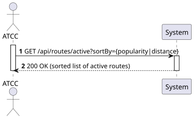
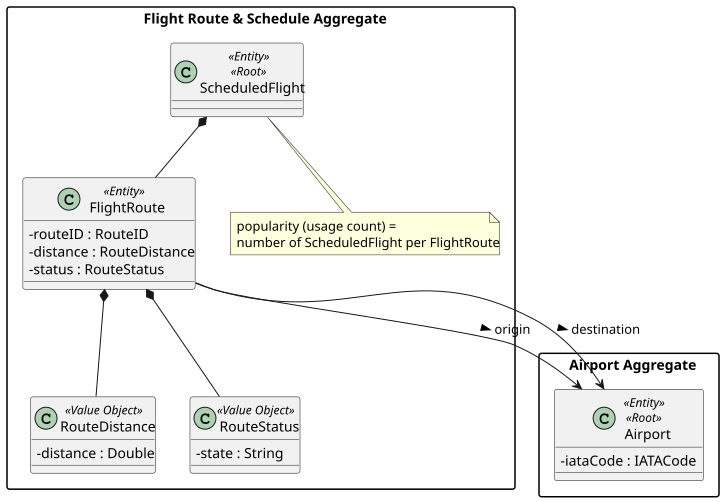
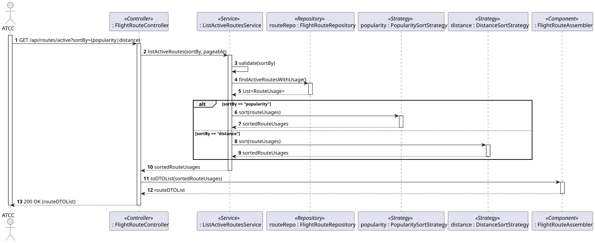
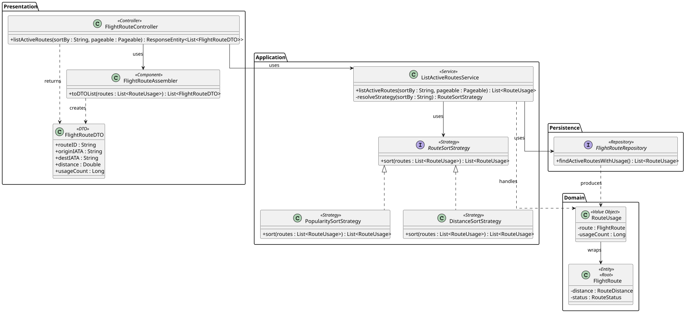

# US214 - List all active routes sorted by popularity or distance

## 1. Requirements Engineering

### 1.1. User Story Description

As an ATCC, I want to list all active routes sorted by popularity (number of times used) or distance.

### 1.2. Customer Specifications and Clarifications

- **Clarification from Forum (Conversation 010):** The *Network* is the set of **active** routes; therefore this listing considers only routes whose status is active.
- **Clarification from Forum (Conversation 002):** A route's distance is a fixed value calculated at creation time, so it can be used directly as a sort key.
- **Interpretation of "popularity":** Popularity is the *number of times a route has been used*, i.e. the number of `ScheduledFlight` instances created on that route (see US212).
- **Assumption (Extensibility):** The sort criterion is chosen by the client via a parameter; the design must allow adding new criteria without changing the calling logic (Strategy Pattern).

### 1.3. Acceptance Criteria

- **AC1:** The system must list only **active** routes.
- **AC2:** The system must support sorting by **popularity** (number of scheduled flights using the route).
- **AC3:** The system must support sorting by **distance**.
- **AC4:** The sort criterion is selected via a query parameter (e.g., `sortBy=popularity|distance`); an invalid value returns `400 Bad Request`.
- **AC5:** Each route in the result includes its ID, origin/destination, distance and usage count, plus HATEOAS links; long lists support pagination.
- **AC6:** The endpoint follows RESTful principles (`GET /api/routes/active?sortBy=...`) and is restricted to users with the `ATCC` role (requires JWT authentication/authorization).

### 1.4. Found out Dependencies

- **Dependency to US110/US112:** Routes (and their active/inactive status) must exist.
- **Dependency to US212:** The usage count (popularity) is derived from the scheduled flights created on each route.

### 1.5 Input and Output Data

**Input Data:**
- Typed data (via URL query parameters):
  - Sort criterion (`sortBy` = `popularity` or `distance`)
  - Pagination parameters (`page`, `size`) — optional

**Output Data:**
- JSON representation of a (paginated) list of active routes (DTOs), each containing:
  - Route ID
  - Origin / Destination (IATA Code)
  - Route Distance
  - Usage Count (popularity)
  - HATEOAS links
- HTTP Status `200 OK`.

### 1.6. System Sequence Diagram (SSD)



### 1.7 Other Relevant Remarks

- The sorting strategy is selected via the **Strategy Pattern**: a `RouteSortStrategy` interface with concrete `PopularitySortStrategy` and `DistanceSortStrategy` implementations, resolved by the service from the `sortBy` parameter. This keeps the service closed for modification but open for new sort criteria (Open/Closed Principle).
- The usage count is obtained efficiently at the persistence layer with a JPQL query that counts scheduled flights grouped by route.

## 2. Analysis

### 2.1. Relevant Domain Model Excerpt



### 2.2. Other Remarks

The popularity metric is a *derived value* (count of `ScheduledFlight` per `FlightRoute`); it is not stored as an attribute of `FlightRoute`. Only routes with an active `RouteStatus` are part of the Network considered here.

## 3. Design - User Story Realization

### 3.1. Rationale

**The rationale grounds on the SSD interactions and the identified input/output data.**

| Interaction ID | Question: Which class is responsible for... | Answer | Justification (with patterns) |
|:---|:---|:---|:---|
| Step 1 | ...receiving the HTTP GET request and the sort parameter? | FlightRouteController | **Controller (REST):** Acts as the entry point for the API, handling HTTP requests. |
| Step 2 | ...coordinating the listing and selecting the sort criterion? | ListActiveRoutesService | **Application Service / Use Case Controller:** Orchestrates the flow and resolves the strategy from the parameter. |
| Step 3 | ...retrieving the active routes with their usage count? | FlightRouteRepository | **Repository:** Queries active routes and the number of scheduled flights per route (JPQL group-by). |
| Step 4 | ...encapsulating the chosen sort algorithm? | RouteSortStrategy (PopularitySortStrategy / DistanceSortStrategy) | **Strategy:** Each criterion is an interchangeable algorithm selected at runtime, isolating the variation. |
| Step 5 | ...converting the routes to a JSON/HATEOAS representation? | FlightRouteAssembler | **DTO (Data Transfer Object):** Separates domain entities from the presentation layer and adds links. |
| Step 6 | ...returning the formatted response to the client? | FlightRouteController | **Controller:** Formats the DTO list and sends the HTTP response (200 OK). |

### Systematization

According to the taken rationale, the conceptual classes promoted to software classes are:
- FlightRoute
- RouteDistance, RouteStatus (Value Objects)

Other software classes (i.e. Pure Fabrication) identified:
- FlightRouteController
- ListActiveRoutesService
- RouteSortStrategy, PopularitySortStrategy, DistanceSortStrategy
- FlightRouteRepository
- FlightRouteDTO
- FlightRouteAssembler

### 3.2. Sequence Diagram (SD)



### 3.3. Class Diagram (CD)



## 4. Tests

**Test 1:** Ensure the popularity strategy orders routes by descending usage count.

```java
@Test
public void ensureRoutesAreSortedByPopularity() {
    List<RouteUsage> routes = List.of(new RouteUsage(routeA, 2), new RouteUsage(routeB, 5));

    List<RouteUsage> sorted = new PopularitySortStrategy().sort(routes);

    assertEquals(routeB, sorted.get(0).getRoute()); // 5 uses first
}
```

**Test 2:** Ensure an invalid sort parameter is rejected.

```java
@Test
public void ensureInvalidSortByThrows() {
    assertThrows(IllegalArgumentException.class, () -> service.listActiveRoutes("price", Pageable.unpaged()));
}
```

## 5. Construction (Implementation)

_To be completed during implementation. The repository returns active routes with their usage counts; the service resolves a `RouteSortStrategy` from the `sortBy` value (Strategy Pattern) and applies it before assembling the DTOs._

## 6. Integration and Demo

_Demonstrated with `GET /api/routes/active?sortBy=popularity` and `GET /api/routes/active?sortBy=distance`, returning the active routes ordered by the chosen criterion._

## 7. Observations

The Strategy Pattern was selected so that future sort criteria (e.g., by estimated flight time) can be added by creating a new strategy class only, without modifying the service or controller — aligned with the Open/Closed Principle.
