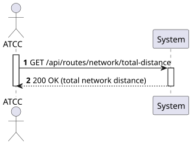
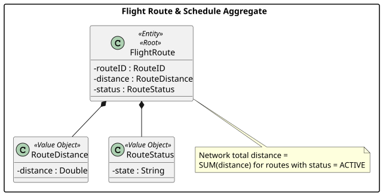
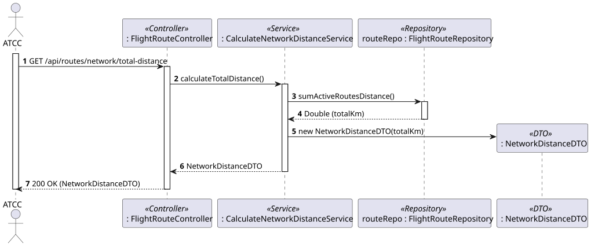
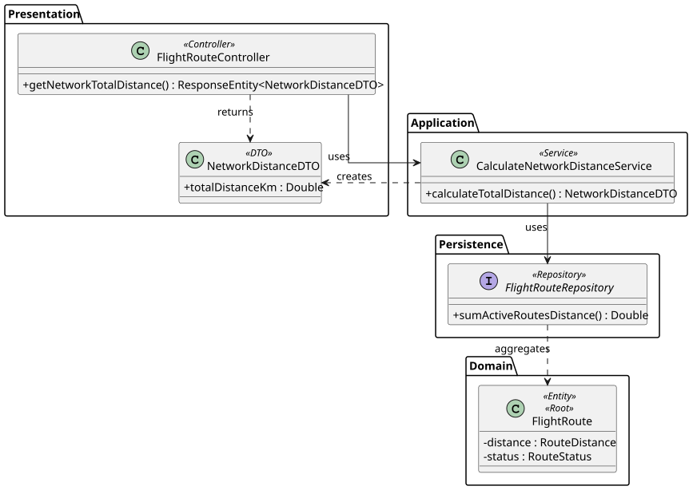

# US215 - Calculate the total distance covered by all routes in the network

## 1. Requirements Engineering

### 1.1. User Story Description

As an ATCC, I want to calculate the total distance covered by all routes in my network.

### 1.2. Customer Specifications and Clarifications

- **Clarification from Forum (Conversation 010):** The *Network* is the set of **active** routes operated by the company. Therefore the total distance is the sum of the distances of all active routes.
- **Clarification from Forum (Conversation 002):** Each route's distance is a fixed value computed at creation time, so the total is a straightforward aggregation.
- **Assumption:** Inactive (deactivated) routes are excluded from the network total.

### 1.3. Acceptance Criteria

- **AC1:** The system must sum the `RouteDistance` of all **active** routes.
- **AC2:** Inactive routes must not be included in the total.
- **AC3:** If there are no active routes, the system returns a total distance of `0`.
- **AC4:** On success the system returns `200 OK` with the total distance (and its unit, e.g. km).
- **AC5:** The endpoint follows RESTful principles (`GET /api/routes/network/total-distance`) and is restricted to users with the `ATCC` role (requires JWT authentication/authorization).

### 1.4. Found out Dependencies

- **Dependency to US110:** Routes (with their fixed distance) must exist.
- **Dependency to US112:** The active/inactive status of routes determines which are part of the network.

### 1.5 Input and Output Data

**Input Data:**
- None (a global metric requested via a parameterless GET endpoint).

**Output Data:**
- JSON object containing the total network distance (e.g., `{ "totalDistanceKm": 12345.6 }`).
- HTTP Status `200 OK`.

### 1.6. System Sequence Diagram (SSD)



### 1.7 Other Relevant Remarks

- The aggregation is delegated to the persistence layer through a JPQL query (`SELECT COALESCE(SUM(...), 0) ... WHERE status = ACTIVE`), avoiding loading all routes into memory (same approach as US117 for maintenance hours). `COALESCE` guarantees `0` instead of `null` when there are no active routes.

## 2. Analysis

### 2.1. Relevant Domain Model Excerpt



### 2.2. Other Remarks

The metric concerns only the *Flight Route & Schedule Aggregate*: it reads `RouteDistance` of every `FlightRoute` whose `RouteStatus` is active. No new domain attributes are required.

## 3. Design - User Story Realization

### 3.1. Rationale

**The rationale grounds on the SSD interactions and the identified input/output data.**

| Interaction ID | Question: Which class is responsible for... | Answer | Justification (with patterns) |
|:---|:---|:---|:---|
| Step 1 | ...receiving the HTTP GET request? | FlightRouteController | **Controller (REST):** Acts as the entry point for the API, handling HTTP requests. |
| Step 2 | ...coordinating the calculation? | CalculateNetworkDistanceService | **Application Service / Use Case Controller:** Orchestrates the flow to fulfil this specific metric. |
| Step 3 | ...summing the distances of active routes in the database? | FlightRouteRepository | **Repository:** Executes an optimized JPQL `SUM` query, calculating the total without loading all entities. |
| Step 4 | ...encapsulating the result in a response object? | CalculateNetworkDistanceService | **Service:** Wraps the total in a dedicated DTO. |
| Step 5 | ...returning the response? | FlightRouteController | **Controller:** Formats the DTO into a JSON HTTP response (200 OK). |

### Systematization

According to the taken rationale, the conceptual classes promoted to software classes are:
- FlightRoute
- RouteDistance, RouteStatus (Value Objects)

Other software classes (i.e. Pure Fabrication) identified:
- FlightRouteController
- CalculateNetworkDistanceService
- FlightRouteRepository
- NetworkDistanceDTO

### 3.2. Sequence Diagram (SD)



### 3.3. Class Diagram (CD)



## 4. Tests

**Test 1:** Ensure the service returns the sum provided by the repository.

```java
@Test
public void whenRepositoryReturnsSum_thenServiceReturnsTotal() {
    when(routeRepository.sumActiveRoutesDistance()).thenReturn(12345.6);

    NetworkDistanceDTO result = service.calculateTotalDistance();

    assertThat(result.getTotalDistanceKm()).isEqualTo(12345.6);
}
```

**Test 2:** Ensure an empty network returns 0.

```java
@DataJpaTest
@Test
public void whenNoActiveRoutes_thenSumIsZero() {
    assertThat(routeRepository.sumActiveRoutesDistance()).isEqualTo(0.0);
}
```

## 5. Construction (Implementation)

_To be completed during implementation. A JPQL query `SELECT COALESCE(SUM(r.distance.distance), 0) FROM FlightRoute r WHERE r.status.state = 'ACTIVE'` performs the aggregation at the database; the service wraps the result in a `NetworkDistanceDTO`._

## 6. Integration and Demo

_Demonstrated with `GET /api/routes/network/total-distance`, returning e.g. `{ "totalDistanceKm": 12345.6 }`._

## 7. Observations

As in US117, pushing the aggregation to the database keeps the operation scalable for large networks. `COALESCE` ensures correct behaviour on an empty network.
