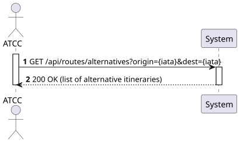
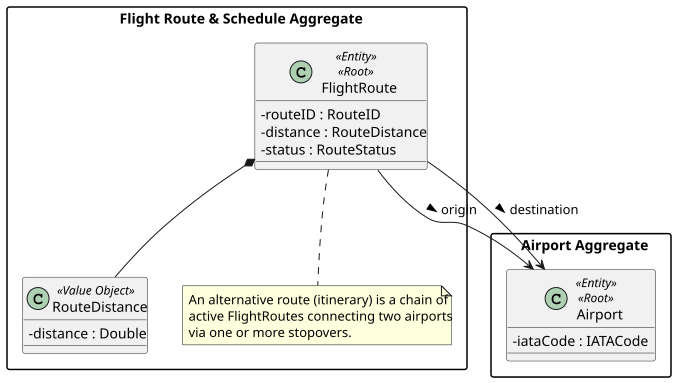
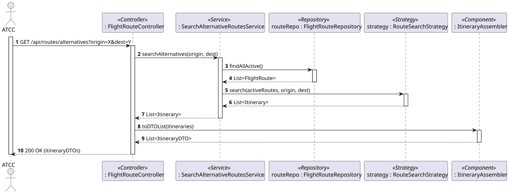
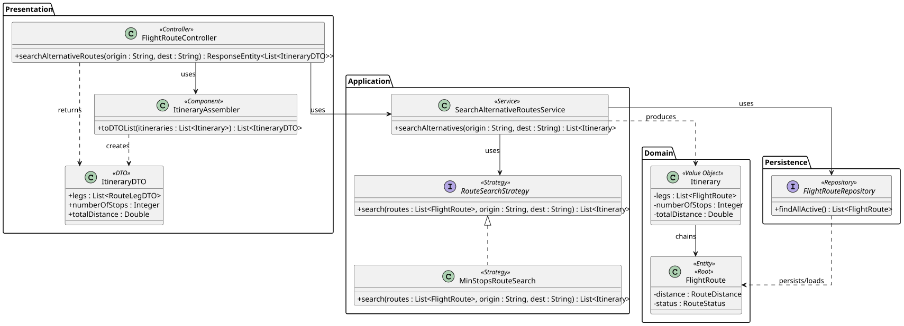

# US216 - Search for alternative routes between two airports

## 1. Requirements Engineering

### 1.1. User Story Description

As an ATCC, I want to search for alternative routes between two airports.

### 1.2. Customer Specifications and Clarifications

- **Clarification from Forum (Conversation 013):** Alternative routes are *combinations of existing routes* that connect the two airports via one or more stopovers. Different approaches may exist (fewest stops, shortest total time, shortest distance). **The system must be designed so that algorithms can be added or replaced easily, without changing the rest of the logic.** For this iteration it is enough to implement **one** algorithm (e.g., the fewest number of stops).
- **Clarification from Forum (Conversation 012):** A single route is always point-to-point; itineraries with stopovers are represented as several chained routes.
- **Assumption:** Only active routes are considered when building the connection graph.

### 1.3. Acceptance Criteria

- **AC1:** Given an origin and a destination airport, the system must return alternative itineraries connecting them through one or more existing routes (stopovers).
- **AC2:** The search must use a pluggable algorithm; for this iteration the implemented algorithm returns the itinerary with the **fewest number of stops** (the design must allow adding other algorithms without changing the service/controller).
- **AC3:** A direct route, if it exists, is a valid alternative with zero stopovers.
- **AC4:** If no connection exists between the airports, the system returns an empty list with `200 OK`.
- **AC5:** If the origin or destination airport does not exist, a `404 Not Found` is returned.
- **AC6:** Each returned itinerary lists the ordered legs (routes) and the total distance/number of stops, with HATEOAS links.
- **AC7:** The endpoint follows RESTful principles (`GET /api/routes/alternatives?origin={iata}&dest={iata}`) and is restricted to users with the `ATCC` role (requires JWT authentication/authorization).

### 1.4. Found out Dependencies

- **Dependency to US110/US112:** The existing (active) routes form the graph that the search traverses.
- **Dependency to US207 (Airport):** Origin and destination airports must exist.

### 1.5 Input and Output Data

**Input Data:**
- Typed data (via URL query parameters):
  - Origin Airport (IATA Code)
  - Destination Airport (IATA Code)

**Output Data:**
- JSON representation of a list of itineraries (DTOs), each containing:
  - Ordered list of legs (each leg: Route ID, origin/destination IATA)
  - Number of stops
  - Total distance
  - HATEOAS links
- HTTP Status `200 OK`.

### 1.6. System Sequence Diagram (SSD)



### 1.7 Other Relevant Remarks

- The search algorithm is selected via the **Strategy Pattern**: a `RouteSearchStrategy` interface with the concrete `MinStopsRouteSearch` implementation (a Breadth-First Search over the graph of active routes). New algorithms (e.g., shortest distance) can be added as new strategies without modifying the `SearchAlternativeRoutesService` (Open/Closed Principle).
- The graph is built from active routes (airports as nodes, routes as directed edges).

## 2. Analysis

### 2.1. Relevant Domain Model Excerpt



### 2.2. Other Remarks

An itinerary (`Itinerary`) is a *query result*, not a persisted domain entity: it is an ordered chain of existing `FlightRoute` legs. The connectivity is derived from the `origin`/`destination` associations of each active `FlightRoute`.

## 3. Design - User Story Realization

### 3.1. Rationale

**The rationale grounds on the SSD interactions and the identified input/output data.**

| Interaction ID | Question: Which class is responsible for... | Answer | Justification (with patterns) |
|:---|:---|:---|:---|
| Step 1 | ...receiving the HTTP GET request with origin and destination? | FlightRouteController | **Controller (REST):** Acts as the entry point for the API, handling HTTP requests. |
| Step 2 | ...coordinating the search and selecting the algorithm? | SearchAlternativeRoutesService | **Application Service / Use Case Controller:** Orchestrates the flow and resolves the search strategy. |
| Step 3 | ...retrieving the active routes that form the graph? | FlightRouteRepository | **Repository:** Provides the active routes used to build the connectivity graph. |
| Step 4 | ...computing the alternative itineraries (fewest stops)? | RouteSearchStrategy (MinStopsRouteSearch) | **Strategy:** Encapsulates the interchangeable search algorithm (BFS), isolating it from the service. |
| Step 5 | ...converting the itineraries to a JSON/HATEOAS representation? | ItineraryAssembler | **DTO (Data Transfer Object):** Separates the computed result from the presentation layer and adds links. |
| Step 6 | ...returning the formatted response to the client? | FlightRouteController | **Controller:** Formats the DTO list and sends the HTTP response (200 OK). |

### Systematization

According to the taken rationale, the conceptual classes promoted to software classes are:
- FlightRoute
- RouteDistance (Value Object)

Other software classes (i.e. Pure Fabrication) identified:
- FlightRouteController
- SearchAlternativeRoutesService
- RouteSearchStrategy, MinStopsRouteSearch
- FlightRouteRepository
- Itinerary, ItineraryDTO
- ItineraryAssembler

### 3.2. Sequence Diagram (SD)



### 3.3. Class Diagram (CD)



## 4. Tests

**Test 1:** Ensure the min-stops algorithm finds an itinerary via one stopover.

```java
@Test
public void ensureMinStopsFindsItineraryWithOneStop() {
    // Routes: LIS->MAD, MAD->CDG ; no direct LIS->CDG
    List<FlightRoute> active = List.of(lisMad, madCdg);

    List<Itinerary> result = new MinStopsRouteSearch().search(active, "LIS", "CDG");

    assertEquals(1, result.get(0).getNumberOfStops());
}
```

**Test 2:** Ensure an unreachable destination returns an empty list.

```java
@Test
public void ensureNoConnectionReturnsEmpty() {
    List<Itinerary> result = new MinStopsRouteSearch().search(List.of(lisMad), "LIS", "JFK");
    assertTrue(result.isEmpty());
}
```

## 5. Construction (Implementation)

_To be completed during implementation. The service loads the active routes, builds a directed graph (airport nodes, route edges), and delegates to a `RouteSearchStrategy`. The `MinStopsRouteSearch` performs a BFS to find the itinerary with the fewest stops; results are assembled into `ItineraryDTO`s._

## 6. Integration and Demo

_Demonstrated with `GET /api/routes/alternatives?origin=LIS&dest=CDG`, returning the itinerary/itineraries connecting the airports with the fewest stops._

## 7. Observations

The Strategy Pattern directly satisfies the client's requirement (Conversation 013) that algorithms be replaceable without touching the rest of the logic. Only the fewest-stops algorithm is implemented now; alternatives (shortest distance/time) can be added later as new strategy classes.
