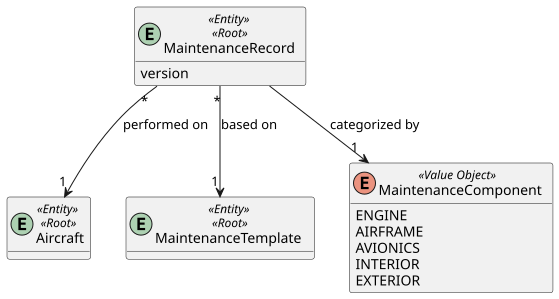

# US 117 - View Total Maintenance Hours for the Fleet

## 1. Context

This User Story is part of the maintenance management module. The objective is to provide a global view of the maintenance effort by calculating the total maintenance hours accumulated by all aircraft in the fleet. This is a critical metric for operational planning and administrative oversight.

## 2. Requirements

**US 117:** "As a Maintenance Supervisor, I want to view the total maintenance hours for the fleet."

**Acceptance Criteria / Business Rules:**
* **Authentication & Authorization:** The user must be authenticated and have the role of `MAINTENANCE_SUPERVISOR` or `ATCC`.
* **Scope:** The calculation should consider all `COMPLETED` maintenance records across the entire fleet.
* **Calculation:** The total hours are the sum of the maintenance duration of all completed operations.

## 3. Analysis

The system must aggregate the duration of all maintenance records that have reached the `COMPLETED` status. To ensure performance, this calculation should be performed at the database level using a sum aggregation query, avoiding the overhead of loading all records into memory.

### 3.1. System Sequence Diagram (SSD)


### 3.2. Domain Model (DM)

The maintenance hours are derived from the `expectedDurationMinutes` attribute in the `MaintenanceRecord` entity.



## 4. Design

### 4.1. Realization (Sequence Diagram)

The controller calls the `ViewTotalMaintenanceHoursUseCase`, which triggers a sum query in the `MaintenanceRecordRepository`.


### 4.2. Class Diagram


### 4.3. Applied Patterns
* **Controller-Service-Repository:** Separation of concerns between the API layer and the business logic.
* **Database Aggregation:** Using JPQL `SUM()` to calculate total hours efficiently at the persistence layer.
* **DTO:** `TotalMaintenanceHoursDto` is used to encapsulate the result returned to the client.

### 4.4. Tests

**Test 1: Ensure total hours are calculated correctly from completed records.**
```java
@Test
void ensureTotalHoursCalculation() {
    // Arrange
    when(repository.sumTotalMaintenanceHours()).thenReturn(500.0);
    
    // Act
    TotalMaintenanceHoursDto result = useCase.execute();
    
    // Assert
    assertEquals(500.0, result.getTotalHours());
}
```

## 5. Implementation

### Key Components

1. **`MaintenanceRecordRepository`:**
   * Custom query to sum durations:
     ```java
     @Query("SELECT SUM(m.expectedDurationMinutes) FROM MaintenanceRecord m WHERE m.status = 'COMPLETED'")
     Double sumTotalMaintenanceHours();
     ```
2. **`ViewTotalMaintenanceHoursUseCase`:** Orchestrates the call to the repository and maps the result to the DTO.
3. **`MaintenanceController`:** Exposes the `GET` endpoint at `/api/maintenance-records/fleet/maintenance-hours`.

## 6. Integration and Demonstration

To demonstrate:
1. Ensure multiple `COMPLETED` maintenance records exist in the system.
2. Authenticate as a `MAINTENANCE_SUPERVISOR`.
3. Call `GET /api/maintenance-records/fleet/maintenance-hours`.
4. The system should return the sum of all durations in hours (or minutes, as per API definition).

## 7. Observations

* The calculation only considers records marked as `COMPLETED`.
* If no maintenance records are completed, the system should return 0, not an error.