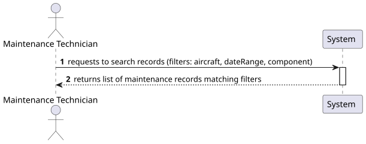
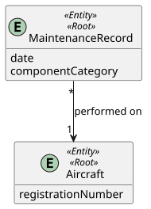
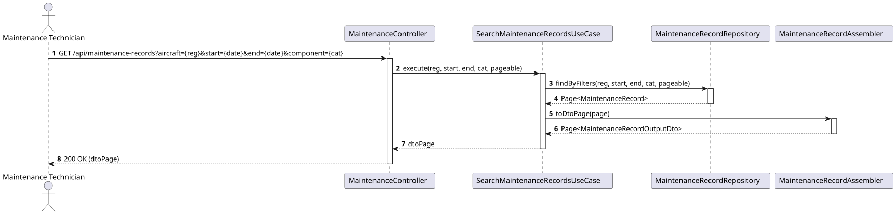
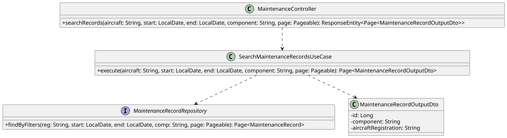

# US 218 - Search maintenance records by filters

## 1. Context

This User Story is part of Phase 2 (WP#4B - Enhanced Maintenance Management). As the maintenance history of the fleet grows, maintenance technicians need the ability to efficiently query records. This User Story provides search capabilities based on aircraft registration, specific date ranges, or maintenance component categories to facilitate quick information retrieval.

## 2. Requirements

**US 218:** "As a Maintenance Technician, I want to search maintenance records by aircraft, date range, or maintenance component."

**Acceptance Criteria / Business Rules:**
* **Authentication & Authorization:** The user must be authenticated and have the role of `MAINTENANCE_TECHNICIAN` (or `MAINTENANCE_SUPERVISOR`).
* **Filters:** The system must support the following optional filters:
    * `aircraft`: Filter by registration number (e.g., "CS-TVA").
    * `start` / `end`: Filter by a date range (creation date of the record).
    * `component`: Filter by maintenance component (e.g., "ENGINE", "AVIONICS").
* **Behavior:** The filters should be cumulative (e.g., searching for "Engines" on "CS-TVA" within a specific date range). If no filters are provided, the system should return a paginated list of all records.

## 3. Analysis

To implement efficient searching, we will use a dynamic filtering approach. The API will accept query parameters and the backend will construct a database query (using Spring Data JPA `Specification` or a repository method with `@Query` supporting nulls). This ensures that we only fetch data relevant to the technician's search, which is crucial for performance as the database grows.

### 3.1. System Sequence Diagram (SSD)



### 3.2. Domain Model (DM)

The search function relies on the attributes within `MaintenanceRecord` (date, component) and its association with `Aircraft`.



## 4. Design

### 4.1. Realization (Sequence Diagram)

The controller passes the filter parameters to the `SearchMaintenanceRecordsUseCase`, which invokes the repository's filtering method.



### 4.2. Class Diagram

The design uses a repository approach suitable for dynamic filtering.



### 4.3. Applied Patterns
* **Controller-Service-Repository:** Standard layered architecture.
* **Dynamic Querying:** Using Spring Data JPA Specifications to handle optional and cumulative filters.
* **Pagination:** The API response is paginated (via `Pageable`) to prevent overloading the client when searching large datasets.

### 4.4. Tests

**Test 1: Ensure search returns records filtered by component category.**
```java
@Test
void ensureSearchByComponent() {
    // Arrange: Mock repository to return records filtered by 'ENGINE'
    
    // Act
    Page<MaintenanceRecordOutputDto> result = useCase.execute(null, null, null, "ENGINE", Pageable.unpaged());
    
    // Assert
    assertTrue(result.getContent().stream().allMatch(r -> r.getComponent().equals("ENGINE")));
}
```

**Test 2: Ensure search returns records within a date range.**
```java
@Test
void ensureSearchByDateRange() {
    // Arrange: Mock repository with records between two dates
    
    // Act
    Page<MaintenanceRecordOutputDto> result = useCase.execute(null, startDate, endDate, null, Pageable.unpaged());
    
    // Assert
    // Check if dates are within range
}
```

## 5. Implementation

### Key Components

1. **`MaintenanceRecordRepository`:**
    * Implements dynamic search (example using `@Query` or `Specification`):
      ```java
      @Query("SELECT m FROM MaintenanceRecord m WHERE " +
             "(:reg IS NULL OR m.aircraft.registrationNumber = :reg) AND " +
             "(:comp IS NULL OR m.componentCategory = :comp) AND " +
             "(:start IS NULL OR m.createdAt >= :start) AND " +
             "(:end IS NULL OR m.createdAt <= :end)")
      Page<MaintenanceRecord> findByFilters(String reg, LocalDate start, LocalDate end, String comp, Pageable page);
      ```
2. **`SearchMaintenanceRecordsUseCase`:** Invokes the repository and converts the results to DTOs.
3. **`MaintenanceController`:** Exposes a `GET` endpoint at `/api/maintenance-records` with optional query parameters.

## 6. Integration and Demonstration

To demonstrate this feature:
1. Populate the database with several records (different components, aircraft, and dates).
2. Authenticate as a `MAINTENANCE_TECHNICIAN`.
3. Call `GET /api/maintenance-records?component=ENGINE&aircraft=CS-TVA`.
4. The system should return `200 OK` with only the records matching the aircraft and component.

## 7. Observations

* The use of `Pageable` is mandatory to ensure the system remains responsive even if there are thousands of maintenance records.
* The query parameters are all optional, allowing for flexible search combinations.