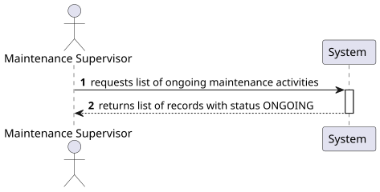
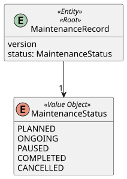
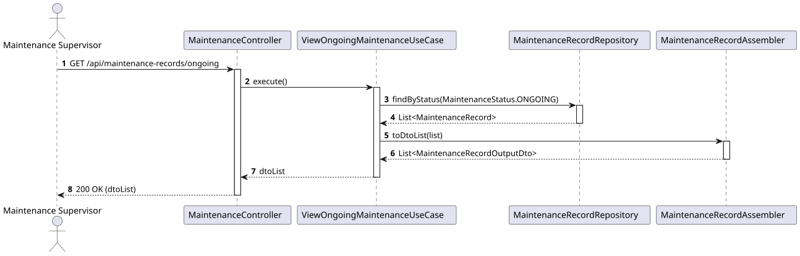
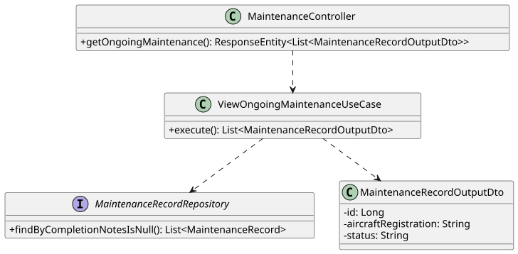

# US 219 - View all ongoing maintenance activities across the fleet

## 1. Context
This User Story is part of Phase 2 (WP#4B - Enhanced Maintenance Management). To ensure efficient operations and fleet airworthiness, the Maintenance Supervisor requires real-time visibility into all maintenance activities currently being performed. This allows the supervisor to monitor progress across the entire fleet.

## 2. Requirements
**US 219:** "As a Maintenance Supervisor, I want to view all ongoing maintenance activities across the fleet."

**Acceptance Criteria / Business Rules:**
* **Authentication & Authorization:** The user must be authenticated and have the role of MAINTENANCE_SUPERVISOR.
* **Scope:** The system must return all maintenance activities currently in the ONGOING state.
* **Definition of Fleet:** As clarified by the client, the "fleet" represents the set of all airplanes managed by the Air Transport Company (ATC).
* **State Inference:** An ongoing maintenance activity is defined as a MaintenanceRecord that has not yet been concluded (i.e., its CompletionNotes are null).

## 3. Analysis
The requirement focuses on filtering maintenance records by their current progress. Since the domain model does not use an explicit status enumeration, we must infer the "ongoing" state by checking if the CompletionNotes value object is null. We need to query the MaintenanceRecordRepository globally to fetch these specific instances.

### 3.1. System Sequence Diagram (SSD)

### 3.2. Domain Model (DM)

## 4. Design

### 4.1. Realization (Sequence Diagram)
The controller handles the GET request, delegates to the ViewOngoingMaintenanceUseCase, which uses the repository to fetch the records where completion notes are absent.

### 4.2. Class Diagram

### 4.3. Applied Patterns
* **Controller-Service-Repository:** Standard architectural pattern for read operations.
* **Assembler/DTO:** Converts domain entities into read-only DTOs for the API response. The DTO can explicitly inject the string "ONGOING" to make the output clearer for the client.

### 4.4. Tests
Test 1: Ensure retrieval of all ongoing maintenance activities.

    @Test
    void ensureOngoingActivitiesAreListed() {
        // Arrange: Create records, some with CompletionNotes and some without
        when(repository.findByCompletionNotesIsNull()).thenReturn(List.of(recordWithoutNotes));
        
        // Act
        List<MaintenanceRecordOutputDto> result = useCase.execute();
        
        // Assert
        assertFalse(result.isEmpty());
        assertTrue(result.stream().allMatch(r -> r.getStatus().equals("ONGOING"))); 
    }

## 5. Implementation

### Key Components

1. **MaintenanceRecordRepository:**
   Query to fetch by implicit status using Spring Data JPA naming conventions:

   List<MaintenanceRecord> findByCompletionNotesIsNull();

2. **ViewOngoingMaintenanceUseCase:** Fetches records via the repository, converts them to DTOs, and returns the list.

3. **MaintenanceController:** Exposes the GET endpoint at /api/maintenance-records/ongoing.

## 6. Integration and Demonstration
To demonstrate this feature:
1. Ensure there are active maintenance records in the system (records created but not yet completed).
2. Authenticate as a MAINTENANCE_SUPERVISOR.
3. Call GET /api/maintenance-records/ongoing.
4. The system should return 200 OK with a list of all maintenance operations currently lacking completion notes.

## 7. Observations
* This is a read-only operation and does not require optimistic locking.
* By relying on CompletionNotes == null, we avoid data duplication and synchronization issues that might occur if we maintained a redundant explicit state variable alongside the completion data.