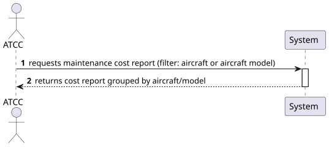
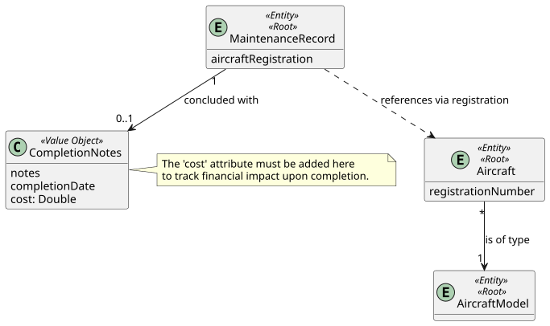
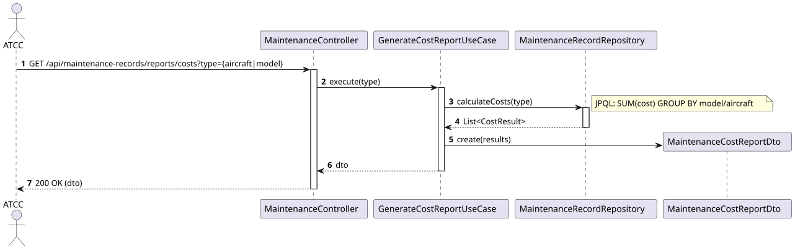
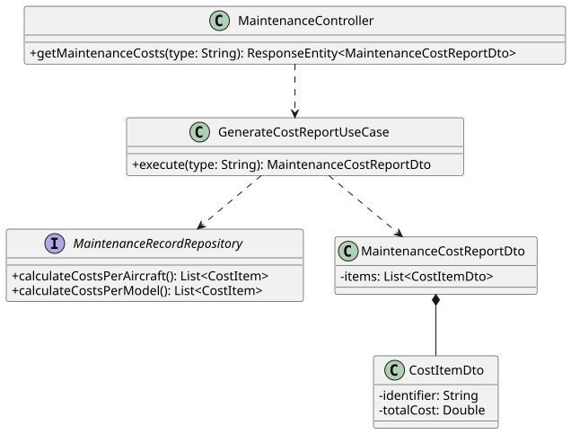

# US 220 - Generate reports on maintenance costs per aircraft or per aircraft model

## 1. Context
This User Story is part of Phase 2 (WP#4B - Enhanced Maintenance Management). To support strategic financial decisions, the ATCC requires visibility into the financial impact of maintenance operations. This feature allows the generation of maintenance cost reports, aggregated either by specific aircraft or by aircraft model, providing insights into operational expenses.

## 2. Requirements
**US 220:** "As an ATCC, I want to generate reports on maintenance costs per aircraft or per aircraft model."

**Acceptance Criteria / Business Rules:**
* **Authentication & Authorization:** The user must be authenticated and have the role of ATCC.
* **Report Options:** The user must be able to choose the granularity of the report:
    * By Aircraft (total cost for a specific tail number).
    * By Aircraft Model (aggregated total cost for all aircraft of a specific model).
* **Calculation Rules:** The system must sum the costs associated only with COMPLETED maintenance records. In this system's context, a record is considered completed when it possesses valid CompletionNotes.

## 3. Analysis
Based on the current Domain Model, the MaintenanceRecord aggregate is decoupled from the Aircraft aggregate, holding only a reference via the aircraftRegistration string. Furthermore, the cost of maintenance is determined upon its conclusion.

**Architectural Decisions:**
1. **Domain Update:** A cost (Double) attribute must be added to the CompletionNotes Value Object.
2. **Database Aggregation:** To avoid loading thousands of records into memory, the grouping and summing logic will be executed at the database level using a cross-aggregate JPQL query joining the registration strings.

### 3.1. System Sequence Diagram (SSD)

### 3.2. Domain Model (DM)

## 4. Design

### 4.1. Realization (Sequence Diagram)
The controller receives the report type filter and delegates the execution to GenerateCostReportUseCase.

### 4.2. Class Diagram

### 4.3. Applied Patterns
* **Controller-Service-Repository:** Standard tiered architecture.
* **Cross-Aggregate Joins:** Resolving aggregate decoupling at the persistence layer using JPQL joins.
* **DTO Projection:** Mapping JPQL query results directly into instantiated CostItem objects for optimal performance.

### 4.4. Tests
Test 1: Ensure cost aggregation per aircraft works correctly.

    @Test
    void ensureCostAggregationPerAircraft() {
        // Arrange: Create completed maintenance records for 'CS-TVA'
        
        // Act
        MaintenanceCostReportDto result = useCase.execute("AIRCRAFT");
        
        // Assert
        assertTrue(result.getItems().stream().anyMatch(i -> i.getIdentifier().equals("CS-TVA")));
    }

## 5. Implementation

### Key Components

1. **CompletionNotes (Domain Value Object):**
   Needs to be updated to include: private Double cost;

2. **MaintenanceRecordRepository:**
   Query for aggregation (handling the conceptual JOIN between separated aggregates):

   // Per Aircraft
   @Query("SELECT new isep.psoft.aisafe.application.CostItem(m.aircraftRegistration, SUM(m.completionNotes.cost)) " +
   "FROM MaintenanceRecord m " +
   "WHERE m.completionNotes IS NOT NULL " +
   "GROUP BY m.aircraftRegistration")
   List<CostItem> calculateCostsPerAircraft();

   // Per Model (Requires implicit join with Aircraft entity)
   @Query("SELECT new isep.psoft.aisafe.application.CostItem(a.model.modelName, SUM(m.completionNotes.cost)) " +
   "FROM MaintenanceRecord m, Aircraft a " +
   "WHERE m.aircraftRegistration = a.registrationNumber.registrationNumber " +
   "AND m.completionNotes IS NOT NULL " +
   "GROUP BY a.model.modelName")
   List<CostItem> calculateCostsPerModel();

3. **MaintenanceController:** Exposes a GET endpoint at /api/maintenance-records/reports/costs?type=...

## 6. Integration and Demonstration
To demonstrate this feature:
1. Ensure the system has multiple maintenance records with CompletionNotes filled in (meaning they are completed) and costs attributed.
2. Authenticate as an ATCC user.
3. Call GET /api/maintenance-records/reports/costs?type=MODEL.
4. The system should return 200 OK with a summary of total costs aggregated by the aircraft models.

## 7. Observations
* The addition of the cost field to the CompletionNotes Value Object aligns with Domain-Driven Design principles, as the actual cost is only realized and locked in when the maintenance is concluded.
* The explicit JPQL cross-join (FROM MaintenanceRecord m, Aircraft a) is a necessary and standard approach to handle relationships between decoupled aggregates that reference each other only by ID/Registration String.