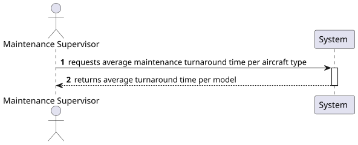
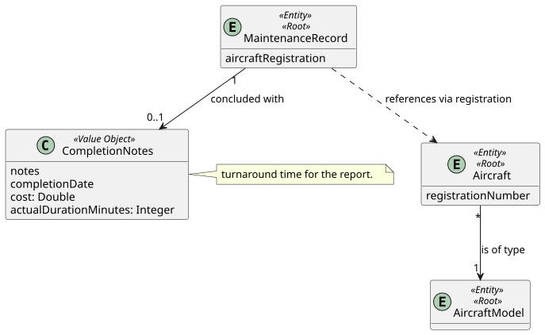
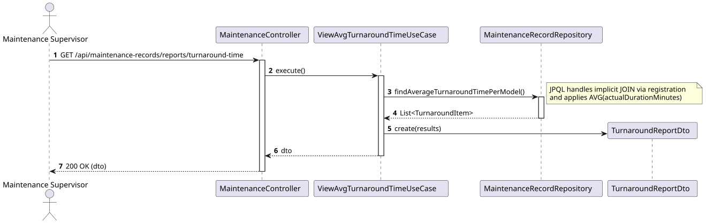
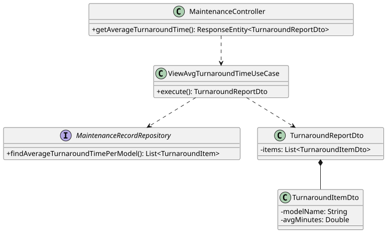

# US 221 - View average maintenance turnaround time per aircraft type

## 1. Context

This User Story is part of Phase 2 (WP#4B - Enhanced Maintenance Management). To support fleet maintenance planning and operational efficiency, the Maintenance Supervisor needs to monitor the average turnaround time for maintenance activities. This metric is analyzed per aircraft type (Aircraft Model) to identify which models are more demanding in terms of maintenance duration.

## 2. Requirements

**US 221:** "As a Maintenance Supervisor, I want to view average maintenance turnaround time per aircraft type."

**Acceptance Criteria / Business Rules:**
* **Authentication & Authorization:** The user must be authenticated and have the role of `MAINTENANCE_SUPERVISOR`.
* **Scope:** The calculation must strictly include maintenance records with the status `COMPLETED`.
* **Definition:** "Aircraft Type" refers to the `AircraftModel`.
* **Calculation:** The average turnaround time is the arithmetic mean of the `expectedDurationMinutes` of all `COMPLETED` maintenance records, grouped by their respective aircraft model.

## 3. Analysis

To generate this report efficiently, the system must perform the calculation directly in the database. Loading all completed records into application memory would be inefficient as the dataset grows. We will use a JPQL query with `AVG()` and `GROUP BY` to retrieve the aggregated data.

### 3.1. System Sequence Diagram (SSD)



### 3.2. Domain Model (DM)

The duration data is retrieved from `MaintenanceRecord`, which links to `Aircraft`, and subsequently to `AircraftModel`.



## 4. Design

### 4.1. Realization (Sequence Diagram)

The controller handles the request, the UseCase triggers the aggregation query, and the result is mapped to the output DTO.



### 4.2. Class Diagram

The class diagram shows the mapping from the repository projection to the `TurnaroundReportDto`.



### 4.3. Applied Patterns
* **Controller-Service-Repository:** Separation of concerns.
* **Database Aggregation:** Use of JPQL aggregation functions (`AVG`) to handle math on the database server.
* **Data Transfer Objects (DTO):** Encapsulation of calculated results for the API response.

### 4.4. Tests

**Test 1: Ensure average calculation is accurate per model.**
```java
@Test
void ensureAverageCalculationPerModel() {
    // Arrange: Create completed maintenance records for A320 and B737 with known durations
    
    // Act
    TurnaroundReportDto result = useCase.execute();
    
    // Assert
    // Check if the AVG value returned matches the manual calculation
}
```

**Test 2: Ensure empty list is returned if no completed records are found.**
```java
@Test
void ensureEmptyReportWhenNoCompletedRecords() {
    // Act
    TurnaroundReportDto result = useCase.execute();
    
    // Assert
    assertTrue(result.getItems().isEmpty());
}
```

## 5. Implementation

### Key Components

1. **`MaintenanceRecordRepository`:**
    * Aggregation Query:
      ```java
      @Query("SELECT new isep.psoft.aisafe.application.TurnaroundItem(m.aircraft.model.modelName, AVG(m.expectedDurationMinutes)) " +
             "FROM MaintenanceRecord m WHERE m.status = 'COMPLETED' " +
             "GROUP BY m.aircraft.model.modelName")
      List<TurnaroundItem> findAverageTurnaroundTimePerModel();
      ```
2. **`ViewAvgTurnaroundTimeUseCase`:** Calls the repository and prepares the response DTO.
3. **`MaintenanceController`:** Exposes the `GET` endpoint at `/api/maintenance-records/reports/turnaround-time`.

## 6. Integration and Demonstration

To demonstrate this feature:
1. Ensure multiple `COMPLETED` maintenance records exist for different aircraft models.
2. Authenticate as a `MAINTENANCE_SUPERVISOR`.
3. Call `GET /api/maintenance-records/reports/turnaround-time`.
4. The system should return `200 OK` with a list showing each model name and its average maintenance time.

## 7. Observations

* The query joins `MaintenanceRecord` -> `Aircraft` -> `AircraftModel` to ensure the grouping is done by the model name, as requested.
* This is a read-only reporting feature that does not impact transactional integrity.