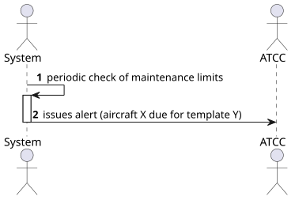
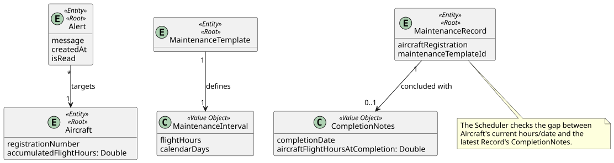
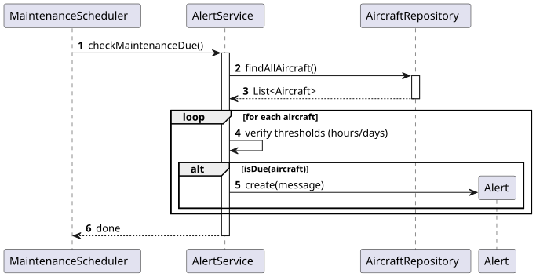
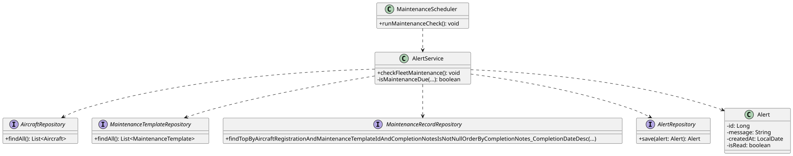

# US 222 - Receive alerts when aircraft are due for scheduled maintenance

## 1. Context
This User Story is part of Phase 2 (WP#4B - Enhanced Maintenance Management). To ensure fleet airworthiness and regulatory compliance, the ATCC (Air Transport Control Center) must be proactively notified when an aircraft is approaching its maintenance limits. These limits are defined by either accumulated flight hours or elapsed calendar days in the Maintenance Templates.

## 2. Requirements
**US 222:** "As an ATCC, I want to receive alerts when aircraft are due for scheduled maintenance based on flight hours or calendar days."

**Acceptance Criteria / Business Rules:**
* **Authentication & Authorization:** The user must be authenticated and have the role of ATCC.
* **Triggers:** The system must evaluate maintenance needs based on two criteria defined in the MaintenanceTemplate's MaintenanceInterval:
    * **Flight Hours:** If (Current Flight Hours - Flight Hours at Last Maintenance) >= Template Hours Interval.
    * **Calendar Days:** If (Current Date - Date of Last Maintenance) >= Template Days Interval.
    * *(Note: If no previous maintenance exists for a template, the baseline is the aircraft's manufacturing date and 0 flight hours).*
* **Alert Mechanism:** When a limit is reached or exceeded, an alert must be generated and persisted in the system to be read by the ATCC.

## 3. Analysis
Unlike passive read/write operations, this feature requires an active background mechanism. A scheduled task (cron job) will periodically iterate over the fleet and applicable templates to verify compliance.

**Architectural Decisions & Domain Updates:**
1. **Aircraft Entity:** Must track `accumulatedFlightHours` (updated when scheduled flights are completed).
2. **CompletionNotes (Value Object):** Must record `aircraftFlightHoursAtCompletion`. Without this snapshot, the system cannot calculate how many hours have passed since the specific maintenance occurred.
3. **Decoupled Evaluation:** The logic evaluates the latest `MaintenanceRecord` (where completionNotes != null) for each specific Aircraft + MaintenanceTemplate combination.

### 3.1. System Sequence Diagram (SSD)

### 3.2. Domain Model (DM)

## 4. Design

### 4.1. Realization (Sequence Diagram)
The system uses a background scheduler that invokes a service to verify the thresholds by querying the latest maintenance records.

### 4.2. Class Diagram

### 4.3. Applied Patterns
* **Scheduler Pattern:** Utilizing Spring's `@Scheduled` tasks to perform periodic background checks without user intervention.
* **Observer/Alert Pattern:** A dedicated `AlertService` creates notification entities when the business rules are breached.
* **Cross-Aggregate querying:** Fetching the latest `MaintenanceRecord` to evaluate the state of the decoupled `Aircraft` aggregate.

### 4.4. Tests
Test 1: Ensure maintenance is flagged due based on flight hours.

    @Test
    void ensureMaintenanceDueByFlightHours() {
        // Arrange
        Aircraft aircraft = createAircraftWithHours(1500.0);
        MaintenanceTemplate template = createTemplateWithInterval(500.0, 365);
        MaintenanceRecord lastRecord = createCompletedRecordAtHours(aircraft, template, 900.0); 
        // 1500 - 900 = 600 hours elapsed. Limit is 500.
        
        // Act & Assert
        assertTrue(alertService.isMaintenanceDue(aircraft, template, lastRecord));
    }

## 5. Implementation

### Key Components

1. **MaintenanceScheduler (Background Job):**
   @Scheduled(cron = "0 0 0 * * ?") // Runs daily at midnight
   public void runMaintenanceCheck() {
   alertService.checkFleetMaintenance();
   }

2. **AlertService:** Orchestrates the logic.
   For each Aircraft and Template, it queries:
   MaintenanceRecord lastRecord = recordRepository.findTopByAircraftRegistrationAndMaintenanceTemplateIdAndCompletionNotesIsNotNullOrderByCompletionNotes_CompletionDateDesc(reg, templateId);

   Then evaluates:
   boolean hoursExceeded = (aircraft.getAccumulatedFlightHours() - lastRecord.getCompletionNotes().getAircraftFlightHoursAtCompletion()) >= template.getInterval().getFlightHours();
   boolean daysExceeded = ChronoUnit.DAYS.between(lastRecord.getCompletionNotes().getCompletionDate(), LocalDate.now()) >= template.getInterval().getCalendarDays();

3. **AlertRepository:** Persists the generated `Alert` entities.

## 6. Integration and Demonstration
To demonstrate this feature:
1. Set up an aircraft with accumulated flight hours exceeding the interval of a specific template since its last completed record.
2. Trigger the MaintenanceScheduler manually or wait for the cron job to execute.
3. Access the system as an ATCC and check the "Alerts" endpoint.
4. Verify that a new alert entry was created specifically citing the aircraft registration and the breached template.

## 7. Observations
* The scheduler frequency (daily) is sufficient for calendar-based alerts. If real-time monitoring of flight hours is strictly required, the check could also be triggered by an event listening to the conclusion of a ScheduledFlight.
* Tracking `aircraftFlightHoursAtCompletion` in `CompletionNotes` guarantees historical accuracy even if the aircraft's total hours continue to increment.